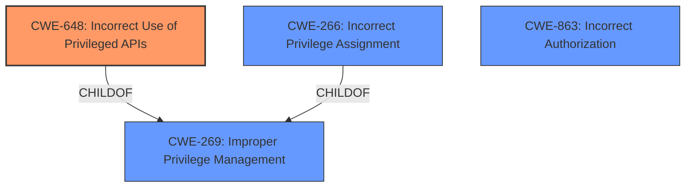

# Analysis for CVE-2025-21235

# Summary
| CWE ID    | CWE Name                                                              | Confidence | CWE Abstraction Level | CWE Vulnerability Mapping Label | CWE-Vulnerability Mapping Notes |
| --------- | --------------------------------------------------------------------- | ---------- | --------------------- | ------------------------------- | ------------------------------- |
| CWE-648   | Incorrect Use of Privileged APIs                                      | 0.75       | Base                  | Primary                         | Allowed                       |
| CWE-269 | Improper Privilege Management                                       | 0.50       | Class                  | Secondary                       | Discouraged |
| CWE-266 | Incorrect Privilege Assignment                                        | 0.50       | Base                  | Secondary                       | Allowed                       |
| CWE-863   | Incorrect Authorization                                       | 0.50       | Class                  | Secondary                       | Allowed-with-Review |

## Evidence and Confidence

*   **Confidence Score:** 0.75
*   **Evidence Strength:** LOW

## Relationship Analysis
The primary CWE is CWE-648, which is a Base level CWE and fits the description of the vulnerability. While the vulnerability description is minimal, the mention of "Elevation of Privilege" and the service name "PrintWorkflowUserSvc" suggests the potential for incorrect use of privileged APIs. Other considered CWEs like CWE-269 and CWE-266 represent broader categories of privilege management and assignment issues and are therefore considered as secondary matches. CWE-863 represents incorrect authorization.

## Vulnerability Chain
The vulnerability chain starts with the **incorrect use of privileged APIs** (CWE-648), potentially stemming from **improper privilege management** (CWE-269) or **incorrect privilege assignment** (CWE-266), leading to the impact of **elevation of privilege**.

## Summary of Analysis
The analysis relies heavily on the service name "PrintWorkflowUserSvc" and the "Elevation of Privilege" impact. There is a lack of detailed information about the root cause, making it challenging to pinpoint the precise weakness. The selection of CWE-648 is based on the assumption that the PrintWorkflowUserSvc might be making **incorrect calls to privileged APIs**, leading to the privilege elevation. The graph relationships show how CWE-648 can be a specific instance of CWE-269. The chosen CWEs are at the optimal level of specificity given the limited evidence.

Relevant CWE Information:

# Enhanced Context (25 CWEs)
The following CWEs were identified as potentially relevant to this vulnerability:

## CWE-648: Incorrect Use of Privileged APIs
**Abstraction Level**: Base
**Similarity Score**: 0.74
**Source**: dense

**Description**:
The product does not conform to the API requirements for a function call that requires extra privileges. This could allow attackers to gain privileges by causing the function to be called incorrectly.

**Mapping Guidance**:
- Usage: Allowed
- Rationale: This CWE entry is at the Base level of abstraction, which is a preferred level of abstraction for mapping to the root causes of vulnerabilities.

# Complete CWE Specifications

CWE-648: Incorrect Use of Privileged APIs

Given the available information, CWE-648 appears to be the most relevant choice as the **root cause** of the vulnerability. The lack of information reduces confidence.