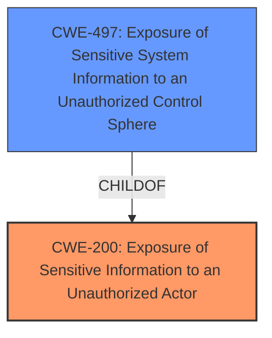

# Analysis for CVE-2025-21242

# Summary
| CWE ID | CWE Name | Confidence | CWE Abstraction Level | CWE Vulnerability Mapping Label | CWE-Vulnerability Mapping Notes |
|---|---|---|---|---|---|
| CWE-200 | Exposure of Sensitive Information to an Unauthorized Actor | 0.8 | Class | Primary | Discouraged |
| CWE-497 | Exposure of Sensitive System Information to an Unauthorized Control Sphere | 0.6 | Base | Secondary | Allowed |

## Evidence and Confidence

*   **Confidence Score:** 0.7
*   **Evidence Strength:** LOW

## Relationship Analysis
The primary relationship to consider is that CWE-497 "Exposure of Sensitive System Information to an Unauthorized Control Sphere" can be a more specific type of CWE-200 "Exposure of Sensitive Information to an Unauthorized Actor". Since the vulnerability description specifically mentions "Windows Kerberos", which can be considered system information, CWE-497 is a plausible secondary candidate, but lacks specific evidence.

## Vulnerability Chain
The vulnerability chain consists of a root cause leading to **information disclosure**. The specific root cause is not provided in the description. The vulnerability description only identifies the high-level impact.

## Summary of Analysis
The vulnerability is described as a Windows Kerberos **Information Disclosure Vulnerability**. The provided information is very limited, with no details about the root cause.

The primary CWE candidate is CWE-200 **Exposure of Sensitive Information to an Unauthorized Actor** because the vulnerability description explicitly uses the term "Information Disclosure Vulnerability". Although CWE-200 is a Class-level CWE and is generally discouraged, it is the best fit given the limited information.

CWE-497 **Exposure of Sensitive System Information to an Unauthorized Control Sphere** is a plausible secondary candidate, since the vulnerability is in "Windows Kerberos" and Kerberos is a system component. However, without more information about *what* information is being disclosed, it is hard to determine if this is the correct CWE.

The retriever results also listed CWE-497, but with a lower confidence score than CWE-200. Other CWEs from the retriever results (e.g. CWE-126, CWE-134) are not relevant, as there is no information about the root cause of the vulnerability.

Relevant CWE Information:

*   CWE-200 **Exposure of Sensitive Information to an Unauthorized Actor**: The product exposes sensitive information to an actor that is not explicitly authorized to have access to that information.
*   CWE-497 **Exposure of Sensitive System Information to an Unauthorized Control Sphere**: The product does not properly prevent sensitive system-level information from being accessed by unauthorized actors who do not have the same level of access to the underlying system as the product does.