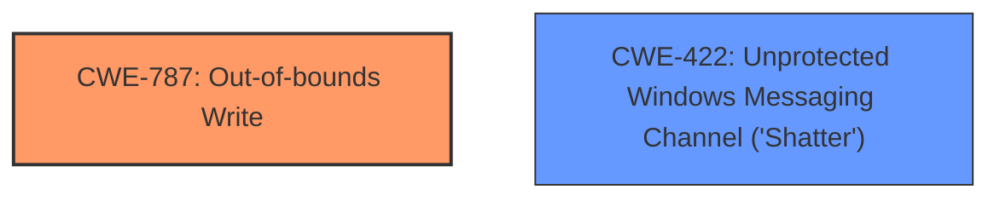

# Enhanced Analysis for CVE-2025-21290

# Summary
| CWE ID | CWE Name | Confidence | CWE Abstraction Level | CWE Vulnerability Mapping Label | CWE-Vulnerability Mapping Notes |
|---|---|---|---|---|---|
| CWE-787 | Out-of-bounds Write | 0.4 | Base | Primary | Allowed |
| CWE-422 | Unprotected Windows Messaging Channel ('Shatter') | 0.3 | Variant | Secondary | Allowed |

## Evidence and Confidence

*   **Confidence Score:** 0.4
*   **Evidence Strength:** LOW

## Relationship Analysis
The primary candidate CWE-787 (Out-of-bounds Write) is a base level CWE. CWE-422 (Unprotected Windows Messaging Channel ('Shatter')) is a variant level CWE. There are no strong relationships to leverage between the candidate CWEs.



## Vulnerability Chain
Given the limited information, the vulnerability chain is not clear. The vulnerability description only mentions "Denial of Service".
  - It is impossible to know which CWE represents root causes vs. impacts
  - There are many missing links in the chain based on relationship data
  - The **Primary CWE** may identify the issue that led to the vulnerability but there isn't enough evidence to say with confidence.

## Summary of Analysis
The initial analysis suggests CWE-787 (Out-of-bounds Write) due to its high score in the Retriever Results. However, the lack of root cause information or technical details in the vulnerability description makes it challenging to confirm this mapping with high confidence. The vulnerability description only mentions "Denial of Service" as the impact and "Microsoft Message Queuing (MSMQ)" as the product. The CVE Reference Links Content Summary contains "UNRELATED" which means there is no further information in the CVE.

The Retriever Results list CWE-787 (Out-of-bounds Write) as a candidate. Given the lack of information, the retriever result is considered as only supporting evidence.

Relevant CWE Information:

# Enhanced Context (25 CWEs)
The following CWEs were identified as potentially relevant to this vulnerability:

## CWE-787: Out-of-bounds Write
**Abstraction Level**: Base
**Similarity Score**: 333.84
**Source**: sparse

**Description**:
The product writes data past the end, or before the beginning, of the intended buffer.

**Mapping Guidance**:
- Usage: Allowed
- Rationale: This CWE entry is at the Base level of abstraction, which is a preferred level of abstraction for mapping to the root causes of vulnerabilities.

## CWE-422: Unprotected Windows Messaging Channel ('Shatter')
**Abstraction Level**: Variant
**Similarity Score**: 0.67
**Source**: dense

**Description**:
The product does not properly verify the source of a message in the Windows Messaging System while running at elevated privileges, creating an alternate channel through which an attacker can directly send a message to the product.

**Mapping Guidance**:
- Usage: Allowed
- Rationale: This CWE entry is at the Variant level of abstraction, which is a preferred level of abstraction for mapping to the root causes of vulnerabilities.

I am using these facts and the Retriever results as supporting evidence:
*   The product is "Microsoft Message Queuing (MSMQ)" which is a Windows Messaging System.
*   The **impact** is "Denial of Service"

The selection of CWE-787 and CWE-422 are at the optimal level of specificity given the limited information.
Confidence is low given the lack of information.


## CWE Relationship Analysis

Current CWEs represent these abstraction levels: .


### Vulnerability Chain Analysis

**Chain starting from CWE-787:**
- 787 (Out-of-bounds Write) - ROOT


**Chain starting from CWE-422:**
- 422 (Unprotected Windows Messaging Channel ('Shatter')) - ROOT


### CWE Relationship Diagram

```mermaid
graph TD
    classDef primary fill:#f96,stroke:#333,stroke-width:2px
    classDef secondary fill:#69f,stroke:#333
    classDef tertiary fill:#9e9,stroke:#333
```