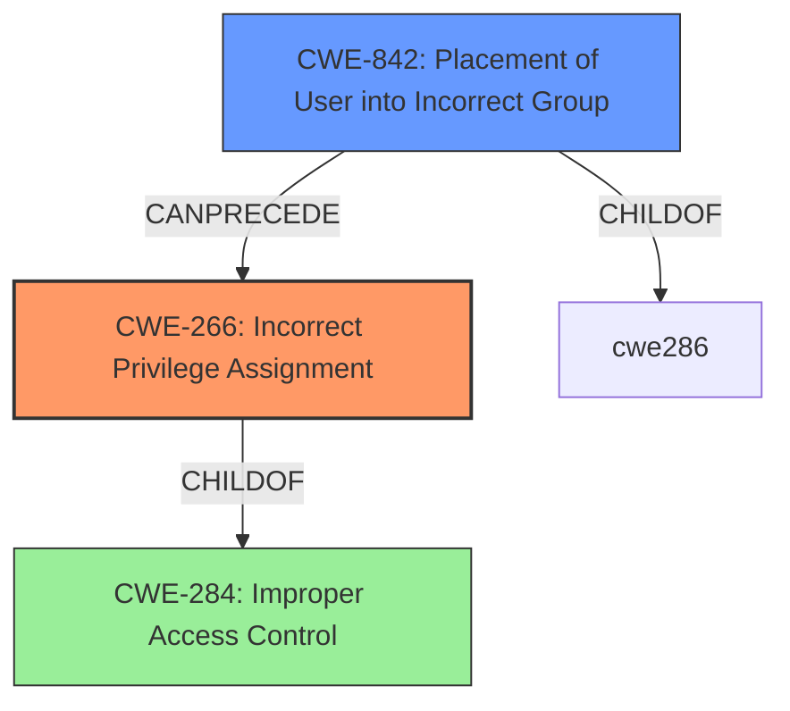

# Analysis for CVE-2025-21293

# Summary
| CWE ID | CWE Name | Confidence | CWE Abstraction Level | CWE Vulnerability Mapping Label | CWE-Vulnerability Mapping Notes |
|---|---|---|---|---|---|
| CWE-266 | Incorrect Privilege Assignment | 0.9 | Base | Primary CWE | Allowed |
| CWE-842 | Placement of User into Incorrect Group | 0.7 | Base | Secondary Candidate | Allowed |
| CWE-284 | Improper Access Control | 0.5 | Pillar | Secondary Candidate | Discouraged |

## Evidence and Confidence

*   **Confidence Score:** 0.8
*   **Evidence Strength:** MEDIUM

## Relationship Analysis
The primary relationship influencing the decision is the hierarchical structure where CWE-266 is a more specific type of **improper access control**. The guidance clearly states that if a specific privilege or permission issue is identifiable, then CWE-266 should be favored over the more generic CWE-284. CWE-842, while relevant, is more about placing the user into an incorrect group. It can be a cause for CWE-266, but the description focuses on the **improper access control** as the root cause, making CWE-266 a better fit.

## Vulnerability Chain
The vulnerability chain starts with the **improper access control** (CWE-266), which leads to an elevation of privilege.
- **Root Cause:** CWE-266 (Incorrect Privilege Assignment)
- **Impact:** Elevation of Privilege

## Summary of Analysis
The initial analysis focused on identifying the root cause of the vulnerability. The key phrase "improper access control" suggested CWE-284, but the provided guidance emphasizes using more specific CWEs when possible. The retriever results also included CWE-266 and CWE-842, which are more specific. The guidance clearly states that when the system assigns incorrect privileges to a user (e.g., admin instead of guest), CWE-266 is appropriate. Therefore, CWE-266 is the primary CWE because the root cause is **improper privilege assignment** leading to elevation of privilege.

CWE-842 was considered because it relates to placing a user in an incorrect group, which could lead to **improper access control**. However, the vulnerability description doesn't specifically mention group placement, so CWE-266 is a better fit as it directly addresses **incorrect privilege assignment**.

CWE-284 was also considered, but is a more generic, parent-level CWE. The guidance discourages using CWE-284 if a more specific child CWE, such as CWE-266, is applicable.

Relevant CWE Information:

# Enhanced Context (25 CWEs)
The following CWEs were identified as potentially relevant to this vulnerability:

## CWE-266: Incorrect Privilege Assignment
**Abstraction Level**: Base
**Similarity Score**: 0.74
**Source**: dense

**Description**:
A product incorrectly assigns a privilege to a particular actor, creating an unintended sphere of control for that actor.

**Mapping Guidance**:
- Usage: Allowed
- Rationale: This CWE entry is at the Base level of abstraction, which is a preferred level of abstraction for mapping to the root causes of vulnerabilities.

## CWE-842: Placement of User into Incorrect Group
**Abstraction Level**: base
**Similarity Score**: 2.40
**Source**: graph

**Description**:
CWE-842: Placement of User into Incorrect Group

**Mapping Guidance**:
- Usage: Allowed
- Rationale: This CWE entry is at the Base level of abstraction, which is a preferred level of abstraction for mapping to the root causes of vulnerabilities.

## CWE-284: Improper Access Control
**Abstraction Level**: Pillar
**Similarity Score**: 2.40
**Source**: graph

**Description**:
The product does not properly control access to resources.

**Mapping Guidance**:
- Usage: Discouraged
- Rationale: This CWE entry is a Pillar, which is a high level of abstraction, and might have Base-level or Variant-level children that would be more appropriate

### Authentication vs Authorization vs Access Control Guidance

## ===Guidance===

### Level Set – Authentication vs Authorization vs Access Control

**Access Control**:
A broader term that includes both authentication and authorization. Governs how resources are protected and who can access them under what conditions.

* CWE relevance:

  * **CWE-284**: *Improper Access Control* – top-level category used when access control failure exists but root cause is unclear.
  * This should be avoided **if** a more specific child CWE like 285, 862, 863, or 306 is appropriate.

### Privileges vs Permissions Guidance

## ===Guidance===

### Level Set – Privileges vs Permissions (in Access Control Context)

**Privileges**

* Represents the *actor's identity level* or capabilities (e.g., root, admin, regular user, guest).
* Commonly defined by roles or security contexts assigned during session creation or login.
* Often involved in **privilege escalation** (e.g., a regular user gaining admin rights).
* 🔍 *Who* the user is and *what they are supposed to be able to do.*

#### 🔸 CWE-266: **Incorrect Privilege Assignment**

* The system assigns incorrect privileges to a user (e.g., admin instead of guest).
* Often the result of misconfigured roles or faulty logic during account provisioning.
* ✅ *“A user created with the ‘guest’ role was assigned admin privileges due to a logic flaw.”*