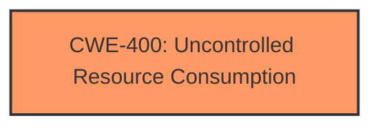

# Enhanced Analysis for CVE-2025-21330

# Summary
| CWE ID | CWE Name | Confidence | CWE Abstraction Level | CWE Vulnerability Mapping Label | CWE-Vulnerability Mapping Notes |
|---|---|---|---|---|---|
| CWE-400 | Uncontrolled Resource Consumption | 0.7 | Class | Allowed-with-Review | Primary CWE |

## Evidence and Confidence

*   **Confidence Score:** 0.7
*   **Evidence Strength:** LOW

## Relationship Analysis
The primary identified CWE is CWE-400 (Uncontrolled Resource Consumption), which is a Class-level CWE. There are no explicit child CWEs apparent from the provided information, which would have provided a more specific classification.



## Vulnerability Chain
The vulnerability chain consists of a single point:

1.  **Root Cause:** Uncontrolled resource consumption due to the nature of the Windows Remote Desktop Services.
2.  **Impact:** Denial of Service.

## Summary of Analysis
The primary CWE identified is CWE-400 (Uncontrolled Resource Consumption) because the provided vulnerability description focuses on a denial-of-service (DoS) condition in Windows Remote Desktop Services. The description indicates that the vulnerability leads to a denial of service, which directly aligns with the impact described in CWE-400.

The confidence level is moderate (0.7) due to the limited information available. The "CVE Reference Links Content Summary" section is marked as "UNRELATED," which means there is no further rootcause or weakness mechanism information available. The vulnerability description key phrases also do not directly specify the root cause, only the impacted product and impact. Without more details about the specific flaw that leads to the uncontrolled resource consumption, a more precise CWE assignment is not possible.

The retriever results listed other CWEs, but these were rejected because they did not directly address the denial-of-service aspect described in the vulnerability. Specifically:

*   CWE-923, CWE-295, CWE-732, CWE-184, CWE-502, CWE-379, CWE-250 and CWE-328 were deemed less relevant as they cover issues like communication channel restrictions, certificate validation, permission assignments, input validation, deserialization, temporary file creation, privilege and weak hash usage, none of which directly indicate the DoS condition.
*   CWE-322 (Key Exchange without Entity Authentication) has even less information.

The selection of CWE-400 is at the class level because there is no information to suggest a more specific variant. The evidence is limited to the vulnerability description indicating a denial-of-service condition.


## CWE Relationship Analysis

Current CWEs represent these abstraction levels: .


### Vulnerability Chain Analysis

**Chain starting from CWE-502:**
- 502 (Deserialization of Untrusted Data) - ROOT


**Chain starting from CWE-400:**
- 400 (Uncontrolled Resource Consumption) - ROOT


### CWE Relationship Diagram

```mermaid
graph TD
    classDef primary fill:#f96,stroke:#333,stroke-width:2px
    classDef secondary fill:#69f,stroke:#333
    classDef tertiary fill:#9e9,stroke:#333
```