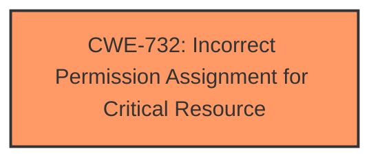

# Analysis for CVE-2025-21349

# Summary
| CWE ID | CWE Name | Confidence | CWE Abstraction Level | CWE Vulnerability Mapping Label | CWE-Vulnerability Mapping Notes |
|---|---|---|---|---|---|
| CWE-732 | Incorrect Permission Assignment for Critical Resource | 0.75 | Class | Allowed-with-Review | Primary CWE |

## Evidence and Confidence

*   **Confidence Score:** 0.75
*   **Evidence Strength:** LOW

## Relationship Analysis
The primary CWE selected is CWE-732 (Incorrect Permission Assignment for Critical Resource), which is a Class-level CWE. There is no information available to specify the child element.

## Vulnerability Chain
The vulnerability chain consists of a single point: **incorrect permission assignment** on the Remote Desktop Configuration Service, leading to potential tampering.
  - The **Primary CWE** is CWE-732 indicating **incorrect permission assignment**.

## Summary of Analysis
The analysis is based on the provided information, which indicates a tampering vulnerability in the Windows Remote Desktop Configuration Service. The retriever results suggest CWE-732 (Incorrect Permission Assignment for Critical Resource) as the top candidate, with a sparse retriever score of 0.012.

The vulnerability description and key phrases do not contain much detail, making it difficult to pinpoint the exact root cause, but **incorrect permission assignment** is a plausible explanation.

Given the limited information, CWE-732 seems to be the most fitting choice. The confidence score is moderate (0.75) due to the lack of detailed evidence.

Relevant CWE Information:

# Enhanced Context (25 CWEs)
The following CWEs were identified as potentially relevant to this vulnerability:

## CWE-732: Incorrect Permission Assignment for Critical Resource
**Abstraction Level**: Class
**Similarity Score**: 0.73
**Source**: dense

**Description**:
The web application does not sufficiently verify inputs that are assumed to be immutable but are actually externally controllable, such as hidden form fields.

**Mapping Guidance**:
- Usage: Allowed
- Rationale: This CWE entry is at the Base level of abstraction, which is a preferred level of abstraction for mapping to the root causes of vulnerabilities.