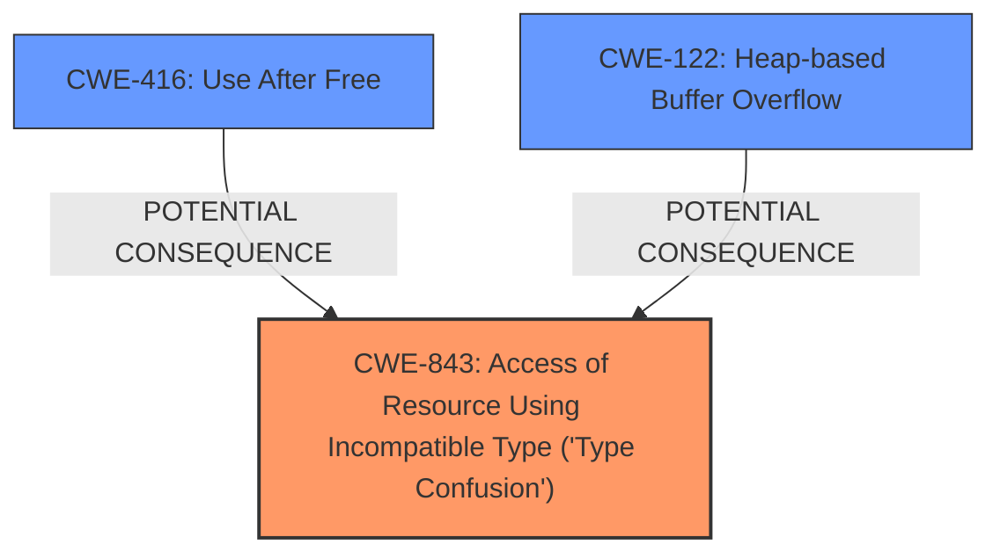

# Analysis for CVE-2025-2135

# Summary
| CWE ID  | CWE Name                                                     | Confidence | CWE Abstraction Level | CWE Vulnerability Mapping Label | CWE-Vulnerability Mapping Notes |
| :-------- | :----------------------------------------------------------- | :--------- | :-------------------- | :------------------------------ | :------------------------------ |
| CWE-843   | Access of Resource Using Incompatible Type ('**Type Confusion**') | 1          | Base                  | Primary CWE                     | Allowed                       |
| CWE-416   | Use After Free                                               | 0.5        | Variant               | Secondary Candidate             | Allowed                       |
| CWE-122   | Heap-based Buffer Overflow                                   | 0.4        | Variant               | Secondary Candidate             | Allowed                       |

## Evidence and Confidence

*   **Confidence Score:** 0.8
*   **Evidence Strength:** HIGH

## Relationship Analysis

The primary CWE is CWE-843, which represents the **Type Confusion** vulnerability directly mentioned in the description. CWE-416 and CWE-122 are potential consequences of type confusion, where incorrect type handling could lead to memory corruption and subsequent use-after-free or buffer overflows. These relationships are not definitive but plausible given the description. The abstraction level of CWE-843 as Base is appropriate for a root cause analysis.

## Vulnerability Chain

The vulnerability chain starts with **Type Confusion** (CWE-843) in the V8 engine. This **weakness** could potentially lead to heap corruption. Heap corruption can manifest as a Use-After-Free (CWE-416) or a Heap-based Buffer Overflow (CWE-122). The chain is:

CWE-843 (Root Cause: **Type Confusion**) -> Heap Corruption -> Possible CWE-416 or CWE-122 (Impact).

## Summary of Analysis

The primary assessment is based on the provided evidence, which explicitly mentions **Type Confusion** in V8. The CVE Reference Links Content Summary confirms this as the root cause.

> **Vulnerability Description Key Phrases**
> -   **weakness:** **Type Confusion**
>
> **CVE Reference Links Content Summary**
> *   **Root cause of vulnerability:** **Type Confusion** in V8.
> *   **Weaknesses/vulnerabilities present:** **Type Confusion**

CWE-843 is selected as the primary CWE because it directly addresses the **Type Confusion** vulnerability. CWE-416 and CWE-122 are included as secondary candidates because they represent plausible outcomes of a successful exploitation of the **Type Confusion** **weakness**, leading to heap corruption. The graph relationships illustrate how **Type Confusion** can precede these memory corruption issues. The selected CWEs are at the optimal level of specificity, with CWE-843 as a Base level CWE and CWE-416 and CWE-122 as Variant level CWEs, representing potential consequences.

The other CWEs listed in the Retriever Results were considered but not used because they did not directly address the **Type Confusion** **weakness** or were less likely outcomes based on the provided information. For instance, CWE-366 (Race Condition within a Thread), CWE-451 (User Interface (UI) Misrepresentation of Critical Information), and CWE-704 (Incorrect Type Conversion or Cast) are not directly supported by the evidence.

Relevant CWE Information:

# Enhanced Context (25 CWEs)

## CWE-843: Access of Resource Using Incompatible Type ('**Type Confusion**')

**Abstraction Level**: Base
**Similarity Score**: 0.82
**Source**: dense

**Description**:
The product allocates or initializes a resource such as a pointer, object, or variable using one type, but it later accesses that resource using a type that is incompatible with the original type.

**Mapping Guidance**:
- Usage: Allowed
- Rationale: This CWE entry is at the Base level of abstraction, which is a preferred level of abstraction for mapping to the root causes of vulnerabilities.

*Explanation:* This CWE perfectly matches the vulnerability description, as it explicitly describes a **Type Confusion** issue. The description states there is a **Type Confusion** in V8, which aligns with accessing a resource using an incompatible type.

## CWE-416: Use After Free

**Abstraction Level**: Variant
**Similarity Score**: 0.73
**Source**: dense

**Description**:
The product reuses or references memory after it has been freed. At some point afterward, the memory may be allocated again and saved in another pointer, while the original pointer references a location somewhere within the new allocation. Any operations using the original pointer are no longer valid because the memory "belongs" to the code that operates on the new pointer.

**Mapping Guidance**:
- Usage: Allowed
- Rationale: This CWE entry is at the Variant level of abstraction, which is a preferred level of abstraction for mapping to the root causes of vulnerabilities.

*Explanation:* This is a potential impact of the **Type Confusion**. If the type confusion leads to memory corruption, a Use-After-Free condition might occur.

## CWE-122: Heap-based Buffer Overflow

**Abstraction Level**: Variant
**Similarity Score**: 603.71
**Source**: sparse

**Description**:
A heap overflow condition is a buffer overflow, where the buffer that can be overwritten is allocated in the heap portion of memory, generally meaning that the buffer was allocated using a routine such as malloc().

**Mapping Guidance**:
- Usage: Allowed
- Rationale: This CWE entry is at the Variant level of abstraction, which is a preferred level of abstraction for mapping to the root causes of vulnerabilities.

*Explanation:* This is another potential impact of the **Type Confusion**. If the type confusion leads to writing outside the bounds of a buffer, a Heap-based Buffer Overflow might occur.

## CWE-704: Incorrect Type Conversion or Cast

**Abstraction Level**: Class
**Similarity Score**: 0.73
**Source**: dense

**Description**:
The product does not correctly convert an object, resource, or structure from one type to a different type.

**Mapping Guidance**:
- Usage: Allowed-with-Review
- Rationale: This CWE entry is a Class and might have Base-level children that would be more appropriate

*Explanation:* While related to **Type Confusion**, this CWE is more generic and less directly applicable than CWE-843. CWE-843 better captures the essence of accessing a resource with an incompatible type, rather than just an incorrect conversion. Therefore it was not selected.

## CWE-366: Race Condition within a Thread

**Abstraction Level**: Base
**Similarity Score**: 0.72
**Source**: dense

**Description**:
If two threads of execution use a resource simultaneously, there exists the possibility that resources may be used while invalid, in turn making the state of execution undefined.

**Mapping Guidance**:
- Usage: Allowed
- Rationale: This CWE entry is at the Base level of abstraction, which is a preferred level of abstraction for mapping to the root causes of vulnerabilities.

*Explanation:* There is no mention of race conditions in the vulnerability description or the reference links content summary. Therefore, this CWE is not relevant.