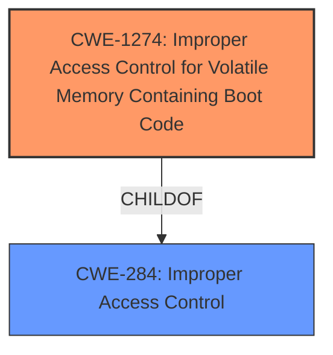

# Raw Analyzer Response for CVE-2025-21370

# Summary
| CWE ID | CWE Name | Confidence | CWE Abstraction Level | CWE Vulnerability Mapping Label | CWE-Vulnerability Mapping Notes |
|---|---|---|---|---|---|
| CWE-1274 | Improper Access Control for Volatile Memory Containing Boot Code | 0.7 | Base | Allowed | Primary CWE |

## Evidence and Confidence

*   **Confidence Score:** 0.7
*   **Evidence Strength:** LOW

## Relationship Analysis
The primary CWE selected, CWE-1274, is at the Base level of abstraction, which is preferred. The retriever results indicated a high score for this CWE based on a dense analysis. While the description of the vulnerability is vague, the CWE name and description align with the nature of virtualization-based security, which involves volatile memory containing boot code. The relationships of this CWE point to access control issues (ChildOf CWE-284).

## Vulnerability Chain
The vulnerability chain is short, given the limited information. The root cause is **improper access control**, leading to a potential elevation of privilege.

## Summary of Analysis
The analysis is heavily reliant on the CWE descriptions and retriever results, as the vulnerability description is very brief. The key aspect is the "Elevation of Privilege" vulnerability within "Windows Virtualization-Based Security (VBS)". The retriever results highlight CWE-1274 as a strong candidate, and its description fits the context. Other CWEs were considered, but the lack of specific details in the vulnerability description made CWE-1274 the most appropriate choice. My confidence is limited by the lack of specific details.

Relevant CWE Information:

# Enhanced Context (25 CWEs)
The following CWEs were identified as potentially relevant to this vulnerability:

## CWE-59: Improper Link Resolution Before File Access ('Link Following')
**Abstraction Level**: Base
**Similarity Score**: 0.79
**Source**: dense

**Description**:
The product attempts to access a file based on the filename, but it does not properly prevent that filename from identifying a link or shortcut that resolves to an unintended resource.

**Mapping Guidance**:
- Usage: Allowed
- Rationale: This CWE entry is at the Base level of abstraction, which is a preferred level of abstraction for mapping to the root causes of vulnerabilities.

## CWE-1274: Improper Access Control for Volatile Memory Containing Boot Code
**Abstraction Level**: base
**Similarity Score**: 2.47
**Source**: graph

**Description**:
CWE-1274: Improper Access Control for Volatile Memory Containing Boot Code

**Mapping Guidance**:
- Usage: Allowed
- Rationale: This CWE entry is at the Base level of abstraction, which is a preferred level of abstraction for mapping to the root causes of vulnerabilities.

**Relationships**:
- CHILDOF -> CWE-284
- PARENTOF -> CWE-1274

# Complete CWE Specifications

CWE-1274: Improper Access Control for Volatile Memory Containing Boot Code
Technical Explanation:

CWE-1274 (Improper Access Control for Volatile Memory Containing Boot Code): This CWE addresses vulnerabilities where access control mechanisms are insufficient for volatile memory regions containing boot code. In the context of Windows VBS, where sensitive code and data are stored in isolated memory regions, **improper access control** can lead to an elevation of privilege.

The vulnerability description indicates an "Elevation of Privilege" within "Windows Virtualization-Based Security". VBS relies on isolating code and data in secure enclaves. If access control to the volatile memory containing the boot code of these enclaves is flawed, an attacker could potentially modify or inject code, leading to privilege escalation.

The retriever results listed CWE-1274 with a high score based on the dense analysis, suggesting a strong correlation. The "Elevation of Privilege" impact further reinforces this mapping.

Other CWEs Considered But Not Used:

CWE-59, CWE-378, CWE-1386, CWE-1421, CWE-454, CWE-127, CWE-426, CWE-123, CWE-363: These CWEs were considered but deemed less relevant because they didn't directly address the specific context of virtualization-based security and volatile memory containing boot code. They represent more general weaknesses, whereas CWE-1274 is more targeted.