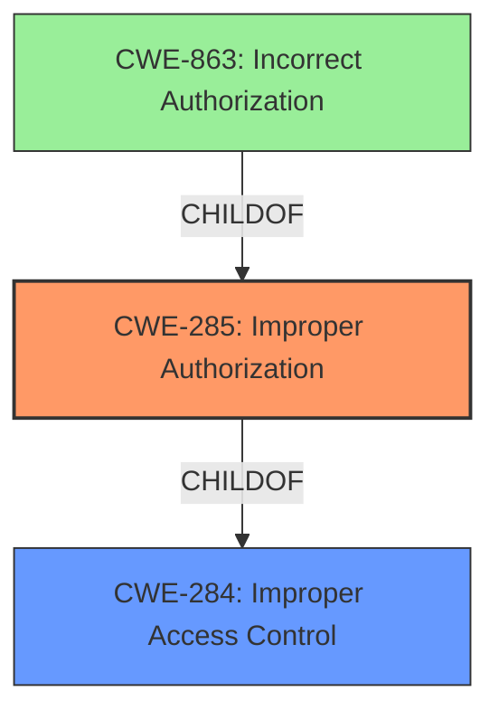

# Enhanced Analysis for CVE-2025-21405

# Summary
| CWE ID | CWE Name | Confidence | CWE Abstraction Level | CWE Vulnerability Mapping Label | CWE-Vulnerability Mapping Notes |
|---|---|---|---|---|---|
| CWE-285 | Improper Authorization | 0.75 | Class | Primary | Allowed-with-Review |

## Evidence and Confidence

*   **Confidence Score:** 0.75
*   **Evidence Strength:** MEDIUM

## Relationship Analysis
The analysis is focused on identifying the most specific and accurate CWE to represent the **improper access control** issue. Several CWEs related to authorization and access control were considered, with a preference for lower-level (Base or Variant) CWEs. The guidance on Authentication vs Authorization vs Access Control was particularly useful in differentiating between authentication and authorization failures. The hierarchical relationships between CWEs (e.g., CWE-285 as a Class with potential more specific children) influenced the decision to choose CWE-285, as the provided information doesn't pinpoint a more specific root cause.



## Vulnerability Chain
The vulnerability chain starts with the **improper access control** (**ROOTCAUSE**) leading to an **Elevation of Privilege Vulnerability** (**WEAKNESS**) resulting in the impact of Elevation of Privilege.

## Summary of Analysis
The primary assessment is based on the vulnerability description which highlights **improper access control** as the root cause of an Elevation of Privilege. The phrase "**improper access control**" and the resulting "Elevation of Privilege" suggest an authorization issue.

Based on the "**Authentication vs Authorization vs Access Control Guidance**", the key factor is to determine whether the issue involves authentication (identity validation) or authorization (access after identity is verified). Since the description mentions "**improper access control**" and not a lack of authentication, the focus shifts to authorization-related CWEs.

CWE-284 (Improper Access Control) is a high-level category and should be avoided if a more specific child CWE is appropriate. The **weakness** is specifically an "**Elevation of Privilege Vulnerability**" so the LLM guidance indicates either CWE-266 (Incorrect Privilege Assignment) or CWE-285 (Improper Authorization).

CWE-863 (Incorrect Authorization) is also a possibility, but it implies that an authorization check exists but is flawed. CWE-285 is a more general category for improper authorization.

The selection of CWE-285 is at a Class level because the provided evidence doesn't offer enough details to pinpoint the exact nature of the improper authorization. It is likely that a more specific Base or Variant CWE could be identified with additional information.

The confidence level is 0.75 due to the limited information available in the vulnerability description. A more detailed description would allow for a more precise CWE mapping.

Relevant CWE Information:

# Enhanced Context (25 CWEs)
The following CWEs were identified as potentially relevant to this vulnerability:

## CWE-266: Incorrect Privilege Assignment
**Abstraction Level**: Base
**Similarity Score**: 0.75
**Source**: dense

**Description**:
A product incorrectly assigns a privilege to a particular actor, creating an unintended sphere of control for that actor.

**Mapping Guidance**:
- Usage: Allowed
- Rationale: This CWE entry is at the Base level of abstraction, which is a preferred level of abstraction for mapping to the root causes of vulnerabilities.

## CWE-285: Improper Authorization
**Abstraction Level**: Class
**Similarity Score**: 2002.26
**Source**: sparse

**Description**:
The product does not perform or incorrectly performs an authorization check when an actor attempts to access a resource or perform an action.

**Mapping Guidance**:
- Usage: Discouraged
- Rationale: CWE-285 is high-level and lower-level CWEs can frequently be used instead. It is a level-1 Class (i.e., a child of a Pillar).

## CWE-863: Incorrect Authorization
**Abstraction Level**: Class
**Similarity Score**: 2061.78
**Source**: sparse

**Description**:
The product performs an authorization check when an actor attempts to access a resource or perform an action, but it does not correctly perform the check.

**Mapping Guidance**:
- Usage: Allowed-with-Review
- Rationale: This CWE entry is a Class and might have Base-level children that would be more appropriate

### Explanation of Selected CWEs:

*   **CWE-285 Improper Authorization:** This CWE is selected as the primary weakness because the vulnerability description indicates **improper access control**, leading to an elevation of privilege. This suggests that the system is not correctly authorizing user actions, which aligns with the definition of CWE-285. The security implication is that unauthorized users can gain elevated privileges, potentially leading to sensitive data exposure or system compromise. While CWE-285 is a Class-level CWE, the provided information is not detailed enough to pinpoint a more specific cause, making it the most appropriate choice. The MITRE mapping guidance discourages the use of CWE-285 when lower-level CWEs can be used instead.

### Explanation of Omitted CWEs:

*   **CWE-266 Incorrect Privilege Assignment:** This CWE was considered but not selected because the vulnerability description does not specifically mention incorrect assignment of privileges.
*   **CWE-863 Incorrect Authorization:** This CWE was considered but not selected because the vulnerability description does not provide sufficient information to determine if an authorization check is present but flawed.
*   **CWE-284 Improper Access Control:** This CWE was considered but is too generic.


## CWE Relationship Analysis

Current CWEs represent these abstraction levels: .


### Vulnerability Chain Analysis

**Chain starting from CWE-284:**
- 284 (Improper Access Control) - ROOT


**Chain starting from CWE-863:**
- 863 (Incorrect Authorization) - ROOT


### CWE Relationship Diagram

```mermaid
graph TD
    classDef primary fill:#f96,stroke:#333,stroke-width:2px
    classDef secondary fill:#69f,stroke:#333
    classDef tertiary fill:#9e9,stroke:#333
```