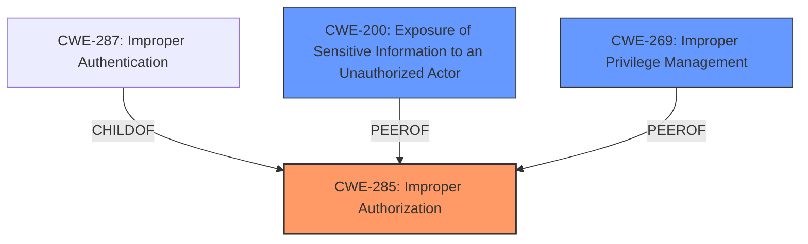

# Raw Analyzer Response for CVE-2025-21548

# Summary
| CWE ID | CWE Name | Confidence | CWE Abstraction Level | CWE Vulnerability Mapping Label | CWE-Vulnerability Mapping Notes |
|---|---|---|---|---|---|
| CWE-285 | Improper Authorization | 0.7 | Class |  Primary | Allowed-with-Review |
| CWE-200 | Exposure of Sensitive Information to an Unauthorized Actor | 0.6 | Class | Secondary | Discouraged |
| CWE-269 | Improper Privilege Management | 0.5 | Class | Secondary | Allowed-with-Review |

## Evidence and Confidence

*   **Confidence Score:** 0.7
*   **Evidence Strength:** MEDIUM

## Relationship Analysis
The primary relationship influencing the decision is the parent-child relationship. CWE-285 is a class-level CWE, and while more specific child CWEs might exist, the provided information doesn't give enough detail to pinpoint a more specific weakness. CWE-200 is included because the vulnerability description mentions unauthorized read access, which aligns with information exposure. CWE-269 is related to the high privileged attacker and the ability to modify data and cause a hang or crash, so it is related to privilege management.

## Vulnerability Chain
The vulnerability chain starts with a **high privileged attacker** gaining network access. The **missing or improper authorization** (CWE-285) leads to unauthorized access to critical data, resulting in unauthorized creation, deletion, or modification of data, unauthorized read access (CWE-200), and the ability to cause a denial of service. The **improper privilege management** (CWE-269) enables the attacker to perform actions they should not be authorized to do.

## Summary of Analysis
The analysis is based on the provided vulnerability description and the retriever results. The primary issue appears to be a lack of proper authorization, leading to several impacts.

The vulnerability description states: "Easily exploitable vulnerability allows **high privileged attacker** with network access via multiple protocols to compromise MySQL Connectors. Successful attacks require human interaction from a person other than the attacker. Successful attacks of this vulnerability can result in unauthorized creation, deletion or modification access to critical data or all MySQL Connectors accessible data as well as **unauthorized read access** to a subset of MySQL Connectors accessible data and unauthorized ability to cause a hang or frequently repeatable crash (complete DOS) of MySQL Connectors."

This points to **improper authorization** (CWE-285), as the attacker is able to perform unauthorized actions. The **unauthorized read access** is also related to information exposure (CWE-200). Finally, the **high privileged attacker** being able to modify data and cause a hang or crash could be related to **improper privilege management** (CWE-269).

The retriever results listed several potential CWEs, but many were related to specific types of input validation or encoding issues, which are not explicitly mentioned in the vulnerability description. CWE-285, although discouraged, is a reasonable fit at the class level given the lack of more specific information. CWE-200 is a reasonable fit at the class level, and CWE-269 is related to privilege management.

I am reasonably confident in this assessment.

Relevant CWE Information:

# Enhanced Context (25 CWEs)

## CWE-303: Incorrect Implementation of Authentication Algorithm
**Abstraction Level**: Base
**Similarity Score**: 0.71
**Source**: dense

**Description**:
The requirements for the product dictate the use of an established authentication algorithm, but the implementation of the algorithm is incorrect.

**Mapping Guidance**:
- Usage: Allowed
- Rationale: This CWE entry is at the Base level of abstraction, which is a preferred level of abstraction for mapping to the root causes of vulnerabilities.

*This is not selected because the vulnerability description doesn't mention any specific issues with authentication algorithms.*

## CWE-294: Authentication Bypass by Capture-replay
**Abstraction Level**: Base
**Similarity Score**: 0.70
**Source**: dense

**Description**:
A capture-replay flaw exists when the design of the product makes it possible for a malicious user to sniff network traffic and bypass authentication by replaying it to the server in question to the same effect as the original message (or with minor changes).

**Mapping Guidance**:
- Usage: Allowed
- Rationale: This CWE entry is at the Base level of abstraction, which is a preferred level of abstraction for mapping to the root causes of vulnerabilities.

*This is not selected because the vulnerability description doesn't mention anything about capture-replay flaws.*

## CWE-497: Exposure of Sensitive System Information to an Unauthorized Control Sphere
**Abstraction Level**: Base
**Similarity Score**: 0.70
**Source**: dense

**Description**:
The product does not properly prevent sensitive system-level information from being accessed by unauthorized actors who do not have the same level of access to the underlying system as the product does.

**Mapping Guidance**:
- Usage: Allowed
- Rationale: This CWE entry is at the Base level of abstraction, which is a preferred level of abstraction for mapping to the root causes of vulnerabilities.

*This is not selected because CWE-200 is a better fit for the **unauthorized read access**.*

## CWE-89: Improper Neutralization of Special Elements used in an SQL Command ('SQL Injection')
**Abstraction Level**: Base
**Similarity Score**: 0.70
**Source**: dense

**Description**:
The product constructs all or part of an SQL command using externally-influenced input from an upstream component, but it does not neutralize or incorrectly neutralizes special elements that could modify the intended SQL command when it is sent to a downstream component. Without sufficient removal or quoting of SQL syntax in user-controllable inputs, the generated SQL query can cause those inputs to be interpreted as SQL instead of ordinary user data.

**Mapping Guidance**:
- Usage: Allowed
- Rationale: This CWE entry is at the Base level of abstraction, which is a preferred level of abstraction for mapping to the root causes of vulnerabilities.

*This is not selected because the vulnerability description doesn't mention SQL injection.*

## CWE-941: Incorrectly Specified Destination in a Communication Channel
**Abstraction Level**: Base
**Similarity Score**: 0.69
**Source**: dense

**Description**:
The product creates a communication channel to initiate an outgoing request to an actor, but it does not correctly specify the intended destination for that actor.

**Mapping Guidance**:
- Usage: Allowed
- Rationale: This CWE entry is at the Base level of abstraction, which is a preferred level of abstraction for mapping to the root causes of vulnerabilities.

*This is not selected because the vulnerability description doesn't mention anything about communication channels.*

## CWE-129: Improper Validation of Array Index
**Abstraction Level**: Variant
**Similarity Score**: 0.69
**Source**: dense

**Description**:
The product uses untrusted input when calculating or using an array index, but the product does not validate or incorrectly validates the index to ensure the index references a valid position within the array.

**Mapping Guidance**:
- Usage: Allowed
- Rationale: This CWE entry is at the Variant level of abstraction, which is a preferred level of abstraction for mapping to the root causes of vulnerabilities.

*This is not selected because the vulnerability description doesn't mention array index issues.*

## CWE-502: Deserialization of Untrusted Data
**Abstraction Level**: Base
**Similarity Score**: 0.69
**Source**: dense

**Description**:
The product deserializes untrusted data without sufficiently ensuring that the resulting data will be valid.

**Mapping Guidance**:
- Usage: Allowed
- Rationale: This CWE entry is at the Base level of abstraction, which is a preferred level of abstraction for mapping to the root causes of vulnerabilities.

*This is not selected because the vulnerability description doesn't mention deserialization issues.*

## CWE-116: Improper Encoding or Escaping of Output
**Abstraction Level**: Class
**Similarity Score**: 0.69
**Source**: dense

**Description**:
The product prepares a structured message for communication with another component, but encoding or escaping of the data is either missing or done incorrectly. As a result, the intended structure of the message is not preserved.

**Mapping Guidance**:
- Usage: Allowed-with-Review
- Rationale: This CWE entry is a Class and might have Base-level children that would be more appropriate

*This is not selected because the vulnerability description doesn't mention encoding or escaping issues.*

## CWE-139