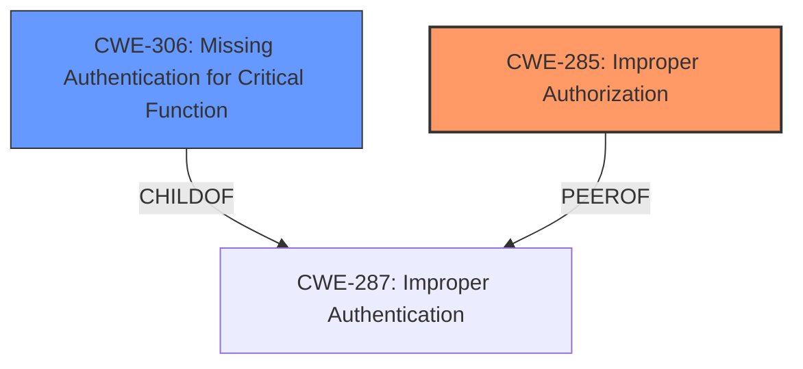

# Raw Analyzer Response for CVE-2025-21586

# Summary
| CWE ID | CWE Name | Confidence | CWE Abstraction Level | CWE Vulnerability Mapping Label | CWE-Vulnerability Mapping Notes |
|---|---|---|---|---|---|
| CWE-285 | Improper Authorization | 0.75 | Class | Primary | Discouraged |
| CWE-306 | Missing Authentication for Critical Function | 0.6 | Base | Secondary | Allowed |

## Evidence and Confidence

*   **Confidence Score:** 0.7
*   **Evidence Strength:** MEDIUM

## Relationship Analysis
The primary CWE selected is CWE-285, "Improper Authorization," which is a Class-level CWE. While it is generally discouraged to map to Class-level CWEs, the description indicates a general authorization issue without specifying a more detailed root cause. CWE-306, "Missing Authentication for Critical Function," is added as a secondary CWE because the description mentions the attacker is low privileged, and that could indicate there is a function missing authentication.

## Vulnerability Chain
The vulnerability chain starts with a **missing or improper authorization** check (CWE-285) or a **missing authentication** (CWE-306). This leads to unauthorized data access (update, insert, delete, read).

## Summary of Analysis
The vulnerability description indicates that a low-privileged attacker can compromise the JD Edwards EnterpriseOne Tools via HTTP, leading to unauthorized data access. The core issue seems to be related to how authorization is handled, which aligns with CWE-285 "Improper Authorization". The attacker being low privileged suggests that a function might be missing authentication, hence CWE-306.

The primary evidence from the vulnerability description is:
"Easily exploitable vulnerability allows low privileged attacker with network access via HTTP to compromise JD Edwards EnterpriseOne Tools. Successful attacks require human interaction from a person other than the attacker and while the vulnerability is in JD Edwards EnterpriseOne Tools, attacks may significantly impact additional products (scope change). Successful attacks of this vulnerability can result in unauthorized update, insert or delete access to some of JD Edwards EnterpriseOne Tools accessible data as well as unauthorized read access to a subset of JD Edwards EnterpriseOne Tools accessible data."

I considered other CWEs, but they were less fitting:
*   CWE-306 "Missing Authentication for Critical Function" was considered but classified as secondary since the vulnerability description points more towards authorization issues.
*   CWE-732 "Incorrect Permission Assignment for Critical Resource" was considered but did not fit as well because the vulnerability is not necessarily about incorrect assignment, but more about a missing check.

Relevant CWE Information:
*   CWE-285: Improper Authorization
    *   Description: The product does not perform or incorrectly performs an authorization check when an actor attempts to access a resource or perform an action.
    *   Mapping Guidance: Discouraged, because it is high-level. However, without more information, it is the best fit.
*   CWE-306: Missing Authentication for Critical Function
    *   Description: The product does not perform any authentication for functionality that requires a provable user identity or consumes a significant amount of resources.
    *   Mapping Guidance: Allowed.