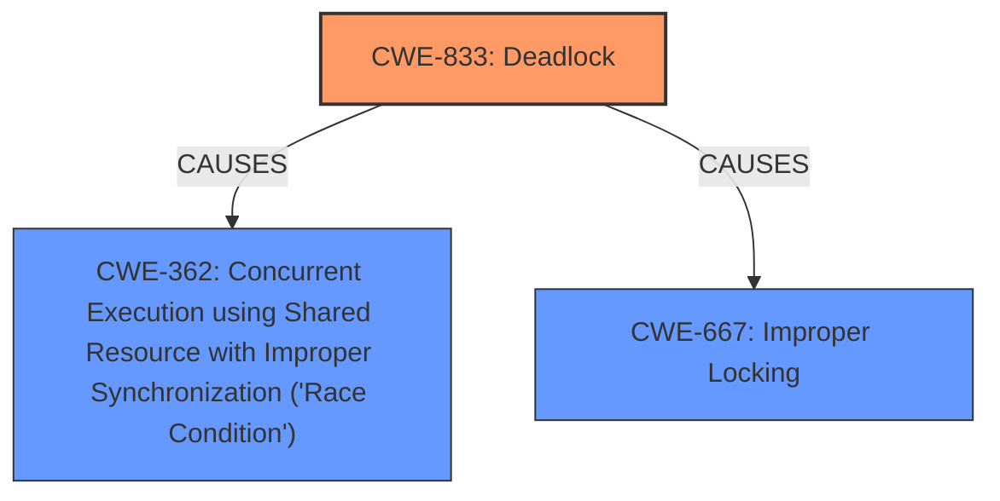

# Enhanced Analysis for CVE-2025-21634

# Summary
| CWE ID | CWE Name | Confidence | CWE Abstraction Level | CWE Vulnerability Mapping Label | CWE-Vulnerability Mapping Notes |
|---|---|---|---|---|---|
| CWE-833 | Deadlock | 0.7 | Base | Primary | Allowed |
| CWE-362 | Concurrent Execution using Shared Resource with Improper Synchronization ('Race Condition') | 0.6 | Class | Secondary | Allowed-with-Review |
| CWE-667 | Improper Locking | 0.5 | Class | Secondary | Allowed-with-Review |

## Evidence and Confidence

*   **Confidence Score:** 0.7
*   **Evidence Strength:** MEDIUM

## Relationship Analysis
The primary relationship that influenced the decision was the presence of deadlock scenarios. While **CWE-362** [Concurrent Execution using Shared Resource with Improper Synchronization ('Race Condition')] and **CWE-667** [Improper Locking] are related, **CWE-833** [Deadlock] is a more specific outcome of these conditions. The analysis also considered that **CWE-833** [Deadlock] is a Base level CWE, while **CWE-362** [Concurrent Execution using Shared Resource with Improper Synchronization ('Race Condition')] and **CWE-667** [Improper Locking] are Class level CWEs.



## Vulnerability Chain
The vulnerability chain starts with asynchronous execution leading to potential circular locking dependencies. The breaking of active protection to avoid deadlock introduces a warning condition which could be fixed by removing the protection breaking operation now that the original deadlock source is gone.
  - **Root Cause:** Asynchronous execution and circular locking dependencies
  - **Intermediate:** Breaking active protection to avoid deadlock
  - **Impact:** Warning due to concurrent cgroup removal

## Summary of Analysis
The initial assessment focused on identifying the root cause of the vulnerability. The description clearly states that the vulnerability is related to a **deadlock** scenario in the Linux kernel's cgroup/cpuset component. The evidence from the vulnerability description supports this assessment: "This change involves calling flush_work(), which can create a multiple processes circular locking dependency that involve cgroup_mutex, potentially leading to a deadlock." Based on this evidence, **CWE-833** [Deadlock] was selected as the primary CWE.

The retriever results also listed **CWE-362** [Concurrent Execution using Shared Resource with Improper Synchronization ('Race Condition')] and **CWE-667** [Improper Locking] as potential candidates. These CWEs were considered as secondary because they represent conditions that could lead to a **deadlock**, but the description explicitly mentions the **deadlock** itself.

The analysis also considered the relationships between the CWEs. **CWE-362** [Concurrent Execution using Shared Resource with Improper Synchronization ('Race Condition')] and **CWE-667** [Improper Locking] can contribute to **CWE-833** [Deadlock].

The final decision was based on the evidence from the vulnerability description and the relationships between the CWEs. **CWE-833** [Deadlock] was selected as the primary CWE because it directly represents the vulnerability, while **CWE-362** [Concurrent Execution using Shared Resource with Improper Synchronization ('Race Condition')] and **CWE-667** [Improper Locking] were considered as contributing factors.

The selected CWEs are at the optimal level of specificity because they accurately represent the vulnerability and its contributing factors. **CWE-833** [Deadlock] is a Base level CWE, which is preferred for mapping to the root causes of vulnerabilities. **CWE-362** [Concurrent Execution using Shared Resource with Improper Synchronization ('Race Condition')] and **CWE-667** [Improper Locking] are Class level CWEs, which provide additional context about the conditions that could lead to the **deadlock**.


## CWE Relationship Analysis

Current CWEs represent these abstraction levels: .


### Vulnerability Chain Analysis

**Chain starting from CWE-667:**
- 667 (Improper Locking) - ROOT


**Chain starting from CWE-833:**
- 833 (Deadlock) - ROOT


### CWE Relationship Diagram

```mermaid
graph TD
    classDef primary fill:#f96,stroke:#333,stroke-width:2px
    classDef secondary fill:#69f,stroke:#333
    classDef tertiary fill:#9e9,stroke:#333
```