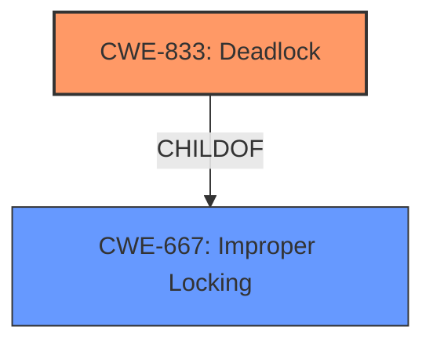

# Enhanced Analysis for CVE-2025-21674

# Summary
| CWE ID | CWE Name | Confidence | CWE Abstraction Level | CWE Vulnerability Mapping Label | CWE-Vulnerability Mapping Notes |
|---|---|---|---|---|---|
| CWE-833 | Deadlock | 0.9 | Base | Primary | Allowed |
| CWE-667 | Improper Locking | 0.7 | Class | Secondary | Allowed-with-Review |

## Evidence and Confidence

*   **Confidence Score:** 0.8
*   **Evidence Strength:** MEDIUM

## Relationship Analysis
The primary relationship that influenced the decision was the parent-child relationship between CWE-667 (Improper Locking) and CWE-833 (Deadlock). Since the vulnerability description explicitly mentions a deadlock scenario arising from lock contention, the more specific CWE-833 was chosen as the primary. CWE-667 is still relevant as a contributing factor, representing the general class of improper locking issues that can lead to deadlocks.



## Vulnerability Chain
The vulnerability chain starts with an **inversion dependency** between locks, leading to a deadlock, which then results in a kernel panic.

## Summary of Analysis
The initial analysis considered several CWEs based on the retriever results, but the core issue appears to be a deadlock. The evidence from the vulnerability description clearly points to a locking **inversion dependency** that results in a deadlock, causing a kernel panic. This evidence is strongest for CWE-833.

The description explicitly states: "WARNING SOFTIRQ-safe -> SOFTIRQ-unsafe lock order detected" and "*** DEADLOCK ***".

CWE-833 (Deadlock) is at the optimal level of specificity because it directly describes the observed issue. CWE-667 (Improper Locking) is a more general category, but the vulnerability description provides enough information to pinpoint the problem as a deadlock.

Relevant CWE Information:

# Enhanced Context (25 CWEs)
The following CWEs were identified as potentially relevant to this vulnerability:

## CWE-667: Improper Locking
**Abstraction Level**: Class
**Similarity Score**: 0.80
**Source**: dense

**Description**:
The product does not properly acquire or release a lock on a resource, leading to unexpected resource state changes and behaviors.

**Mapping Guidance**:
- Usage: Allowed-with-Review
- Rationale: This CWE entry is a Class and might have Base-level children that would be more appropriate

## CWE-833: Deadlock
**Abstraction Level**: Base
**Similarity Score**: 0.77
**Source**: dense

**Description**:
The product contains multiple threads or executable segments that are waiting for each other to release a necessary lock, resulting in deadlock.

**Mapping Guidance**:
- Usage: Allowed
- Rationale: This CWE entry is at the Base level of abstraction, which is a preferred level of abstraction for mapping to the root causes of vulnerabilities.

## CWE-833
CWE-833 (Deadlock)

*   **Explanation:** The vulnerability description clearly indicates a deadlock situation due to an **inversion dependency** in lock acquisition order. The system hangs because multiple threads are waiting for each other to release locks.
*   **Security Implications:** Deadlocks can cause denial of service by freezing system resources and preventing further operations.
*   **Relationship:** CWE-833 is a child of CWE-667 (Improper Locking).
*   **Primary/Secondary:** Primary.
*   **Mapping Guidance Influence:** The "Allowed" usage for CWE-833 and its Base abstraction level makes it a suitable choice.

## CWE-667
CWE-667 (Improper Locking)

*   **Explanation:** This CWE represents the general class of improper locking issues. While the specific issue is a deadlock, improper locking is the underlying cause.
*   **Security Implications:** Improper locking can lead to race conditions, deadlocks, and other concurrency issues that can compromise system integrity and availability.
*   **Relationship:** CWE-667 is the parent of CWE-833.
*   **Primary/Secondary:** Secondary.
*   **Mapping Guidance Influence:** The "Allowed-with-Review" usage acknowledges that more specific CWEs might be available.

Other CWEs Considered:

*   CWE-367 (Time-of-check Time-of-use (TOCTOU) Race Condition): While concurrency is involved, the vulnerability is not a TOCTOU race condition. It's a deadlock caused by lock inversion.
*   CWE-362 (Concurrent Execution using Shared Resource with Improper Synchronization ('Race Condition')) and CWE-667 (Improper Locking) are more general and less specific than CWE-833. The detailed description points to a deadlock, so CWE-833 is a better fit.


## CWE Relationship Analysis

Current CWEs represent these abstraction levels: .


### Vulnerability Chain Analysis

**Chain starting from CWE-667:**
- 667 (Improper Locking) - ROOT


**Chain starting from CWE-833:**
- 833 (Deadlock) - ROOT


### CWE Relationship Diagram

```mermaid
graph TD
    classDef primary fill:#f96,stroke:#333,stroke-width:2px
    classDef secondary fill:#69f,stroke:#333
    classDef tertiary fill:#9e9,stroke:#333
```