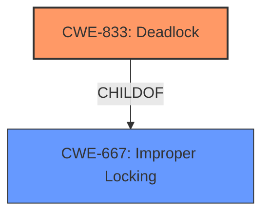

# Analysis Report for CVE-2025-21674

# Vulnerability Analysis Report: CVE-2025-21674

## Description

In the Linux kernel, the following vulnerability has been resolved net/mlx5e Fix **inversion dependency** warning while enabling IPsec tunnel Attempt to enable IPsec packet offload in tunnel mode in debug kernel generates the following kernel panic, which is happening due to two issues 1. In SA add section, the should be _bh() variant when marking SA mode. 2. There is not needed flush_workqueue in SA delete routine. It is not needed as at this stage as it is removed from SADB and the running work will be canceled later in SA free. ===================================================== WARNING SOFTIRQ-safe -> SOFTIRQ-unsafe lock order detected 6.12.0+ #4 Not tainted ----------------------------------------------------- charon/1337 [HC0[0]SC0[4]HE1SE0] is trying to acquire ffff88810f365020 (&xa->xa_lock#24){+.+.}-{33}, at mlx5e_xfrm_del_state+0xca/0x1e0 [mlx5_core] and this task is already holding ffff88813e0f0d48 (&x->lock){+.-.}-{33}, at xfrm_state_delete+0x16/0x30 which would create a new lock dependency (&x->lock){+.-.}-{33} -> (&xa->xa_lock#24){+.+.}-{33} but this new dependency connects a SOFTIRQ-irq-safe lock (&x->lock){+.-.}-{33} ... which became SOFTIRQ-irq-safe at lock_acquire+0x1be/0x520 _raw_spin_lock_bh+0x34/0x40 xfrm_timer_handler+0x91/0xd70 __hrtimer_run_queues+0x1dd/0xa60 hrtimer_run_softirq+0x146/0x2e0 handle_softirqs+0x266/0x860 irq_exit_rcu+0x115/0x1a0 sysvec_apic_timer_interrupt+0x6e/0x90 asm_sysvec_apic_timer_interrupt+0x16/0x20 default_idle+0x13/0x20 default_idle_call+0x67/0xa0 do_idle+0x2da/0x320 cpu_startup_entry+0x50/0x60 start_secondary+0x213/0x2a0 common_startup_64+0x129/0x138 to a SOFTIRQ-irq-unsafe lock (&xa->xa_lock#24){+.+.}-{33} ... which became SOFTIRQ-irq-unsafe at ... lock_acquire+0x1be/0x520 _raw_spin_lock+0x2c/0x40 xa_set_mark+0x70/0x110 mlx5e_xfrm_add_state+0xe48/0x2290 [mlx5_core] xfrm_dev_state_add+0x3bb/0xd70 xfrm_add_sa+0x2451/0x4a90 xfrm_user_rcv_msg+0x493/0x880 netlink_rcv_skb+0x12e/0x380 xfrm_netlink_rcv+0x6d/0x90 netlink_unicast+0x42f/0x740 netlink_sendmsg+0x745/0xbe0 __sock_sendmsg+0xc5/0x190 __sys_sendto+0x1fe/0x2c0 __x64_sys_sendto+0xdc/0x1b0 do_syscall_64+0x6d/0x140 entry_SYSCALL_64_after_hwframe+0x4b/0x53 other info that might help us debug this Possible interrupt unsafe locking scenario CPU0 CPU1 ---- ---- lock(&xa->xa_lock#24) local_irq_disable() lock(&x->lock) lock(&xa->xa_lock#24) lock(&x->lock) *** DEADLOCK *** 2 locks held by charon/1337 #0 ffffffff87f8f858 (&net->xfrm.xfrm_cfg_mutex){+.+.}-{44}, at xfrm_netlink_rcv+0x5e/0x90 #1 ffff88813e0f0d48 (&x->lock){+.-.}-{33}, at xfrm_state_delete+0x16/0x30 the dependencies between SOFTIRQ-irq-safe lock and the holding lock -> (&x->lock){+.-.}-{33} ops 29 { HARDIRQ-ON-W at lock_acquire+0x1be/0x520 _raw_spin_lock_bh+0x34/0x40 xfrm_alloc_spi+0xc0/0xe60 xfrm_alloc_userspi+0x5f6/0xbc0 xfrm_user_rcv_msg+0x493/0x880 netlink_rcv_skb+0x12e/0x380 xfrm_netlink_rcv+0x6d/0x90 netlink_unicast+0x42f/0x740 netlink_sendmsg+0x745/0xbe0 __sock_sendmsg+0xc5/0x190 __sys_sendto+0x1fe/0x2c0 __x64_sys_sendto+0xdc/0x1b0 do_syscall_64+0x6d/0x140 entry_SYSCALL_64_after_hwframe+0x4b/0x53 IN-SOFTIRQ-W at lock_acquire+0x1be/0x520 _raw_spin_lock_bh+0x34/0x40 xfrm_timer_handler+0x91/0xd70 __hrtimer_run_queues+0x1dd/0xa60 ---truncated---

## Vulnerability Description Key Phrases

- **Rootcause:** inversion dependency
- **Impact:** kernel panic
- **Product:** Linux kernel
- **Component:** net/mlx5e

## Analysis (with Relationship Data)

# Summary
| CWE ID | CWE Name | Confidence | CWE Abstraction Level | CWE Vulnerability Mapping Label | CWE-Vulnerability Mapping Notes |
|---|---|---|---|---|---|
| CWE-833 | Deadlock | 0.9 | Base | Primary | Allowed |
| CWE-667 | Improper Locking | 0.7 | Class | Secondary | Allowed-with-Review |

## Evidence and Confidence

*   **Confidence Score:** 0.8
*   **Evidence Strength:** MEDIUM

## Relationship Analysis
The primary relationship that influenced the decision was the parent-child relationship between CWE-667 (Improper Locking) and CWE-833 (Deadlock). Since the vulnerability description explicitly mentions a deadlock scenario arising from lock contention, the more specific CWE-833 was chosen as the primary. CWE-667 is still relevant as a contributing factor, representing the general class of improper locking issues that can lead to deadlocks.



## Vulnerability Chain
The vulnerability chain starts with an **inversion dependency** between locks, leading to a deadlock, which then results in a kernel panic.

## Summary of Analysis
The initial analysis considered several CWEs based on the retriever results, but the core issue appears to be a deadlock. The evidence from the vulnerability description clearly points to a locking **inversion dependency** that results in a deadlock, causing a kernel panic. This evidence is strongest for CWE-833.

The description explicitly states: "WARNING SOFTIRQ-safe -> SOFTIRQ-unsafe lock order detected" and "*** DEADLOCK ***".

CWE-833 (Deadlock) is at the optimal level of specificity because it directly describes the observed issue. CWE-667 (Improper Locking) is a more general category, but the vulnerability description provides enough information to pinpoint the problem as a deadlock.

Relevant CWE Information:

# Enhanced Context (25 CWEs)
The following CWEs were identified as potentially relevant to this vulnerability:

## CWE-667: Improper Locking
**Abstraction Level**: Class
**Similarity Score**: 0.80
**Source**: dense

**Description**:
The product does not properly acquire or release a lock on a resource, leading to unexpected resource state changes and behaviors.

**Mapping Guidance**:
- Usage: Allowed-with-Review
- Rationale: This CWE entry is a Class and might have Base-level children that would be more appropriate

## CWE-833: Deadlock
**Abstraction Level**: Base
**Similarity Score**: 0.77
**Source**: dense

**Description**:
The product contains multiple threads or executable segments that are waiting for each other to release a necessary lock, resulting in deadlock.

**Mapping Guidance**:
- Usage: Allowed
- Rationale: This CWE entry is at the Base level of abstraction, which is a preferred level of abstraction for mapping to the root causes of vulnerabilities.

## CWE-833
CWE-833 (Deadlock)

*   **Explanation:** The vulnerability description clearly indicates a deadlock situation due to an **inversion dependency** in lock acquisition order. The system hangs because multiple threads are waiting for each other to release locks.
*   **Security Implications:** Deadlocks can cause denial of service by freezing system resources and preventing further operations.
*   **Relationship:** CWE-833 is a child of CWE-667 (Improper Locking).
*   **Primary/Secondary:** Primary.
*   **Mapping Guidance Influence:** The "Allowed" usage for CWE-833 and its Base abstraction level makes it a suitable choice.

## CWE-667
CWE-667 (Improper Locking)

*   **Explanation:** This CWE represents the general class of improper locking issues. While the specific issue is a deadlock, improper locking is the underlying cause.
*   **Security Implications:** Improper locking can lead to race conditions, deadlocks, and other concurrency issues that can compromise system integrity and availability.
*   **Relationship:** CWE-667 is the parent of CWE-833.
*   **Primary/Secondary:** Secondary.
*   **Mapping Guidance Influence:** The "Allowed-with-Review" usage acknowledges that more specific CWEs might be available.

Other CWEs Considered:

*   CWE-367 (Time-of-check Time-of-use (TOCTOU) Race Condition): While concurrency is involved, the vulnerability is not a TOCTOU race condition. It's a deadlock caused by lock inversion.
*   CWE-362 (Concurrent Execution using Shared Resource with Improper Synchronization ('Race Condition')) and CWE-667 (Improper Locking) are more general and less specific than CWE-833. The detailed description points to a deadlock, so CWE-833 is a better fit.


## CWE Relationship Analysis

Current CWEs represent these abstraction levels: .


### Vulnerability Chain Analysis

**Chain starting from CWE-667:**
- 667 (Improper Locking) - ROOT


**Chain starting from CWE-833:**
- 833 (Deadlock) - ROOT


### CWE Relationship Diagram

```mermaid
graph TD
    classDef primary fill:#f96,stroke:#333,stroke-width:2px
    classDef secondary fill:#69f,stroke:#333
    classDef tertiary fill:#9e9,stroke:#333
```


*Report generated on 2025-07-14 09:43:01*
