# Analysis Report for CVE-2025-21695

# Vulnerability Analysis Report: CVE-2025-21695

## Description

In the Linux kernel, the following vulnerability has been resolved platform/x86 dell-uart-backlight fix serdev race The dell_uart_bl_serdev_probe() function calls devm_serdev_device_open() before setting the client ops via serdev_device_set_client_ops(). This ordering can trigger a **NULL pointer dereference** in the serdev controllers receive_buf handler, as it assumes serdev->ops is valid when SERPORT_ACTIVE is set. This is similar to the issue fixed in commit 5e700b384ec1 (platform/chrome cros_ec_uart properly fix **race condition**) where devm_serdev_device_open() was called before fully initializing the device. Fix the race by ensuring client ops are set before enabling the port via devm_serdev_device_open(). Note, serdev_device_set_baudrate() and serdev_device_set_flow_control() calls should be after the devm_serdev_device_open() call.

## Vulnerability Description Key Phrases

- **Rootcause:** race condition
- **Weakness:** NULL pointer dereference
- **Product:** Linux kernel
- **Component:** dell_uart_bl_serdev_probe() function

## Analysis (with Relationship Data)

# Summary
| CWE ID  | CWE Name                                                                                   | Confidence | CWE Abstraction Level | CWE Vulnerability Mapping Label | CWE-Vulnerability Mapping Notes |
| :-------- | :----------------------------------------------------------------------------------------- | :---------- | :----------------------- | :------------------------------ | :-------------------------------- |
| CWE-362   | Concurrent Execution using Shared Resource with Improper Synchronization ('Race Condition') | 0.9         | Class                    | Primary                         | Allowed-with-Review               |
| CWE-476   | NULL Pointer Dereference                                                                  | 0.8         | Base                     | Secondary                       | Allowed                           |

## Evidence and Confidence

*   **Confidence Score:** 0.85
*   **Evidence Strength:** MEDIUM

## Relationship Analysis
The primary weakness is a race condition (CWE-362) which leads to a NULL pointer dereference (CWE-476). CWE-362 is a Class-level CWE, and child CWEs like CWE-367 (Time-of-check Time-of-use Race Condition) could be considered, but the description doesn't provide enough information to determine if it's a TOCTOU issue. CWE-476 is a Base-level CWE and accurately describes the direct consequence of the race condition. The retriever results support both CWEs, with CWE-362 having the highest score.

```mermaid
graph TD
    cwe362["CWE-362: Concurrent Execution using Shared Resource with Improper Synchronization ('Race Condition')"]
    cwe476["CWE-476: NULL Pointer Dereference"]

    cwe476 -- CANFOLLOW --> cwe362
    cwe476 -- CHILDOF --> CWE754["CWE-754: Improper Check for Unusual or Exceptional Conditions"]
    cwe362 -- CHILDOF --> CWE367["CWE-367: Time-of-check Time-of-use (TOCTOU) Race Condition"]

    classDef primary fill:#f96,stroke:#333,stroke-width:2px
    classDef secondary fill:#69f,stroke:#333
    class cwe362 primary
    class cwe476 secondary
```



## Vulnerability Chain
The vulnerability chain starts with a **race condition** (CWE-362) in the `dell_uart_bl_serdev_probe()` function. This **race condition** occurs because `devm_serdev_device_open()` is called before the client ops are set via `serdev_device_set_client_ops()`. Because of this ordering, the `serdev` structure's `ops` field might be invalid when `SERPORT_ACTIVE` is set, leading to a **NULL pointer dereference** (CWE-476) in the `receive_buf` handler.

## Summary of Analysis
The analysis is based on the provided vulnerability description and the retriever results. The description explicitly mentions a **race condition** and a **NULL pointer dereference**, making CWE-362 and CWE-476 the most relevant CWEs. The retriever results also list these CWEs with high scores.

The vulnerability description states: "This ordering can trigger a **NULL pointer dereference** in the serdev controllers receive_buf handler, as it assumes serdev->ops is valid when SERPORT_ACTIVE is set." This statement directly supports the selection of CWE-476 as a secondary weakness resulting from the race condition. The fix involves ensuring client ops are set before enabling the port, which directly addresses the **race condition**.

CWE-362 is selected as the primary CWE because the **race condition** is the root cause of the vulnerability. The **NULL pointer dereference** is a consequence of this **race condition**. Both CWEs are at appropriate levels of specificity.

# Enhanced Context (25 CWEs)
The following CWEs were identified as potentially relevant to this vulnerability:

## CWE-362: Concurrent Execution using Shared Resource with Improper Synchronization ('Race Condition')
**Abstraction Level**: Class
**Similarity Score**: 0.77
**Source**: dense

**Description**:
The product contains a concurrent code sequence that requires temporary, exclusive access to a shared resource, but a timing window exists in which the shared resource can be modified by another code sequence operating concurrently.

**Mapping Guidance**:
- Usage: Allowed-with-Review
- Rationale: This CWE entry is a Class and might have Base-level children that would be more appropriate

## CWE-366: Race Condition within a Thread
**Abstraction Level**: Base
**Similarity Score**: 0.76
**Source**: dense

**Description**:
If two threads of execution use a resource simultaneously, there exists the possibility that resources may be used while invalid, in turn making the state of execution undefined.

**Mapping Guidance**:
- Usage: Allowed
- Rationale: This CWE entry is at the Base level of abstraction, which is a preferred level of abstraction for mapping to the root causes of vulnerabilities.

## CWE-367: Time-of-check Time-of-use (TOCTOU) Race Condition
**Abstraction Level**: Base
**Similarity Score**: 0.76
**Source**: dense

**Description**:
The product checks the state of a resource before using that resource, but the resource's state can change between the check and the use in a way that invalidates the results of the check. This can cause the product to perform invalid actions when the resource is in an unexpected state.

**Mapping Guidance**:
- Usage: Allowed
- Rationale: This CWE entry is at the Base level of abstraction, which is a preferred level of abstraction for mapping to the root causes of vulnerabilities.

## CWE-667: Improper Locking
**Abstraction Level**: Class
**Similarity Score**: 0.75
**Source**: dense

**Description**:
The product does not properly acquire or release a lock on a resource, leading to unexpected resource state changes and behaviors.

**Mapping Guidance**:
- Usage: Allowed-with-Review
- Rationale: This CWE entry is a Class and might have Base-level children that would be more appropriate

## CWE-755: Improper Handling of Exceptional Conditions
**Abstraction Level**: Class
**Similarity Score**: 0.74
**Source**: dense

**Description**:
The product does not handle or incorrectly handles an exceptional condition.

**Mapping Guidance**:
- Usage: Discouraged
- Rationale: This CWE entry is a level-1 Class (i.e., a child of a Pillar). It might have lower-level children that would be more appropriate

## CWE-824: Access of Uninitialized Pointer
**Abstraction Level**: Base
**Similarity Score**: 0.74
**Source**: dense

**Description**:
The product accesses or uses a pointer that has not been initialized.

**Mapping Guidance**:
- Usage: Allowed
- Rationale: This CWE entry is at the Base level of abstraction, which is a preferred level of abstraction for mapping to the root causes of vulnerabilities.

## CWE-476: NULL Pointer Dereference
**Abstraction Level**: Base
**Similarity Score**: 0.74
**Source**: dense

**Description**:
The product dereferences a pointer that it expects to be valid but is NULL.

**Mapping Guidance**:
- Usage: Allowed
- Rationale: This CWE entry is at the Base level of abstraction, which is a preferred level of abstraction for mapping to the root causes of vulnerabilities.

## CWE-822: Untrusted Pointer Dereference
**Abstraction Level**: Base
**Similarity Score**: 0.74
**Source**: dense

**Description**:
The product obtains a value from an untrusted source, converts this value to a pointer, and dereferences the resulting pointer.

**Mapping Guidance**:
- Usage: Allowed
- Rationale: This CWE entry is at the Base level of abstraction, which is a preferred level of abstraction for mapping to the root causes of vulnerabilities.

## CWE-252: Unchecked Return Value
**Abstraction Level**: Base
**Similarity Score**: 0.73
**Source**: dense

**Description**:
The product does not check the return value from a method or function, which can prevent it from detecting unexpected states and conditions.

**Mapping Guidance**:
- Usage: Allowed
- Rationale: This CWE entry is at the Base level of abstraction, which is a preferred level of abstraction for mapping to the root causes of vulnerabilities.

## CWE-754: Improper Check for Unusual or Exceptional Conditions
**Abstraction Level**: Class
**Similarity Score**: 0.73
**Source**: dense

**Description**:
The product does not check or incorrectly checks for unusual or exceptional conditions that are not expected to occur frequently during day to day operation of the product.

**Mapping Guidance**:
- Usage: Allowed-with-Review
- Rationale: This CWE entry is a Class and might have Base-level children that would be more appropriate

## CWE-364: Signal Handler Race Condition
**Abstraction Level**: Base
**Similarity Score**: 514.00
**Source**: sparse

**Description**:
The product uses a signal handler that introduces a race condition.

**Mapping Guidance**:
- Usage: Allowed
- Rationale: This CWE entry is at the Base level of abstraction, which is a preferred level of abstraction for mapping to the root causes of


## CWE Relationship Analysis

Current CWEs represent these abstraction levels: .


### Vulnerability Chain Analysis

**Chain starting from CWE-476:**
- 476 (NULL Pointer Dereference) - ROOT


**Chain starting from CWE-667:**
- 667 (Improper Locking) - ROOT


### CWE Relationship Diagram

```mermaid
graph TD
    classDef primary fill:#f96,stroke:#333,stroke-width:2px
    classDef secondary fill:#69f,stroke:#333
    classDef tertiary fill:#9e9,stroke:#333
```


*Report generated on 2025-07-14 09:44:47*
