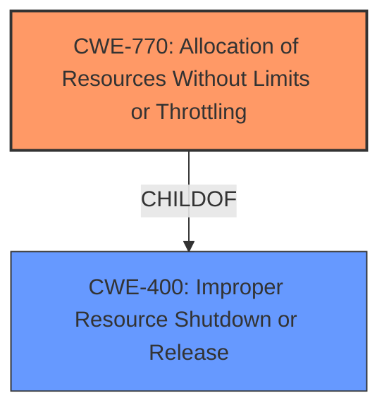

# Analysis Report for CVE-2025-21710

# Vulnerability Analysis Report: CVE-2025-21710

## Description

In the Linux kernel, the following vulnerability has been resolved tcp correct handling of extreme memory squeeze Testing with iperf3 using the pasta protocol splicer has revealed a problem in the way tcp handles window advertising in extreme memory squeeze situations. Under memory pressure, a socket endpoint may temporarily advertise a zero-sized window, but this is not stored as part of the socket data. The reasoning behind this is that it is considered a temporary setting which shouldnt influence any further calculations. However, if we happen to stall at an unfortunate value of the current window size, the algorithm selecting a new value will consistently fail to advertise a non-zero window once we have freed up enough memory. This means that this sides notion of the current window size is different from the one last advertised to the peer, causing the latter to not send any data to resolve the sitution. The problem occurs on the iperf3 server side, and the socket in question is a completely regular socket with the default settings for the fedora40 kernel. We do not use SO_PEEK or SO_RCVBUF on the socket. The following excerpt of a logging session, with own comments added, shows more in detail what is happening // tcp_v4_rcv(->) // tcp_rcv_established(->) [520139222] ==== Activating log @ net/ipv4/tcp_input.c/tcp_data_queue()/5257 ==== [520139222] tcp_data_queue(->) [520139222] DROPPING skb [265600160..265665640], reason SKB_DROP_REASON_PROTO_MEM [rcv_nxt 265600160, rcv_wnd 262144, snt_ack 265469200, win_now 131184] [copied_seq 259909392->260034360 (124968), unread 5565800, qlen 85, ofoq 0] [OFO queue gap 65480, len 0] [520139222] tcp_data_queue(39222] __tcp_transmit_skb(->) [tp->rcv_wup 265469200, tp->rcv_wnd 262144, tp->rcv_nxt 265600160] [520139222] tcp_select_window(->) [520139222] (inet_csk(sk)->icsk_ack.pending & ICSK_ACK_NOMEM) ? --> TRUE [tp->rcv_wup 265469200, tp->rcv_wnd 262144, tp->rcv_nxt 265600160] returning 0 [520139222] tcp_select_window(39222] ADVERTISING WIN 0, ACK_SEQ 265600160 [520139222] [__tcp_transmit_skb(39222] tcp_rcv_established(39222] tcp_v4_rcv(rcv_wnd and tp->rcv_wup accordingly, which means // we unconditionally shrink the window. [520139222] tcp_recvmsg_locked(->) [520139222] __tcp_cleanup_rbuf(->) tp->rcv_wup 265469200, tp->rcv_wnd 262144, tp->rcv_nxt 265600160 [520139222] [new_win = 0, win_now = 131184, 2 * win_now = 262368] [520139222] [new_win >= (2 * win_now) ? --> time_to_ack = 0] [520139222] NOT calling tcp_send_ack() [tp->rcv_wup 265469200, tp->rcv_wnd 262144, tp->rcv_nxt 265600160] [520139222] __tcp_cleanup_rbuf(260040464 (0), unread 5559696, qlen 85, ofoq 0] returning 6104 bytes [520139222] tcp_recvmsg_locked(rcv_wnd. // Meanwhile, the peer thinks the window is zero, and will not send // any more data to trigger an update from the interrupt mode side. [520139222] tcp_recvmsg_locked(->) [520139222] __tcp_cleanup_rbuf(->) tp->rcv_wup 265469200, tp->rcv_wnd 262144, tp->rcv_nxt 265600160 [520139222] [new_win = 262144, win_now = 131184, 2 * win_n ---truncated---

## Vulnerability Description Key Phrases

- **Impact:** not send any data to resolve the situtation
- **Vector:** extreme memory squeeze situations
- **Product:** Linux kernel
- **Component:** tcp

## Analysis (with Relationship Data)

# Summary
| CWE ID | CWE Name | Confidence | CWE Abstraction Level | CWE Vulnerability Mapping Label | CWE-Vulnerability Mapping Notes |
|---|---|---|---|---|---|
| CWE-770 | Allocation of Resources Without Limits or Throttling | 0.7 | Base | Allowed | Primary CWE |
| CWE-400 | Improper Resource Shutdown or Release | 0.6 | Class | Allowed | Secondary Candidate |

## Evidence and Confidence

*   **Confidence Score:** 0.7
*   **Evidence Strength:** MEDIUM

## Relationship Analysis
The primary relationship influencing the decision is the hierarchical relationship between CWE-400 and CWE-770 (CWE-770 is a child of CWE-400). Additionally, the description points to resource allocation problems under memory pressure, suggesting a potential lack of limits which aligns with CWE-770.



## Vulnerability Chain
The vulnerability chain starts with the **improper** handling of resource allocation limits (**CWE-770**). This leads to a state where the system cannot recover from memory pressure, resulting in denial of service or stalled communication (**CWE-400**).

## Summary of Analysis
Initially, the analysis focused on the symptoms of the vulnerability, such as stalled communication. However, by examining the root cause described as the TCP stack not handling window advertisements correctly under extreme memory pressure, it became clear that the issue stems from **improper** resource management. This aligns with **CWE-770 (Allocation of Resources Without Limits or Throttling)**, which describes the allocation of resources without proper limits.

The description mentions "extreme memory squeeze situations" and the algorithm consistently fails to advertise a non-zero window once enough memory has been freed. This indicates the system's **inability** to handle resource allocation under stress. The "not send any data to resolve the situation" impact further indicates resource exhaustion and the inability to recover which is **CWE-400 (Improper Resource Shutdown or Release)**.

The selection of **CWE-770** is at the Base level, providing more specific details about the nature of the resource allocation issue, making it more appropriate than a higher-level Class or Pillar.

Relevant CWE Information:

# Enhanced Context (25 CWEs)
The following CWEs were identified as potentially relevant to this vulnerability:

## CWE-754: Improper Check for Unusual or Exceptional Conditions
**Abstraction Level**: Class
**Similarity Score**: 0.79
**Source**: dense

**Description**:
The product does not check or incorrectly checks for unusual or exceptional conditions that are not expected to occur frequently during day to day operation of the product.

**Mapping Guidance**:
- Usage: Allowed-with-Review
- Rationale: This CWE entry is a Class and might have Base-level children that would be more appropriate

## CWE-755: Improper Handling of Exceptional Conditions
**Abstraction Level**: Class
**Similarity Score**: 0.78
**Source**: dense

**Description**:
The product does not handle or incorrectly handles an exceptional condition.

**Mapping Guidance**:
- Usage: Discouraged
- Rationale: This CWE entry is a level-1 Class (i.e., a child of a Pillar). It might have lower-level children that would be more appropriate

## CWE-617: Reachable Assertion
**Abstraction Level**: Base
**Similarity Score**: 0.78
**Source**: dense

**Description**:
The product contains an assert() or similar statement that can be triggered by an attacker, which leads to an application exit or other behavior that is more severe than necessary.

**Mapping Guidance**:
- Usage: Allowed
- Rationale: This CWE entry is at the Base level of abstraction, which is a preferred level of abstraction for mapping to the root causes of vulnerabilities.

## CWE-696: Incorrect Behavior Order
**Abstraction Level**: Class
**Similarity Score**: 0.78
**Source**: dense

**Description**:
The product performs multiple related behaviors, but the behaviors are performed in the wrong order in ways which may produce resultant weaknesses.

**Mapping Guidance**:
- Usage: Allowed-with-Review
- Rationale: This CWE entry is a Class and might have Base-level children that would be more appropriate

## CWE-212: Improper Removal of Sensitive Information Before Storage or Transfer
**Abstraction Level**: Base
**Similarity Score**: 0.77
**Source**: dense

**Description**:
The product stores, transfers, or shares a resource that contains sensitive information, but it does not properly remove that information before the product makes the resource available to unauthorized actors.

**Mapping Guidance**:
- Usage: Allowed
- Rationale: This CWE entry is at the Base level of abstraction, which is a preferred level of abstraction for mapping to the root causes of vulnerabilities.

## CWE-346: Origin Validation Error
**Abstraction Level**: Class
**Similarity Score**: 0.77
**Source**: dense

**Description**:
The product does not properly verify that the source of data or communication is valid.

**Mapping Guidance**:
- Usage: Allowed-with-Review
- Rationale: This CWE entry is a Class and might have Base-level children that would be more appropriate

## CWE-824: Access of Uninitialized Pointer
**Abstraction Level**: Base
**Similarity Score**: 0.77
**Source**: dense

**Description**:
The product accesses or uses a pointer that has not been initialized.

**Mapping Guidance**:
- Usage: Allowed
- Rationale: This CWE entry is at the Base level of abstraction, which is a preferred level of abstraction for mapping to the root causes of vulnerabilities.

## CWE-923: Improper Restriction of Communication Channel to Intended Endpoints
**Abstraction Level**: Class
**Similarity Score**: 0.77
**Source**: dense

**Description**:
The product establishes a communication channel to (or from) an endpoint for privileged or protected operations, but it does not properly ensure that it is communicating with the correct endpoint.

**Mapping Guidance**:
- Usage: Allowed-with-Review
- Rationale: This CWE entry is a Class and might have Base-level children that would be more appropriate

## CWE-703: Improper Check or Handling of Exceptional Conditions
**Abstraction Level**: Pillar
**Similarity Score**: 0.77
**Source**: dense

**Description**:
The product does not properly anticipate or handle exceptional conditions that rarely occur during normal operation of the product.

**Mapping Guidance**:
- Usage: Discouraged
- Rationale: This CWE entry is extremely high-level, a Pillar.

## CWE-789: Memory Allocation with Excessive Size Value
**Abstraction Level**: Variant
**Similarity Score**: 0.77
**Source**: dense

**Description**:
The product allocates memory based on an untrusted, large size value, but it does not ensure that the size is within expected limits, allowing arbitrary amounts of memory to be allocated.

**Mapping Guidance**:
- Usage: Allowed
- Rationale: This CWE entry is at the Variant level of abstraction, which is a preferred level of abstraction for mapping to the root causes of vulnerabilities.

## CWE-757: Selection of Less-Secure Algorithm During Negotiation ('Algorithm Downgrade')
**Abstraction Level**: Base
**Similarity Score**: 746.87
**Source**: sparse

**Description**:
A protocol or its implementation supports interaction between multiple actors and allows those actors to negotiate which algorithm should be used as a protection mechanism such as encryption or authentication, but it does not select the strongest algorithm that is available to both parties.

**Mapping Guidance**:
- Usage: Allowed
- Rationale: This CWE entry is at the Base level of abstraction, which is a preferred level of abstraction for mapping to the root causes of vulnerabilities.

## CWE-1284: Improper Validation of Specified Quantity in Input
**Abstraction Level**: Base
**Similarity Score**: 724.47
**Source**: sparse

**Description**:
The product receives input that is expected to specify a quantity (such as size or length), but it does not validate or incorrectly validates that the quantity has the required properties.

**Mapping Guidance**:
- Usage: Allowed
- Rationale: This CWE entry is at the Base level of abstraction, which is a preferred level of abstraction for mapping to the root causes of vulnerabilities.

## CWE-362: Concurrent Execution using Shared Resource with Improper Synchronization ('Race Condition')
**Abstraction Level**: Class
**Similarity Score**: 720.31
**Source**: sparse

**Description**:
The product contains a concurrent code sequence that requires temporary, exclusive access to a shared resource, but a timing window exists in which the shared resource can be modified by another code sequence operating concurrently.

**Mapping Guidance**:
- Usage: Allowed-with-Review
- Rationale: This CWE entry is a Class


## CWE Relationship Analysis

Current CWEs represent these abstraction levels: .


### Vulnerability Chain Analysis

**Chain starting from CWE-1284:**
- 1284 (Improper Validation of Specified Quantity in Input) - ROOT


**Chain starting from CWE-400:**
- 400 (Uncontrolled Resource Consumption) - ROOT


### CWE Relationship Diagram

```mermaid
graph TD
    classDef primary fill:#f96,stroke:#333,stroke-width:2px
    classDef secondary fill:#69f,stroke:#333
    classDef tertiary fill:#9e9,stroke:#333
```


*Report generated on 2025-07-14 09:45:31*
