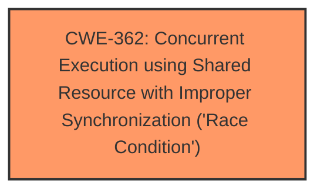

# Enhanced Analysis for CVE-2025-21732

# Summary
| CWE ID | CWE Name | Confidence | CWE Abstraction Level | CWE Vulnerability Mapping Label | CWE-Vulnerability Mapping Notes |
|---|---|---|---|---|---|
| CWE-362 | Concurrent Execution using Shared Resource with Improper Synchronization ('**Race Condition**') | 0.9 | Class | Primary | Allowed-with-Review |

## Evidence and Confidence

*   **Confidence Score:** 0.9
*   **Evidence Strength:** HIGH

## Relationship Analysis
The primary CWE identified is CWE-362, which is a Class-level CWE. While it's generally preferred to map to Base or Variant level CWEs, the description of the vulnerability clearly points to a **race condition** without specifying a more precise type of concurrency issue. Therefore, CWE-362 is the most appropriate choice given the available information.



## Vulnerability Chain
The vulnerability chain is as follows:
1.  **Root Cause:** **Race condition** in RDMA/mlx5 driver during ODP MR deregistration (**CWE-362**)
2.  The **race condition** occurs between `mlx5_revoke_mr()` and `mlx5_ib_invalidate_range()`.
3.  The `lkey` is freed prematurely.
4.  `mlx5_ib_invalidate_range()` attempts to invalidate the freed `lkey`.
5.  **Impact:** CQE with an error on the UMR QP, causing the UMR QP to enter an error state.

## Summary of Analysis
The vulnerability description clearly indicates a **race condition** in the RDMA/mlx5 driver, specifically during the deregistration of an ODP MR. The **race condition** leads to a CQE error and puts the UMR QP into an error state.

The primary indicator for a **race condition** is the concurrent execution of `mlx5_revoke_mr()` and `mlx5_ib_invalidate_range()` on the same `lkey`. The premature freeing of the `lkey` before the invalidation attempt is complete causes the error. The fix implemented involves acquiring a mutex lock to prevent concurrent access to the `lkey` during the revocation process.

The Retriever Results also support this assessment, with CWE-362 having the highest score.

I considered other CWEs such as CWE-367 (Time-of-check Time-of-use (TOCTOU) **Race Condition**) and CWE-366 (**Race Condition** within a Thread), but CWE-362 is more general and accurately describes the overall problem. It is not a TOCTOU vulnerability, because it does not involve a check then use scenario. Also, the description doesn't specify the **race condition** is specifically within a single thread.

Relevant CWE Information:

# Enhanced Context (25 CWEs)
The following CWEs were identified as potentially relevant to this vulnerability:

## CWE-362: Concurrent Execution using Shared Resource with Improper Synchronization ('Race Condition')
**Abstraction Level**: Class
**Similarity Score**: 0.78
**Source**: dense

**Description**:
The product contains a concurrent code sequence that requires temporary, exclusive access to a shared resource, but a timing window exists in which the shared resource can be modified by another code sequence operating concurrently.

**Mapping Guidance**:
- Usage: Allowed-with-Review
- Rationale: This CWE entry is a Class and might have Base-level children that would be more appropriate

## CWE-367: Time-of-check Time-of-use (TOCTOU) Race Condition
**Abstraction Level**: Base
**Similarity Score**: 0.76
**Source**: dense

**Description**:
The product checks the state of a resource before using that resource, but the resource's state can change between the check and the use in a way that invalidates the results of the check. This can cause the product to perform invalid actions when the resource is in an unexpected state.

**Mapping Guidance**:
- Usage: Allowed
- Rationale: This CWE entry is at the Base level of abstraction, which is a preferred level of abstraction for mapping to the root causes of vulnerabilities.

## CWE-366: Race Condition within a Thread
**Abstraction Level**: Base
**Similarity Score**: 0.75
**Source**: dense

**Description**:
If two threads of execution use a resource simultaneously, there exists the possibility that resources may be used while invalid, in turn making the state of execution undefined.

**Mapping Guidance**:
- Usage: Allowed
- Rationale: This CWE entry is at the Base level of abstraction, which is a preferred level of abstraction for mapping to the root causes of vulnerabilities.


## CWE Relationship Analysis

Current CWEs represent these abstraction levels: .


### Vulnerability Chain Analysis

**Chain starting from CWE-366:**
- 366 (Race Condition within a Thread) - ROOT


**Chain starting from CWE-367:**
- 367 (Time-of-check Time-of-use (TOCTOU) Race Condition) - ROOT


### CWE Relationship Diagram

```mermaid
graph TD
    classDef primary fill:#f96,stroke:#333,stroke-width:2px
    classDef secondary fill:#69f,stroke:#333
    classDef tertiary fill:#9e9,stroke:#333
```