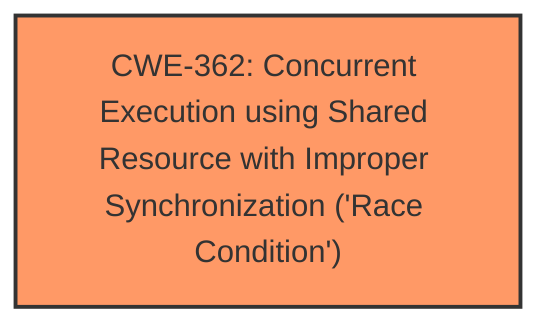

# Analysis Report for CVE-2025-21732

# Vulnerability Analysis Report: CVE-2025-21732

## Description

In the Linux kernel, the following vulnerability has been resolved RDMA/mlx5 Fix a race for an ODP MR which leads to CQE with error This patch addresses a ****race condition** for an ODP MR** that can result in a CQE with an error on the UMR QP. During the __mlx5_ib_dereg_mr() flow, the following sequence of calls occurs mlx5_revoke_mr() mlx5r_umr_revoke_mr() mlx5r_umr_post_send_wait() At this point, the lkey is freed from the hardwares perspective. However, concurrently, mlx5_ib_invalidate_range() might be triggered by another task attempting to invalidate a range for the same freed lkey. This task will - Acquire the umem_odp->umem_mutex lock. - Call mlx5r_umr_update_xlt() on the UMR QP. - Since the lkey has already been freed, this can lead to a CQE error, causing the UMR QP to enter an error state [1]. To resolve this **race condition**, the umem_odp->umem_mutex lock is now also acquired as part of the mlx5_revoke_mr() scope. Upon successful revoke, we set umem_odp->private which points to that MR to NULL, preventing any further invalidation attempts on its lkey. [1] From dmesg infiniband rocep8s0f0 dump_cqe277(pid 0) WC error 6, Message memory bind operation error cqe_dump 00000000 00 00 00 00 00 00 00 00 00 00 00 00 00 00 00 00 cqe_dump 00000010 00 00 00 00 00 00 00 00 00 00 00 00 00 00 00 00 cqe_dump 00000020 00 00 00 00 00 00 00 00 00 00 00 00 00 00 00 00 cqe_dump 00000030 00 00 00 00 08 00 78 06 25 00 11 b9 00 0e dd d2 WARNING CPU 15 PID 1506 at drivers/infiniband/hw/mlx5/umr.c394 mlx5r_umr_post_send_wait+0x15a/0x2b0 [mlx5_ib] Modules linked in ip6table_mangle ip6table_natip6table_filter ip6_tables iptable_mangle xt_conntrack xt_MASQUERADE nf_conntrack_netlink nfnetlink xt_addrtype iptable_nat nf_nat br_netfilter rpcsec_gss_krb5 auth_rpcgss oid_registry overlay rpcrdma rdma_ucm ib_iser libiscsi scsi_transport_iscsi rdma_cm iw_cm ib_umad ib_ipoib ib_cm mlx5_ib ib_uverbs ib_core fuse mlx5_core CPU 15 UID 0 PID 1506 Comm ibv_rc_pingpong Not tainted 6.12.0-rc7+ #1626 Hardware name QEMU Standard PC (Q35 + ICH9, 2009), BIOS rel-1.13.0-0-gf21b5a4aeb02-prebuilt.qemu.org 04/01/2014 RIP 0010mlx5r_umr_post_send_wait+0x15a/0x2b0 [mlx5_ib] [..] Call Trace mlx5r_umr_update_xlt+0x23c/0x3e0 [mlx5_ib] mlx5_ib_invalidate_range+0x2e1/0x330 [mlx5_ib] __mmu_notifier_invalidate_range_start+0x1e1/0x240 zap_page_range_single+0xf1/0x1a0 madvise_vma_behavior+0x677/0x6e0 do_madvise+0x1a2/0x4b0 __x64_sys_madvise+0x25/0x30 do_syscall_64+0x6b/0x140 entry_SYSCALL_64_after_hwframe+0x76/0x7e

## Vulnerability Description Key Phrases

- **Component:** RDMA/mlx5, mlx5_ib_invalidate_range(), mlx5r_umr_post_send_wait()
- **Rootcause:** race condition for an ODP MR
- **Weakness:** race condition
- **Product:** Linux kernel
- **Impact:** cqe with error, CQE with error
- **Version:** 6.12.0-rc7+

## Analysis (with Relationship Data)

# Summary
| CWE ID | CWE Name | Confidence | CWE Abstraction Level | CWE Vulnerability Mapping Label | CWE-Vulnerability Mapping Notes |
|---|---|---|---|---|---|
| CWE-362 | Concurrent Execution using Shared Resource with Improper Synchronization ('**Race Condition**') | 0.9 | Class | Primary | Allowed-with-Review |

## Evidence and Confidence

*   **Confidence Score:** 0.9
*   **Evidence Strength:** HIGH

## Relationship Analysis
The primary CWE identified is CWE-362, which is a Class-level CWE. While it's generally preferred to map to Base or Variant level CWEs, the description of the vulnerability clearly points to a **race condition** without specifying a more precise type of concurrency issue. Therefore, CWE-362 is the most appropriate choice given the available information.



## Vulnerability Chain
The vulnerability chain is as follows:
1.  **Root Cause:** **Race condition** in RDMA/mlx5 driver during ODP MR deregistration (**CWE-362**)
2.  The **race condition** occurs between `mlx5_revoke_mr()` and `mlx5_ib_invalidate_range()`.
3.  The `lkey` is freed prematurely.
4.  `mlx5_ib_invalidate_range()` attempts to invalidate the freed `lkey`.
5.  **Impact:** CQE with an error on the UMR QP, causing the UMR QP to enter an error state.

## Summary of Analysis
The vulnerability description clearly indicates a **race condition** in the RDMA/mlx5 driver, specifically during the deregistration of an ODP MR. The **race condition** leads to a CQE error and puts the UMR QP into an error state.

The primary indicator for a **race condition** is the concurrent execution of `mlx5_revoke_mr()` and `mlx5_ib_invalidate_range()` on the same `lkey`. The premature freeing of the `lkey` before the invalidation attempt is complete causes the error. The fix implemented involves acquiring a mutex lock to prevent concurrent access to the `lkey` during the revocation process.

The Retriever Results also support this assessment, with CWE-362 having the highest score.

I considered other CWEs such as CWE-367 (Time-of-check Time-of-use (TOCTOU) **Race Condition**) and CWE-366 (**Race Condition** within a Thread), but CWE-362 is more general and accurately describes the overall problem. It is not a TOCTOU vulnerability, because it does not involve a check then use scenario. Also, the description doesn't specify the **race condition** is specifically within a single thread.

Relevant CWE Information:

# Enhanced Context (25 CWEs)
The following CWEs were identified as potentially relevant to this vulnerability:

## CWE-362: Concurrent Execution using Shared Resource with Improper Synchronization ('Race Condition')
**Abstraction Level**: Class
**Similarity Score**: 0.78
**Source**: dense

**Description**:
The product contains a concurrent code sequence that requires temporary, exclusive access to a shared resource, but a timing window exists in which the shared resource can be modified by another code sequence operating concurrently.

**Mapping Guidance**:
- Usage: Allowed-with-Review
- Rationale: This CWE entry is a Class and might have Base-level children that would be more appropriate

## CWE-367: Time-of-check Time-of-use (TOCTOU) Race Condition
**Abstraction Level**: Base
**Similarity Score**: 0.76
**Source**: dense

**Description**:
The product checks the state of a resource before using that resource, but the resource's state can change between the check and the use in a way that invalidates the results of the check. This can cause the product to perform invalid actions when the resource is in an unexpected state.

**Mapping Guidance**:
- Usage: Allowed
- Rationale: This CWE entry is at the Base level of abstraction, which is a preferred level of abstraction for mapping to the root causes of vulnerabilities.

## CWE-366: Race Condition within a Thread
**Abstraction Level**: Base
**Similarity Score**: 0.75
**Source**: dense

**Description**:
If two threads of execution use a resource simultaneously, there exists the possibility that resources may be used while invalid, in turn making the state of execution undefined.

**Mapping Guidance**:
- Usage: Allowed
- Rationale: This CWE entry is at the Base level of abstraction, which is a preferred level of abstraction for mapping to the root causes of vulnerabilities.


## CWE Relationship Analysis

Current CWEs represent these abstraction levels: .


### Vulnerability Chain Analysis

**Chain starting from CWE-366:**
- 366 (Race Condition within a Thread) - ROOT


**Chain starting from CWE-367:**
- 367 (Time-of-check Time-of-use (TOCTOU) Race Condition) - ROOT


### CWE Relationship Diagram

```mermaid
graph TD
    classDef primary fill:#f96,stroke:#333,stroke-width:2px
    classDef secondary fill:#69f,stroke:#333
    classDef tertiary fill:#9e9,stroke:#333
```


*Report generated on 2025-07-14 09:46:49*
