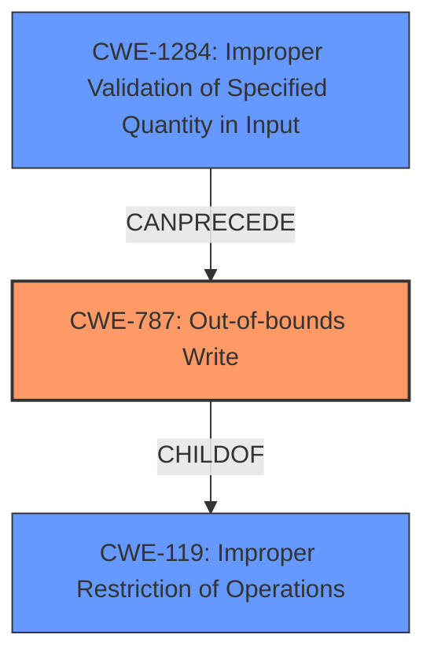

# Analysis Report for CVE-2025-21738

# Vulnerability Analysis Report: CVE-2025-21738

## Description

In the Linux kernel, the following vulnerability has been resolved ata libata-sff Ensure that we cannot **write outside the allocated buffer** reveliofuzzing reported that a SCSI_IOCTL_SEND_COMMAND ioctl with out_len set to 0xd42, SCSI command set to ATA_16 PASS-THROUGH, ATA command set to ATA_NOP, and protocol set to ATA_PROT_PIO, can cause ata_pio_sector() to **write outside the allocated buffer**, overwriting random memory. While a ATA device is supposed to abort a ATA_NOP command, there does seem to be a bug either in libata-sff or QEMU, where either this status is not set, or the status is cleared before read by ata_sff_hsm_move(). Anyway, that is most likely a separate bug. Looking at __atapi_pio_bytes(), it already has a safety check to ensure that __atapi_pio_bytes() cannot **write outside the allocated buffer**. Add a similar check to ata_pio_sector(), such that also ata_pio_sector() cannot **write outside the allocated buffer**.

## Vulnerability Description Key Phrases

- **Weakness:** write outside the allocated buffer
- **Product:** Linux kernel
- **Component:** ata libata-sff

## Analysis (with Relationship Data)

# Summary
| CWE ID | CWE Name | Confidence | CWE Abstraction Level | CWE Vulnerability Mapping Label | CWE-Vulnerability Mapping Notes |
|---|---|---|---|---|---|
| CWE-787 | Out-of-bounds Write | 1.0 | Base | Primary | Allowed |
| CWE-1284 | Improper Validation of Specified Quantity in Input | 0.7 | Base | Secondary | Allowed |

## Evidence and Confidence

*   **Confidence Score:** 0.9
*   **Evidence Strength:** HIGH

## Relationship Analysis
The primary relationship that influenced my decision was the parent-child relationship between CWE-119 (Improper Restriction of Operations within the Bounds of a Memory Buffer) and CWE-787 (Out-of-bounds Write). CWE-787 is a more specific instance of CWE-119, and the vulnerability description explicitly mentions a write operation outside the allocated buffer, making CWE-787 the more appropriate choice. Additionally, CWE-1284 (Improper Validation of Specified Quantity in Input) can precede CWE-787 in a vulnerability chain, where an improperly validated quantity leads to an out-of-bounds write.



## Vulnerability Chain
The vulnerability chain begins with the **improper handling of the out_len value** in the `SCSI_IOCTL_SEND_COMMAND` ioctl. This leads to `ata_pio_sector()` function to **write outside the allocated buffer**, resulting in memory corruption.

*   Root Cause: **Improper handling of out_len** (potentially related to a missing or incorrect size check, but not explicitly stated).
*   Weakness: CWE-787 (Out-of-bounds Write) - Writing outside the allocated buffer.
*   Impact: Overwriting random memory.

## Summary of Analysis
The primary weakness is clearly an out-of-bounds write (CWE-787), as the vulnerability description states multiple times that the issue involves **writing outside the allocated buffer**. The description "ensure that we cannot **write outside the allocated buffer**" and "can cause ata_pio_sector() to **write outside the allocated buffer**, overwriting random memory" strongly supports this. While the root cause isn't explicitly stated, the provided information suggests it is related to the improper validation of the `out_len` parameter.

The retriever results also suggest CWE-787 as a strong candidate.

CWE-1284 (Improper Validation of Specified Quantity in Input) is considered a secondary CWE because the description mentions the `out_len` being set to 0xd42, and the vulnerability occurs when this value is not properly validated. This aligns with CWE-1284's description: "The product receives input that is expected to specify a quantity (such as size or length), but it does not validate or incorrectly validates that the quantity has the required properties."

Other CWEs were considered but ultimately deemed less relevant:

*   CWE-190 (Integer Overflow or Wraparound): While an integer overflow could theoretically contribute to an incorrect buffer size calculation, there's no direct evidence of this in the description.
*   CWE-125 (Out-of-bounds Read): The vulnerability focuses on writing, not reading, outside the buffer.
*   CWE-131 (Incorrect Calculation of Buffer Size): While related, the description emphasizes the out-of-bounds write itself rather than the buffer size calculation. Also, the code fix was not related to buffer size, but rather an explicit bounds check.

I am confident in the selection of CWE-787 as the primary weakness and CWE-1284 as a secondary contributing factor. The evidence directly supports the out-of-bounds write, and the relationship analysis clarifies the connection to improper input validation.

Relevant CWE Information:


## CWE Relationship Analysis

Current CWEs represent these abstraction levels: .


### Vulnerability Chain Analysis

**Chain starting from CWE-1284:**
- 1284 (Improper Validation of Specified Quantity in Input) - ROOT


**Chain starting from CWE-125:**
- 125 (Out-of-bounds Read) - ROOT


### CWE Relationship Diagram

```mermaid
graph TD
    classDef primary fill:#f96,stroke:#333,stroke-width:2px
    classDef secondary fill:#69f,stroke:#333
    classDef tertiary fill:#9e9,stroke:#333
```


*Report generated on 2025-07-14 09:47:05*
