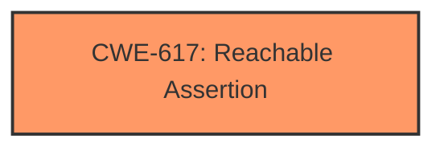

# Analysis Report for CVE-2025-21754

# Vulnerability Analysis Report: CVE-2025-21754

## Description

In the Linux kernel, the following vulnerability has been resolved btrfs fix **assertion failure** when splitting ordered extent after transaction abort If while we are doing a direct IO write a transaction abort happens, we mark all existing ordered extents with the BTRFS_ORDERED_IOERR flag (done at btrfs_destroy_ordered_extents()), and then after that if we enter btrfs_split_ordered_extent() and the ordered extent has bytes left (meaning we have a bio that doesnt cover the whole ordered extent, see details at btrfs_extract_ordered_extent()), we will fail on the following assertion at btrfs_split_ordered_extent() ASSERT(!(flags & ~BTRFS_ORDERED_TYPE_FLAGS)) because the BTRFS_ORDERED_IOERR flag is set and the definition of BTRFS_ORDERED_TYPE_FLAGS is just the union of all flags that identify the type of write (regular, nocow, prealloc, compressed, direct IO, encoded). Fix this by returning an error from btrfs_extract_ordered_extent() if we find the BTRFS_ORDERED_IOERR flag in the ordered extent. The error will be the error that resulted in the transaction abort or -EIO if no transaction abort happened. This was recently reported by syzbot with the following trace FAULT_INJECTION forcing a failure. name failslab, interval 1, probability 0, space 0, times 1 CPU 0 UID 0 PID 5321 Comm syz.0.0 Not tainted 6.13.0-rc5-syzkaller #0 Hardware name QEMU Standard PC (Q35 + ICH9, 2009), BIOS 1.16.3-debian-1.16.3-2~bpo12+1 04/01/2014 Call Trace __dump_stack lib/dump_stack.c94 [inline] dump_stack_lvl+0x241/0x360 lib/dump_stack.c120 fail_dump lib/fault-inject.c53 [inline] should_fail_ex+0x3b0/0x4e0 lib/fault-inject.c154 should_failslab+0xac/0x100 mm/failslab.c46 slab_pre_alloc_hook mm/slub.c4072 [inline] slab_alloc_node mm/slub.c4148 [inline] __do_kmalloc_node mm/slub.c4297 [inline] __kmalloc_noprof+0xdd/0x4c0 mm/slub.c4310 kmalloc_noprof include/linux/slab.h905 [inline] kzalloc_noprof include/linux/slab.h1037 [inline] btrfs_chunk_alloc_add_chunk_item+0x244/0x1100 fs/btrfs/volumes.c5742 reserve_chunk_space+0x1ca/0x2c0 fs/btrfs/block-group.c4292 check_system_chunk fs/btrfs/block-group.c4319 [inline] do_chunk_alloc fs/btrfs/block-group.c3891 [inline] btrfs_chunk_alloc+0x77b/0xf80 fs/btrfs/block-group.c4187 find_free_extent_update_loop fs/btrfs/extent-tree.c4166 [inline] find_free_extent+0x42d1/0x5810 fs/btrfs/extent-tree.c4579 btrfs_reserve_extent+0x422/0x810 fs/btrfs/extent-tree.c4672 btrfs_new_extent_direct fs/btrfs/direct-io.c186 [inline] btrfs_get_blocks_direct_write+0x706/0xfa0 fs/btrfs/direct-io.c321 btrfs_dio_iomap_begin+0xbb7/0x1180 fs/btrfs/direct-io.c525 iomap_iter+0x697/0xf60 fs/iomap/iter.c90 __iomap_dio_rw+0xeb9/0x25b0 fs/iomap/direct-io.c702 btrfs_dio_write fs/btrfs/direct-io.c775 [inline] btrfs_direct_write+0x610/0xa30 fs/btrfs/direct-io.c880 btrfs_do_write_iter+0x2a0/0x760 fs/btrfs/file.c1397 do_iter_readv_writev+0x600/0x880 vfs_writev+0x376/0xba0 fs/read_write.c1050 do_pwritev fs/read_write.c1146 [inline] __do_sys_pwritev2 fs/read_write.c1204 [inline] __se_sys_pwritev2+0x196/0x2b0 fs/read_write.c1195 do_syscall_x64 arch/x86/entry/common.c52 [inline] do_syscall_64+0xf3/0x230 arch/x86/entry/common.c83 entry_SYSCALL_64_after_hwframe+0x77/0x7f RIP 00330x7f1281f85d29 RSP 002b00007f12819fe038 EFLAGS 00000246 ORIG_RAX 0000000000000148 RAX ffffffffffffffda RBX 00007f1282176080 RCX 00007f1281f85d29 RDX 0000000000000001 RSI 0000000020000240 RDI 0000000000000005 RBP 00007f12819fe090 R08 0000000000000000 R09 0000000000000003 R10 0000000000007000 R11 0000000000000246 R12 0000000000000002 R13 0000000000000000 R14 00007f1282176080 R15 00007ffcb9e23328 BTRFS error (device loop0 state A) Transaction aborted (error -12) BTRFS error (device loop0 state A ---truncated---

## Vulnerability Description Key Phrases

- **Weakness:** assertion failure
- **Product:** Linux kernel
- **Component:** btrfs

## Analysis (with Relationship Data)

# Summary
| CWE ID | CWE Name | Confidence | CWE Abstraction Level | CWE Vulnerability Mapping Label | CWE-Vulnerability Mapping Notes |
|---|---|---|---|---|---|
| CWE-617 | Reachable Assertion | 1.0 | Base | Primary | Allowed |

## Evidence and Confidence

*   **Confidence Score:** 1.0
*   **Evidence Strength:** HIGH

## Relationship Analysis
The primary relationship identified is that CWE-617 is a Base level CWE, which is preferred for mapping root causes. There are no direct parent-child or chain relationships significantly influencing the selection in this case. The focus is on the direct match of the vulnerability description to the CWE definition.



## Vulnerability Chain
The vulnerability chain is straightforward:
1.  **Root Cause:** **Assertion Failure** due to unexpected flag being set (BTRFS_ORDERED_IOERR).
2.  **Impact:** Application exit/abnormal termination, potentially disrupting system operations.

## Summary of Analysis
The primary CWE selected is CWE-617 (Reachable Assertion). This is based on the explicit mention of "**assertion failure**" in the vulnerability description. The description states "we will fail on the following assertion at btrfs_split_ordered_extent() ASSERT(!(flags & ~BTRFS_ORDERED_TYPE_FLAGS))". This directly matches the definition of CWE-617, where an assertion is triggered, leading to abnormal program behavior. The retriever results also strongly support this, with CWE-617 having the highest score. The other CWEs considered, such as those related to locking or race conditions, do not directly address the **assertion failure** aspect, making CWE-617 the most appropriate choice. The selection is at the optimal level of specificity as CWE-617 is a Base level CWE.

Relevant CWE Information:

# Enhanced Context (25 CWEs)
The following CWEs were identified as potentially relevant to this vulnerability:

## CWE-617: Reachable Assertion
**Abstraction Level**: Base
**Similarity Score**: 0.76
**Source**: dense

**Description**:
The product contains an assert() or similar statement that can be triggered by an attacker, which leads to an application exit or other behavior that is more severe than necessary.

**Mapping Guidance**:
- Usage: Allowed
- Rationale: This CWE entry is at the Base level of abstraction, which is a preferred level of abstraction for mapping to the root causes of vulnerabilities.
---


## CWE Relationship Analysis

Current CWEs represent these abstraction levels: .


### Vulnerability Chain Analysis

**Chain starting from CWE-617:**
- 617 (Reachable Assertion) - ROOT


### CWE Relationship Diagram

```mermaid
graph TD
    classDef primary fill:#f96,stroke:#333,stroke-width:2px
    classDef secondary fill:#69f,stroke:#333
    classDef tertiary fill:#9e9,stroke:#333
```


*Report generated on 2025-07-14 09:48:48*
