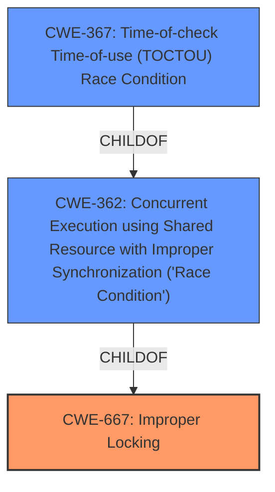

# Raw Analyzer Response for CVE-2025-21767

# Summary
| CWE ID | CWE Name | Confidence | CWE Abstraction Level | CWE Vulnerability Mapping Label | CWE-Vulnerability Mapping Notes |
|---|---|---|---|---|---|
| CWE-667 | Improper Locking | 0.85 | Class | Primary CWE | Allowed-with-Review |
| CWE-362 | Concurrent Execution using Shared Resource with Improper Synchronization ('Race Condition') | 0.70 | Class | Secondary Candidate | Allowed-with-Review |
| CWE-367 | Time-of-check Time-of-use (TOCTOU) Race Condition | 0.60 | Base | Secondary Candidate | Allowed |

## Evidence and Confidence

*   **Confidence Score:** 0.80
*   **Evidence Strength:** HIGH

## Relationship Analysis
The primary CWE identified is CWE-667 (Improper Locking), a Class-level CWE. The vulnerability description indicates that a **sleeping function is called from an invalid context** because locks **cannot be acquired in atomic context**. This directly relates to improper locking mechanisms. CWE-362 (Race Condition) is a related Class-level CWE, as improper locking often leads to race conditions. CWE-367 (TOCTOU) is a Base-level CWE and a child of CWE-362. These relationships highlight a potential chain where improper locking (CWE-667) could contribute to race conditions (CWE-362), and in specific scenarios, TOCTOU vulnerabilities (CWE-367).

## Vulnerability Chain
The vulnerability chain starts with the **root cause** of **improper locking (CWE-667)** due to calling `get_random_u32()` in an atomic context, where sleeping locks are acquired. This leads to a kernel bug because the locks **cannot be acquired in atomic context**. This can cause a race condition scenario **(CWE-362)**.

## Summary of Analysis
The assessment is based on the provided evidence, specifically the phrases "**sleeping function called from invalid context**" and "**cannot be acquired in atomic context**." The Retriever Results also support CWE-667 as the top candidate.

The graph relationships show how improper locking can lead to race conditions and potentially TOCTOU vulnerabilities.

CWE-667 is selected as the primary CWE because it directly addresses the **root cause** of the locking issue. While CWE-362 and CWE-367 are related and potentially present, CWE-667 represents the initial flaw that triggers the subsequent issues.

The level of specificity is appropriate, as CWE-667 is a Class-level CWE that captures the general issue of improper locking. Lower-level CWEs could be considered if more specific information about the locking mechanism was available, but the current evidence points to a general locking problem.

Relevant CWE Information:
CWE-787 (Out-of-bounds Write), CWE-415 (Double Free), and CWE-190 (Integer Overflow or Wraparound) were considered but deemed less relevant as the vulnerability description does not provide evidence of memory corruption or arithmetic errors.