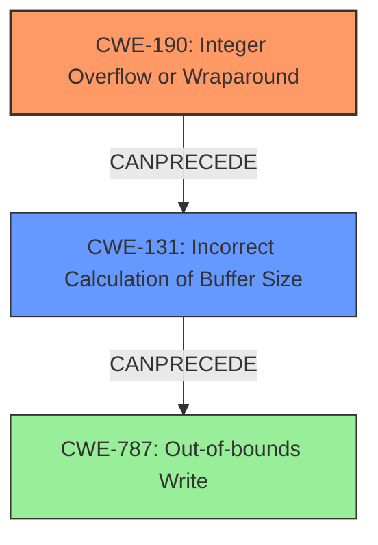

# Analysis Report for CVE-2025-2177

# Vulnerability Analysis Report: CVE-2025-2177

## Description

A vulnerability classified as critical was found in libzvbi up to 0.2.43. This vulnerability affects the function vbi_search_new of the file src/search.c. The manipulation of the argument pat_len leads to **integer overflow**. The attack can be initiated remotely. The exploit has been disclosed to the public and may be used. Upgrading to version 0.2.44 is able to address this issue. The patch is identified as ca1672134b3e2962cd392212c73f44f8f4cb489f. It is recommended to upgrade the affected component. The code maintainer was informed beforehand about the issues. She reacted very fast and highly professional.

## Vulnerability Description Key Phrases

- **Weakness:** integer overflow
- **Product:** libzvbi
- **Version:** up to 0.2.43
- **Component:** vbi_search_new in src/search.c

## Analysis (with Relationship Data)

# Summary
| CWE ID | CWE Name | Confidence | CWE Abstraction Level | CWE Vulnerability Mapping Label | CWE-Vulnerability Mapping Notes |
|---|---|---|---|---|---|
| CWE-190 | Integer Overflow or Wraparound | 1.0 | Base | Allowed | Primary CWE. The vulnerability occurs due to an integer overflow when handling the `pat_len` argument in the `vbi_search_new` function. |
| CWE-131 | Incorrect Calculation of Buffer Size | 0.8 | Base | Allowed | Secondary CWE. The integer overflow can lead to an incorrect buffer size calculation, which is a prerequisite for a buffer overflow. |

## Evidence and Confidence

*   **Confidence Score:** 0.9
*   **Evidence Strength:** HIGH

## Relationship Analysis
The primary CWE is CWE-190 (Integer Overflow or Wraparound), which is a base-level CWE. This can lead to CWE-131 (Incorrect Calculation of Buffer Size) as a consequence. CWE-131 can further lead to buffer overflows like CWE-120 or CWE-787.



## Vulnerability Chain
The vulnerability chain starts with:
1.  **Integer Overflow (CWE-190)**: The **integer overflow** occurs when the `pat_len` argument is manipulated.
2.  **Incorrect Calculation of Buffer Size (CWE-131)**: The **integer overflow** leads to an incorrect calculation of the buffer size.
3.  **Out-of-bounds Write (CWE-787)**: The incorrect buffer size calculation can result in a heap overflow or out-of-bounds write.
The provided information does not explicitly state the out-of-bounds write but it is the expected result of the overflow.

## Summary of Analysis
The primary weakness is an **integer overflow** (CWE-190) in the `vbi_search_new` function, triggered by manipulating the `pat_len` argument. This leads to an incorrect buffer size calculation (CWE-131), which sets the stage for potential buffer overflows. The evidence for CWE-190 is strong, as the vulnerability description explicitly mentions it, and the CVE summary also highlights integer overflows as the root cause. The choice of CWE-190 is specific and at the base level of abstraction, which is preferred. The CVE summary mentions CWE-824 and CWE-908, however those are not the rootcause.

The Retriever Results also lists CWE-190 as the top candidate. Other CWEs like CWE-79 and CWE-89 are less relevant because the vulnerability is not directly related to web page generation or SQL injection. CWE-125 (Out-of-bounds Read) is a potential consequence, but the initial error is the integer overflow.

Relevant CWE Information:

# Enhanced Context (25 CWEs)
The following CWEs were identified as potentially relevant to this vulnerability:

## CWE-191: Integer Underflow (Wrap or Wraparound)
**Abstraction Level**: Base
**Similarity Score**: 0.74
**Source**: dense

**Description**:
The product subtracts one value from another, such that the result is less than the minimum allowable integer value, which produces a value that is not equal to the correct result.

**Mapping Guidance**:
- Usage: Allowed
- Rationale: This CWE entry is at the Base level of abstraction, which is a preferred level of abstraction for mapping to the root causes of vulnerabilities.

## CWE-125: Out-of-bounds Read
**Abstraction Level**: Base
**Similarity Score**: 0.72
**Source**: dense

**Description**:
The product reads data past the end, or before the beginning, of the intended buffer.

**Mapping Guidance**:
- Usage: Allowed
- Rationale: This CWE entry is at the Base level of abstraction, which is a preferred level of abstraction for mapping to the root causes of vulnerabilities.

## CWE-190: Integer Overflow or Wraparound
**Abstraction Level**: Base
**Similarity Score**: 0.72
**Source**: dense

**Description**:
The product performs a calculation that can
         produce an integer overflow or wraparound when the logic
         assumes that the resulting value will always be larger than
         the original value. This occurs when an integer value is
         incremented to a value that is too large to store in the
         associated representation. When this occurs, the value may
         become a very small or negative number.

**Mapping Guidance**:
- Usage: Allowed
- Rationale: This CWE entry is at the Base level of abstraction, which is a preferred level of abstraction for mapping to the root causes of vulnerabilities.

## CWE-252: Unchecked Return Value
**Abstraction Level**: Base
**Similarity Score**: 0.72
**Source**: dense

**Description**:
The product does not check the return value from a method or function, which can prevent it from detecting unexpected states and conditions.

**Mapping Guidance**:
- Usage: Allowed
- Rationale: This CWE entry is at the Base level of abstraction, which is a preferred level of abstraction for mapping to the root causes of vulnerabilities.

## CWE-131: Incorrect Calculation of Buffer Size
**Abstraction Level**: Base
**Similarity Score**: 0.72
**Source**: dense

**Description**:
The product does not correctly calculate the size to be used when allocating a buffer, which could lead to a buffer overflow.

**Mapping Guidance**:
- Usage: Allowed
- Rationale: This CWE entry is at the Base level of abstraction, which is a preferred level of abstraction for mapping to the root causes of vulnerabilities.

## CWE-116: Improper Encoding or Escaping of Output
**Abstraction Level**: Class
**Similarity Score**: 0.71
**Source**: dense

**Description**:
The product prepares a structured message for communication with another component, but encoding or escaping of the data is either missing or done incorrectly. As a result, the intended structure of the message is not preserved.

**Mapping Guidance**:
- Usage: Allowed-with-Review
- Rationale: This CWE entry is a Class and might have Base-level children that would be more appropriate

## CWE-1286: Improper Validation of Syntactic Correctness of Input
**Abstraction Level**: Base
**Similarity Score**: 0.71
**Source**: dense

**Description**:
The product receives input that is expected to be well-formed - i.e., to comply with a certain syntax - but it does not validate or incorrectly validates that the input complies with the syntax.

**Mapping Guidance**:
- Usage: Allowed
- Rationale: This CWE entry is at the Base level of abstraction, which is a preferred level of abstraction for mapping to the root causes of vulnerabilities.

## CWE-193: Off-by-one Error
**Abstraction Level**: Base
**Similarity Score**: 0.71
**Source**: dense

**Description**:
A product calculates or uses an incorrect maximum or minimum value that is 1 more, or 1 less, than the correct value.

**Mapping Guidance**:
- Usage: Allowed
- Rationale: This CWE entry is at the Base level of abstraction, which is a preferred level of abstraction for mapping to the root causes of vulnerabilities.

## CWE-129: Improper Validation of Array Index
**Abstraction Level**: Variant
**Similarity Score**: 0.71
**Source**: dense

**Description**:
The product uses untrusted input when calculating or using an array index, but the product does not validate or incorrectly validates the index to ensure the index references a valid position within the array.

**Mapping Guidance**:
- Usage: Allowed
- Rationale: This CWE entry is at the Variant level of abstraction, which is a preferred level of abstraction for mapping to the root causes of vulnerabilities.

## CWE-126: Buffer Over-read
**Abstraction Level**: Variant
**Similarity Score**: 0.71
**Source**: dense

**Description**:
The product reads from a buffer using buffer access mechanisms such as indexes or pointers that reference memory locations after the targeted buffer.

**Mapping Guidance**:
- Usage: Allowed
- Rationale: This CWE entry is at the Variant level of abstraction, which is a preferred level of abstraction for mapping to the root causes of vulnerabilities.

## CWE-190: Integer Overflow or Wraparound
**Abstraction Level**: Base
**Similarity Score**: 886.87
**Source**: sparse

**Description**:
The product performs a calculation that can
         produce an


## CWE Relationship Analysis

Current CWEs represent these abstraction levels: .


### Vulnerability Chain Analysis

**Chain starting from CWE-89:**
- 89 (Improper Neutralization of Special Elements used in an SQL Command ('SQL Injection')) - ROOT


**Chain starting from CWE-116:**
- 116 (Improper Encoding or Escaping of Output) - ROOT


### CWE Relationship Diagram

```mermaid
graph TD
    classDef primary fill:#f96,stroke:#333,stroke-width:2px
    classDef secondary fill:#69f,stroke:#333
    classDef tertiary fill:#9e9,stroke:#333
```


*Report generated on 2025-07-14 09:50:07*
