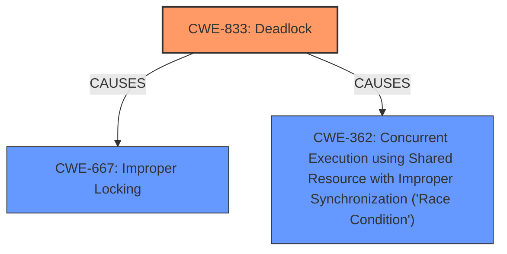

# Analysis Report for CVE-2025-21817

# Vulnerability Analysis Report: CVE-2025-21817

## Description

In the Linux kernel, the following vulnerability has been resolved block mark GFP_NOIO around sysfs ->store() sysfs ->store is called with queue freezed, meantime we have several ->store() callbacks(update_nr_requests, wbt, scheduler) to allocate memory with GFP_KERNEL which may run into direct reclaim code path, then **potential deadlock** can be caused. Fix the issue by marking NOIO around sysfs ->store()

## Vulnerability Description Key Phrases

- **Weakness:** potential deadlock
- **Product:** Linux kernel

## Analysis (with Relationship Data)

# Summary
| CWE ID | CWE Name | Confidence | CWE Abstraction Level | CWE Vulnerability Mapping Label | CWE-Vulnerability Mapping Notes |
|---|---|---|---|---|---|
| CWE-833 | Deadlock | 0.9 | Base | Primary | Allowed |
| CWE-667 | Improper Locking | 0.7 | Class | Secondary | Allowed-with-Review |
| CWE-362 | Concurrent Execution using Shared Resource with Improper Synchronization ('Race Condition') | 0.6 | Class | Secondary | Allowed-with-Review |

## Evidence and Confidence

*   **Confidence Score:** 0.9
*   **Evidence Strength:** HIGH

## Relationship Analysis
The primary CWE is CWE-833 (Deadlock), which directly reflects the vulnerability description. CWE-667 (Improper Locking) and CWE-362 (Race Condition) are related to concurrency issues that can lead to deadlocks. CWE-667 represents a higher level of abstraction related to locking mechanisms, while CWE-362 highlights potential race conditions during concurrent execution. These relationships helped to refine the selection of CWE-833 as the primary cause.



## Vulnerability Chain
The vulnerability chain starts with the system call to `sysfs ->store()`, which is called with the queue frozen. Multiple callbacks (`update_nr_requests`, `wbt`, `scheduler`) allocate memory with `GFP_KERNEL`, leading to a potential direct reclaim code path. This scenario can cause a **deadlock** (CWE-833). The **improper locking** (CWE-667) and **race conditions** (CWE-362) during memory allocation and resource access are contributing factors.
  - Root Cause: System call to sysfs ->store() with queue frozen, allocation memory with GFP_KERNEL during callbacks
  - Weakness: Deadlock

## Summary of Analysis
The analysis is primarily based on the vulnerability description key phrase "**potential deadlock**". The evidence clearly points to a deadlock scenario in the Linux kernel due to concurrent execution and resource allocation during sysfs operations. The graph relationships show how improper locking and race conditions can contribute to the deadlock. CWE-833 is the most specific and appropriate choice, accurately representing the **deadlock** condition. While CWE-667 and CWE-362 are related, they are secondary factors contributing to the primary issue.

Relevant CWE Information:

# Enhanced Context (25 CWEs)
The following CWEs were identified as potentially relevant to this vulnerability:

## CWE-833: Deadlock
**Abstraction Level**: Base
**Similarity Score**: 0.80
**Source**: dense

**Description**:
The product contains multiple threads or executable segments that are waiting for each other to release a necessary lock, resulting in deadlock.

**Mapping Guidance**:
- Usage: Allowed
- Rationale: This CWE entry is at the Base level of abstraction, which is a preferred level of abstraction for mapping to the root causes of vulnerabilities.

## CWE-667: Improper Locking
**Abstraction Level**: Class
**Similarity Score**: 0.79
**Source**: dense

**Description**:
The product does not properly acquire or release a lock on a resource, leading to unexpected resource state changes and behaviors.

**Mapping Guidance**:
- Usage: Allowed-with-Review
- Rationale: This CWE entry is a Class and might have Base-level children that would be more appropriate

## CWE-362: Concurrent Execution using Shared Resource with Improper Synchronization ('Race Condition')
**Abstraction Level**: Class
**Similarity Score**: 319.02
**Source**: sparse

**Description**:
The product contains a concurrent code sequence that requires temporary, exclusive access to a shared resource, but a timing window exists in which the shared resource can be modified by another code sequence operating concurrently.

**Mapping Guidance**:
- Usage: Allowed-with-Review
- Rationale: This CWE entry is a Class and might have Base-level children that would be more appropriate

I am overriding the retriever suggestion of CWE-667 as the primary CWE because the Vulnerability Description key phrases pointed to "**potential deadlock**" as the primary weakness.


## CWE Relationship Analysis

Current CWEs represent these abstraction levels: .


### Vulnerability Chain Analysis

**Chain starting from CWE-667:**
- 667 (Improper Locking) - ROOT


**Chain starting from CWE-833:**
- 833 (Deadlock) - ROOT


### CWE Relationship Diagram

```mermaid
graph TD
    classDef primary fill:#f96,stroke:#333,stroke-width:2px
    classDef secondary fill:#69f,stroke:#333
    classDef tertiary fill:#9e9,stroke:#333
```


*Report generated on 2025-07-14 09:51:55*
