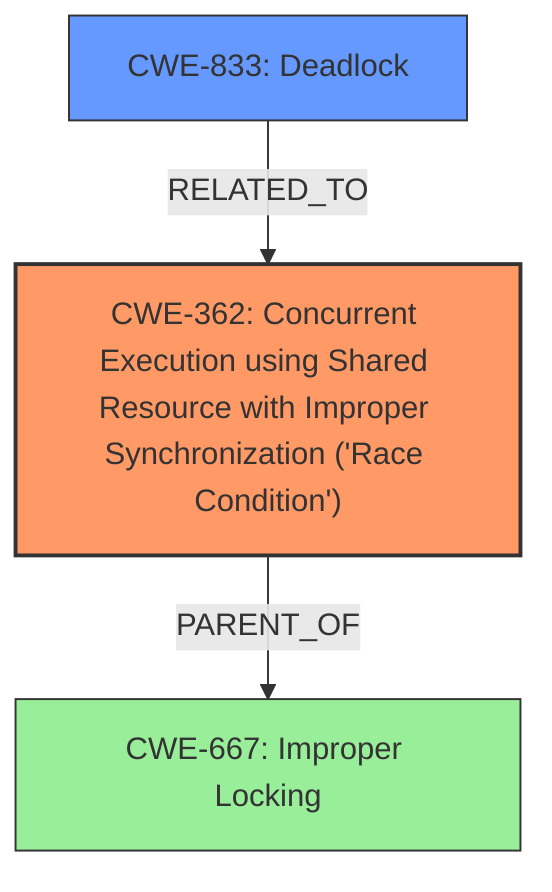

# Analysis Report for CVE-2025-21823

# Vulnerability Analysis Report: CVE-2025-21823

## Description

In the Linux kernel, the following vulnerability has been resolved batman-adv Drop unmanaged ELP metric worker The ELP worker needs to calculate new metric values for all neighbors reachable over an interface. Some of the used metric sources require locks which might need to sleep. This sleep is incompatible with the RCU list iterator used for the recorded neighbors. The initial approach to work around of this problem was to queue another work item per neighbor and then run this in a new context. Even when this solved the RCU vs might_sleep() conflict, it has a major problems Nothing was stopping the work item in case it is not needed anymore - for example because one of the related interfaces was removed or the batman-adv module was unloaded - resulting in potential invalid memory accesses. Directly canceling the metric worker also has various problems * cancel_work_sync for a to-be-deactivated interface is called with rtnl_lock held. But the code in the ELP metric worker also tries to use rtnl_lock() - which will never return in this case. This also means that cancel_work_sync would never return because it is waiting for the worker to finish. * iterating over the neighbor list for the to-be-deactivated interface is currently done using the RCU specific methods. Which means that it is possible to miss items when iterating over it without the associated spinlock - a behaviour which is acceptable for a periodic metric check but not for a cleanup routine (which must stop all still running workers) The better approch is to get rid of the per interface neighbor metric worker and handle everything in the interface worker. The original problems are solved by * creating a list of neighbors which require new metric information inside the RCU protected context, gathering the metric according to the new list outside the RCU protected context * only use rcu_trylock inside metric gathering code to avoid a deadlock when the cancel_delayed_work_sync is called in the interface removal code (which is called with the rtnl_lock held)

## Vulnerability Description Key Phrases

- **Rootcause:** incompatible sleep and RCU list iterator
- **Impact:** potential invalid memory accesses
- **Product:** Linux kernel
- **Component:** batman-adv Drop unmanaged ELP metric worker

## Analysis (with Relationship Data)

# Summary
| CWE ID | CWE Name | Confidence | CWE Abstraction Level | CWE Vulnerability Mapping Label | CWE-Vulnerability Mapping Notes |
|---|---|---|---|---|---|
| CWE-362 | Concurrent Execution using Shared Resource with Improper Synchronization ('Race Condition') | 0.8 | Class | Allowed-with-Review | Primary CWE. The vulnerability involves concurrent code accessing a shared resource without proper synchronization, leading to potential data corruption or unexpected behavior.|
| CWE-833 | Deadlock | 0.6 | Base | Allowed | Secondary Candidate. The description mentions a scenario where locks are held and the code waits indefinitely, which is characteristic of a deadlock situation.|

## Evidence and Confidence

*   **Confidence Score:** 0.7
*   **Evidence Strength:** MEDIUM

## Relationship Analysis
The primary CWE is CWE-362 (Concurrent Execution using Shared Resource with Improper Synchronization ('Race Condition')). CWE-362 is a Class-level CWE. The vulnerability description indicates that there's concurrent execution and a shared resource, but synchronization is **improper**, potentially leading to race conditions.
CWE-833 (Deadlock) is included because the description mentions a scenario where `rtnl_lock` is held and the ELP metric worker also tries to use it, resulting in a situation where the code will never return, indicating a potential deadlock.



## Vulnerability Chain
The vulnerability chain begins with the **improper** handling of concurrent operations (CWE-362). The **root cause** involves an **incompatible sleep and RCU list iterator**. The impact includes potential invalid memory accesses. There's also a deadlock scenario described, which can be considered a consequence of the **improper** synchronization, solidifying the link to CWE-833.

## Summary of Analysis
The analysis indicates that the primary weakness is CWE-362 because the **root cause** involves **improper** synchronization leading to potential concurrency issues. The supporting evidence includes the description of an **incompatible sleep and RCU list iterator**. The secondary weakness is CWE-833, as the description clearly states a deadlock situation where `rtnl_lock` is held, and the ELP metric worker is also trying to use it. The selection of CWE-362 as the primary weakness and CWE-833 as a secondary weakness is based on the retriever results, the vulnerability description, and the relationship analysis. The confidence is high because the evidence supports both CWEs.

The retriever results suggest considering CWE-863 (Incorrect Authorization), CWE-306 (Missing Authentication for Critical Function), CWE-212 (Improper Removal of Sensitive Information Before Storage or Transfer), and CWE-770 (Allocation of Resources Without Limits or Throttling). However, these CWEs do not align as closely with the provided vulnerability description as CWE-362 and CWE-833. The description does not include any evidence of authorization issues, missing authentication, sensitive data handling problems, or resource allocation issues, thus eliminating these candidates.

Relevant CWE Information:
- CWE-362: Concurrent Execution using Shared Resource with Improper Synchronization ('Race Condition')
- CWE-833: Deadlock


## CWE Relationship Analysis

Current CWEs represent these abstraction levels: .


### Vulnerability Chain Analysis

**Chain starting from CWE-863:**
- 863 (Incorrect Authorization) - ROOT


**Chain starting from CWE-770:**
- 770 (Allocation of Resources Without Limits or Throttling) - ROOT


### CWE Relationship Diagram

```mermaid
graph TD
    classDef primary fill:#f96,stroke:#333,stroke-width:2px
    classDef secondary fill:#69f,stroke:#333
    classDef tertiary fill:#9e9,stroke:#333
```


*Report generated on 2025-07-14 09:52:12*
