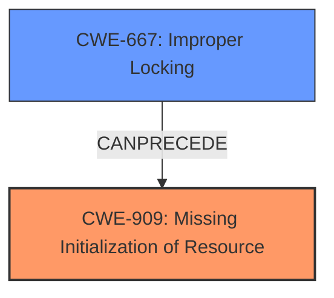

# Analysis Report for CVE-2025-21862

# Vulnerability Analysis Report: CVE-2025-21862

## Description

In the Linux kernel, the following vulnerability has been resolved drop_monitor fix **incorrect initialization order** Syzkaller reports the following bug BUG spinlock bad magic on CPU#1, syz-executor.0/7995 lock 0xffff88805303f3e0, .magic 00000000, .owner /-1, .owner_cpu 0 CPU 1 PID 7995 Comm syz-executor.0 Tainted G E 5.10.209+ #1 Hardware name VMware, Inc. VMware Virtual Platform/440BX Desktop Reference Platform, BIOS 6.00 11/12/2020 Call Trace __dump_stack lib/dump_stack.c77 [inline] dump_stack+0x119/0x179 lib/dump_stack.c118 debug_spin_lock_before kernel/locking/spinlock_debug.c83 [inline] do_raw_spin_lock+0x1f6/0x270 kernel/locking/spinlock_debug.c112 __raw_spin_lock_irqsave include/linux/spinlock_api_smp.h117 [inline] _raw_spin_lock_irqsave+0x50/0x70 kernel/locking/spinlock.c159 reset_per_cpu_data+0xe6/0x240 [drop_monitor] net_dm_cmd_trace+0x43d/0x17a0 [drop_monitor] genl_family_rcv_msg_doit+0x22f/0x330 net/netlink/genetlink.c739 genl_family_rcv_msg net/netlink/genetlink.c783 [inline] genl_rcv_msg+0x341/0x5a0 net/netlink/genetlink.c800 netlink_rcv_skb+0x14d/0x440 net/netlink/af_netlink.c2497 genl_rcv+0x29/0x40 net/netlink/genetlink.c811 netlink_unicast_kernel net/netlink/af_netlink.c1322 [inline] netlink_unicast+0x54b/0x800 net/netlink/af_netlink.c1348 netlink_sendmsg+0x914/0xe00 net/netlink/af_netlink.c1916 sock_sendmsg_nosec net/socket.c651 [inline] __sock_sendmsg+0x157/0x190 net/socket.c663 ____sys_sendmsg+0x712/0x870 net/socket.c2378 ___sys_sendmsg+0xf8/0x170 net/socket.c2432 __sys_sendmsg+0xea/0x1b0 net/socket.c2461 do_syscall_64+0x30/0x40 arch/x86/entry/common.c46 entry_SYSCALL_64_after_hwframe+0x62/0xc7 RIP 00330x7f3f9815aee9 Code ff ff c3 66 2e 0f 1f 84 00 00 00 00 00 0f 1f 40 00 48 89 f8 48 89 f7 48 89 d6 48 89 ca 4d 89 c2 4d 89 c8 4c 8b 4c 24 08 0f 05 3d 01 f0 ff ff 73 01 c3 48 c7 c1 b0 ff ff ff f7 d8 64 89 01 48 RSP 002b00007f3f972bf0c8 EFLAGS 00000246 ORIG_RAX 000000000000002e RAX ffffffffffffffda RBX 00007f3f9826d050 RCX 00007f3f9815aee9 RDX 0000000020000000 RSI 0000000020001300 RDI 0000000000000007 RBP 00007f3f981b63bd R08 0000000000000000 R09 0000000000000000 R10 0000000000000000 R11 0000000000000246 R12 0000000000000000 R13 000000000000006e R14 00007f3f9826d050 R15 00007ffe01ee6768 If drop_monitor is built as a kernel module, syzkaller may have time to send a netlink NET_DM_CMD_START message during the module loading. This will call the net_dm_monitor_start() function that uses a spinlock that has not yet been initialized. To fix this, lets place resource initialization above the registration of a generic netlink family. Found by InfoTeCS on behalf of Linux Verification Center (linuxtesting.org) with Syzkaller.

## Vulnerability Description Key Phrases

- **Rootcause:** incorrect initialization order
- **Impact:** BUG spinlock bad magic
- **Product:** Linux kernel
- **Version:** 5.10.209+
- **Component:** drop_monitor

## Analysis (with Relationship Data)

# Summary

| CWE ID  | CWE Name                                                                                                                                                                | Confidence | CWE Abstraction Level | CWE Vulnerability Mapping Label | CWE-Vulnerability Mapping Notes |
| :------- | :---------------------------------------------------------------------------------------------------------------------------------------------------------------------- | :--------- | :---------------------- | :------------------------------ | :------------------------------ |
| CWE-909  | Missing Initialization of Resource                                                                                                                                      | 1          | Class                   | Primary                         | Allowed-with-Review             |
| CWE-667  | Improper Locking                                                                                                                                                        | 0.7        | Class                   | Secondary                       | Allowed-with-Review             |

## Evidence and Confidence

*   **Confidence Score:** 0.85
*   **Evidence Strength:** MEDIUM

## Relationship Analysis

The primary relationship that impacted the decision was the hierarchical relationship between CWE-909 (Missing Initialization of Resource) and its potential base-level children. However, the description focuses specifically on the order of initialization rather than simply the absence of it, so the class level is sufficient. The secondary relationship is CWE-667, since the uninitialized resource is a spinlock.



## Vulnerability Chain

The vulnerability chain starts with the **incorrect initialization order** (CWE-909) leading to an attempt to use a spinlock that hasn't been initialized (CWE-667), ultimately causing a "BUG spinlock bad magic" error.

## Summary of Analysis

The initial analysis focused on the **root cause**, which is clearly stated as an **incorrect initialization order**. This led to considering CWE-909 (Missing Initialization of Resource).

The description explicitly mentions "**incorrect initialization order**" which is the primary weakness. The crash occurs because the spinlock is used before being initialized.

The graph relationships helped to solidify the understanding of how the missing initialization could lead to other errors, like a lock being used before being initialized.

The selected CWEs are at the optimal level of specificity because, while base-level CWEs are preferred, the provided information doesn't give enough detail to narrow the weakness down further.

Relevant CWE Information:

# Enhanced Context (25 CWEs)
The following CWEs were identified as potentially relevant to this vulnerability:

## CWE-667: Improper Locking
**Abstraction Level**: Class
**Similarity Score**: 0.78
**Source**: dense

**Description**:
The product does not properly acquire or release a lock on a resource, leading to unexpected resource state changes and behaviors.

**Mapping Guidance**:
- Usage: Allowed-with-Review
- Rationale: This CWE entry is a Class and might have Base-level children that would be more appropriate

## CWE-909: Missing Initialization of Resource
**Abstraction Level**: Class
**Similarity Score**: 0.77
**Source**: dense

**Description**:
The product does not initialize a critical resource.

**Mapping Guidance**:
- Usage: Allowed-with-Review
- Rationale: This CWE entry is a Class and might have Base-level children that would be more appropriate

## CWE-665: Improper Initialization
**Abstraction Level**: Class
**Similarity Score**: 0.76
**Source**: dense

**Description**:
The product does not initialize or incorrectly initializes a resource, which might leave the resource in an unexpected state when it is accessed or used.

**Mapping Guidance**:
- Usage: Discouraged
- Rationale: This CWE entry is a level-1 Class (i.e., a child of a Pillar). It might have lower-level children that would be more appropriate

## CWE-362: Concurrent Execution using Shared Resource with Improper Synchronization ('Race Condition')
**Abstraction Level**: Class
**Similarity Score**: 0.75
**Source**: dense

**Description**:
The product contains a concurrent code sequence that requires temporary, exclusive access to a shared resource, but a timing window exists in which the shared resource can be modified by another code sequence operating concurrently.

**Mapping Guidance**:
- Usage: Allowed-with-Review
- Rationale: This CWE entry is a Class and might have Base-level children that would be more appropriate

## CWE-755: Improper Handling of Exceptional Conditions
**Abstraction Level**: Class
**Similarity Score**: 0.75
**Source**: dense

**Description**:
The product does not handle or incorrectly handles an exceptional condition.

**Mapping Guidance**:
- Usage: Discouraged
- Rationale: This CWE entry is a level-1 Class (i.e., a child of a Pillar). It might have lower-level children that would be more appropriate

## CWE-908: Use of Uninitialized Resource
**Abstraction Level**: Base
**Similarity Score**: 0.74
**Source**: dense

**Description**:
The product uses or accesses a resource that has not been initialized.

**Mapping Guidance**:
- Usage: Allowed
- Rationale: This CWE entry is at the Base level of abstraction, which is a preferred level of abstraction for mapping to the root causes of vulnerabilities.

## CWE-476: NULL Pointer Dereference
**Abstraction Level**: Base
**Similarity Score**: 0.74
**Source**: dense

**Description**:
The product dereferences a pointer that it expects to be valid but is NULL.

**Mapping Guidance**:
- Usage: Allowed
- Rationale: This CWE entry is at the Base level of abstraction, which is a preferred level of abstraction for mapping to the root causes of vulnerabilities.

## CWE-404: Improper Resource Shutdown or Release
**Abstraction Level**: Class
**Similarity Score**: 0.74
**Source**: dense

**Description**:
The product does not release or incorrectly releases a resource before it is made available for re-use.

**Mapping Guidance**:
- Usage: Allowed-with-Review
- Rationale: This CWE entry is a Class and might have Base-level children that would be more appropriate

## CWE-252: Unchecked Return Value
**Abstraction Level**: Base
**Similarity Score**: 0.73
**Source**: dense

**Description**:
The product does not check the return value from a method or function, which can prevent it from detecting unexpected states and conditions.

**Mapping Guidance**:
- Usage: Allowed
- Rationale: This CWE entry is at the Base level of abstraction, which is a preferred level of abstraction for mapping to the root causes of vulnerabilities.

## CWE-909: Missing Initialization of Resource
**Abstraction Level**: Class
**Similarity Score**: 530.77
**Source**: sparse

**Description**:
The product does not initialize a critical resource.

**Mapping Guidance**:
- Usage: Allowed-with-Review
- Rationale: This CWE entry is a Class and might have Base-level children that would be more appropriate

## CWE-476: NULL Pointer Dereference
**Abstraction Level**: Base
**Similarity Score**: 526.15
**Source**: sparse

**Description**:
The product dereferences a pointer that it expects to be valid but is NULL.

**Mapping Guidance**:
- Usage: Allowed
- Rationale: This CWE entry is at the Base level of abstraction, which is a preferred level of abstraction for mapping to the root causes of vulnerabilities.

## CWE-770: Allocation of Resources Without Limits or Throttling
**Abstraction Level**: Base
**Similarity Score**: 518.43
**Source**: sparse

**Description**:
The product allocates a reusable resource or group of resources on behalf of an actor without imposing any restrictions on the size or number of resources that can be allocated, in violation of the intended security policy for that actor.

**Mapping Guidance**:
- Usage: Allowed
- Rationale: This CWE entry is at the Base level of abstraction, which is a preferred level of abstraction for mapping to the root causes of vulnerabilities.

## CWE-400: Uncontrolled Resource Consumption
**Abstraction Level**: Class
**Similarity Score**: 502.77
**Source**: sparse

**Description**:
The product does not properly control the allocation and maintenance of a limited resource, thereby enabling an actor to influence the amount of resources consumed, eventually leading to the exhaustion of available resources.

**Mapping Guidance**:
- Usage: Discouraged
- Rationale: CWE-400 is intended for incorrect behaviors in which the product is expected to track and restrict how many resources it consumes, but CWE-400 is often misused because it is conflated with the "technical impact" of vulnerabilities in which resource consumption occurs. It is sometimes used for low-information vulnerability reports. It is a level-1 Class (i.e., a child of a Pillar).

## CWE-667: Improper Locking
**Abstraction Level**: Class
**Similarity Score**: 498.89
**Source**: sparse

**Description**:
The product does not properly acquire or release a lock on a resource, leading


## CWE Relationship Analysis

Current CWEs represent these abstraction levels: .


### Vulnerability Chain Analysis

**Chain starting from CWE-476:**
- 476 (NULL Pointer Dereference) - ROOT


**Chain starting from CWE-400:**
- 400 (Uncontrolled Resource Consumption) - ROOT


### CWE Relationship Diagram

```mermaid
graph TD
    classDef primary fill:#f96,stroke:#333,stroke-width:2px
    classDef secondary fill:#69f,stroke:#333
    classDef tertiary fill:#9e9,stroke:#333
```


*Report generated on 2025-07-14 09:55:04*
