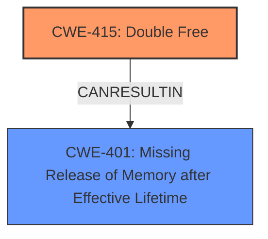

# Analysis Report for CVE-2025-21865

# Vulnerability Analysis Report: CVE-2025-21865

## Description

In the Linux kernel, the following vulnerability has been resolved gtp Suppress list corruption splat in gtp_net_exit_batch_rtnl(). Brad Spengler reported the list_del() corruption splat in gtp_net_exit_batch_rtnl(). [0] Commit eb28fd76c0a0 (gtp Destroy device along with udp sockets netns dismantle.) added the for_each_netdev() loop in gtp_net_exit_batch_rtnl() to destroy devices in each netns as done in geneve and ip tunnels. However, this could trigger ->dellink() twice for the same device during ->exit_batch_rtnl(). Say we have two netns A & B and gtp device B that resides in netns B but whose UDP socket is in netns A. 1. cleanup_net() processes netns A and then B. 2. gtp_net_exit_batch_rtnl() finds the device B while iterating netns As gn->gtp_dev_list and calls ->dellink(). [ device B is not yet unlinked from netns B as unregister_netdevice_many() has not been called. ] 3. gtp_net_exit_batch_rtnl() finds the device B while iterating netns Bs for_each_netdev() and calls ->dellink(). gtp_dellink() cleans up the devices hash table, unlinks the dev from gn->gtp_dev_list, and calls unregister_netdevice_queue(). Basically, calling gtp_dellink() multiple times is fine unless CONFIG_DEBUG_LIST is enabled. Lets remove for_each_netdev() in gtp_net_exit_batch_rtnl() and delegate the destruction to default_device_exit_batch() as done in bareudp. [0] list_del corruption, ffff8880aaa62c00->next (autoslab_size_M_dev_P_net_core_dev_11127_8_1328_8_S_4096_A_64_n_139+0xc00/0x1000 [slab object]) is LIST_POISON1 (ffffffffffffff02) (prev is 0xffffffffffffff04) kernel BUG at lib/list_debug.c58! Oops invalid opcode 0000

## Vulnerability Description Key Phrases

- **Impact:** ['kernel BUG', 'Oops']
- **Product:** Linux kernel
- **Component:** gtp_net_exit_batch_rtnl()

## Analysis (with Relationship Data)

# Summary
| CWE ID | CWE Name | Confidence | CWE Abstraction Level | CWE Vulnerability Mapping Label | CWE-Vulnerability Mapping Notes |
|---|---|---|---|---|---|
| CWE-415 | Double Free | 0.9 | Variant | Allowed | Primary CWE. The code attempts to free the same memory twice. |
| CWE-401 | Missing Release of Memory after Effective Lifetime | 0.6 | Variant | Allowed | Secondary CWE. Memory is not released which can lead to double free. |

## Evidence and Confidence

*   **Confidence Score:** 0.8
*   **Evidence Strength:** MEDIUM

## Relationship Analysis
The primary weakness is a **Double Free (CWE-415)**, which is a variant-level CWE, indicating a specific type of memory management error. **CWE-415** can be related to **CWE-401 (Missing Release of Memory after Effective Lifetime)**, as a failure to manage memory lifetime can lead to double frees.



## Vulnerability Chain
The vulnerability chain starts with the incorrect handling of net namespaces and device cleanup, leading to a device being processed twice during the `exit_batch_rtnl` phase. This double processing results in the `gtp_dellink()` function being called multiple times for the same device. The first call frees the device, and the subsequent call results in a **double free**, triggering a kernel BUG.

## Summary of Analysis
The analysis indicates a **Double Free** vulnerability (CWE-415) in the Linux kernel's gtp_net_exit_batch_rtnl() function due to a flaw in how network devices are cleaned up across different network namespaces. The for_each_netdev() loop iterates network namespaces to find and destroy devices, but it can trigger the ->dellink() function twice for the same device if the device's UDP socket resides in a different namespace. This results in a double free, causing a kernel bug and system crash. The primary CWE is CWE-415 (Double Free), and a secondary CWE is CWE-401 (Missing Release of Memory after Effective Lifetime).
The selection is based on the vulnerability description which states "calling gtp_dellink() multiple times is fine unless CONFIG_DEBUG_LIST is enabled." This confirms that memory is being freed multiple times, leading to a double free.
The retriever results listed CWE-415 as the top candidate CWE, and the vulnerability description aligns with the characteristics of a double free.

Relevant CWE Information:

# Enhanced Context (25 CWEs)
The following CWEs were identified as potentially relevant to this vulnerability:

## CWE-131: Incorrect Calculation of Buffer Size
**Abstraction Level**: Base
**Similarity Score**: 0.78
**Source**: dense

**Description**:
The product does not correctly calculate the size to be used when allocating a buffer, which could lead to a buffer overflow.

**Mapping Guidance**:
- Usage: Allowed
- Rationale: This CWE entry is at the Base level of abstraction, which is a preferred level of abstraction for mapping to the root causes of vulnerabilities.


## CWE-362: Concurrent Execution using Shared Resource with Improper Synchronization ('Race Condition')
**Abstraction Level**: Class
**Similarity Score**: 0.77
**Source**: dense

**Description**:
The product contains a concurrent code sequence that requires temporary, exclusive access to a shared resource, but a timing window exists in which the shared resource can be modified by another code sequence operating concurrently.

**Mapping Guidance**:
- Usage: Allowed-with-Review
- Rationale: This CWE entry is a Class and might have Base-level children that would be more appropriate


## CWE-667: Improper Locking
**Abstraction Level**: Class
**Similarity Score**: 0.77
**Source**: dense

**Description**:
The product does not properly acquire or release a lock on a resource, leading to unexpected resource state changes and behaviors.

**Mapping Guidance**:
- Usage: Allowed-with-Review
- Rationale: This CWE entry is a Class and might have Base-level children that would be more appropriate


## CWE-193: Off-by-one Error
**Abstraction Level**: Base
**Similarity Score**: 0.76
**Source**: dense

**Description**:
A product calculates or uses an incorrect maximum or minimum value that is 1 more, or 1 less, than the correct value.

**Mapping Guidance**:
- Usage: Allowed
- Rationale: This CWE entry is at the Base level of abstraction, which is a preferred level of abstraction for mapping to the root causes of vulnerabilities.


## CWE-755: Improper Handling of Exceptional Conditions
**Abstraction Level**: Class
**Similarity Score**: 0.76
**Source**: dense

**Description**:
The product does not handle or incorrectly handles an exceptional condition.

**Mapping Guidance**:
- Usage: Discouraged
- Rationale: This CWE entry is a level-1 Class (i.e., a child of a Pillar). It might have lower-level children that would be more appropriate


## CWE-476: NULL Pointer Dereference
**Abstraction Level**: Base
**Similarity Score**: 0.76
**Source**: dense

**Description**:
The product dereferences a pointer that it expects to be valid but is NULL.

**Mapping Guidance**:
- Usage: Allowed
- Rationale: This CWE entry is at the Base level of abstraction, which is a preferred level of abstraction for mapping to the root causes of vulnerabilities.


## CWE-252: Unchecked Return Value
**Abstraction Level**: Base
**Similarity Score**: 0.76
**Source**: dense

**Description**:
The product does not check the return value from a method or function, which can prevent it from detecting unexpected states and conditions.

**Mapping Guidance**:
- Usage: Allowed
- Rationale: This CWE entry is at the Base level of abstraction, which is a preferred level of abstraction for mapping to the root causes of vulnerabilities.


## CWE-125: Out-of-bounds Read
**Abstraction Level**: Base
**Similarity Score**: 0.76
**Source**: dense

**Description**:
The product reads data past the end, or before the beginning, of the intended buffer.

**Mapping Guidance**:
- Usage: Allowed
- Rationale: This CWE entry is at the Base level of abstraction, which is a preferred level of abstraction for mapping to the root causes of vulnerabilities.


## CWE-909: Missing Initialization of Resource
**Abstraction Level**: Class
**Similarity Score**: 0.76
**Source**: dense

**Description**:
The product does not initialize a critical resource.

**Mapping Guidance**:
- Usage: Allowed-with-Review
- Rationale: This CWE entry is a Class and might have Base-level children that would be more appropriate


## CWE-617: Reachable Assertion
**Abstraction Level**: Base
**Similarity Score**: 0.76
**Source**: dense

**Description**:
The product contains an assert() or similar statement that can be triggered by an attacker, which leads to an application exit or other behavior that is more severe than necessary.

**Mapping Guidance**:
- Usage: Allowed
- Rationale: This CWE entry is at the Base level of abstraction, which is a preferred level of abstraction for mapping to the root causes of vulnerabilities.


## CWE-415: Double Free
**Abstraction Level**: Variant
**Similarity Score**: 562.37
**Source**: sparse

**Description**:
The product calls free() twice on the same memory address, potentially leading to modification of unexpected memory locations.

**Mapping Guidance**:
- Usage: Allowed
- Rationale: This CWE entry is at the Variant level of abstraction, which is a preferred level of abstraction for mapping to the root causes of vulnerabilities.


## CWE-362: Concurrent Execution using Shared Resource with Improper Synchronization ('Race Condition')
**Abstraction Level**: Class
**Similarity Score**: 553.93
**Source**: sparse

**Description**:
The product contains a concurrent code sequence that requires temporary, exclusive access to a shared resource, but a timing window exists in which the shared resource can be modified by another code sequence operating concurrently.

**Mapping Guidance**:
- Usage: Allowed-with-Review
- Rationale: This CWE entry is a Class and might have Base-level children that would be more appropriate


## CWE-667: Improper Locking
**Abstraction Level**: Class
**Similarity Score**: 549.08
**Source**: sparse

**Description**:
The product does not properly acquire or release a lock on a resource, leading to unexpected resource state changes and behaviors.

**Mapping Guidance**:
- Usage: Allowed-with-Review
- Rationale: This CWE entry is a Class and might have Base-level children that would be more appropriate


## CWE-770: Allocation of Resources Without Limits or


## CWE Relationship Analysis

Current CWEs represent these abstraction levels: .


### Vulnerability Chain Analysis

**Chain starting from CWE-617:**
- 617 (Reachable Assertion) - ROOT


**Chain starting from CWE-476:**
- 476 (NULL Pointer Dereference) - ROOT


### CWE Relationship Diagram

```mermaid
graph TD
    classDef primary fill:#f96,stroke:#333,stroke-width:2px
    classDef secondary fill:#69f,stroke:#333
    classDef tertiary fill:#9e9,stroke:#333
```


*Report generated on 2025-07-14 09:55:26*
