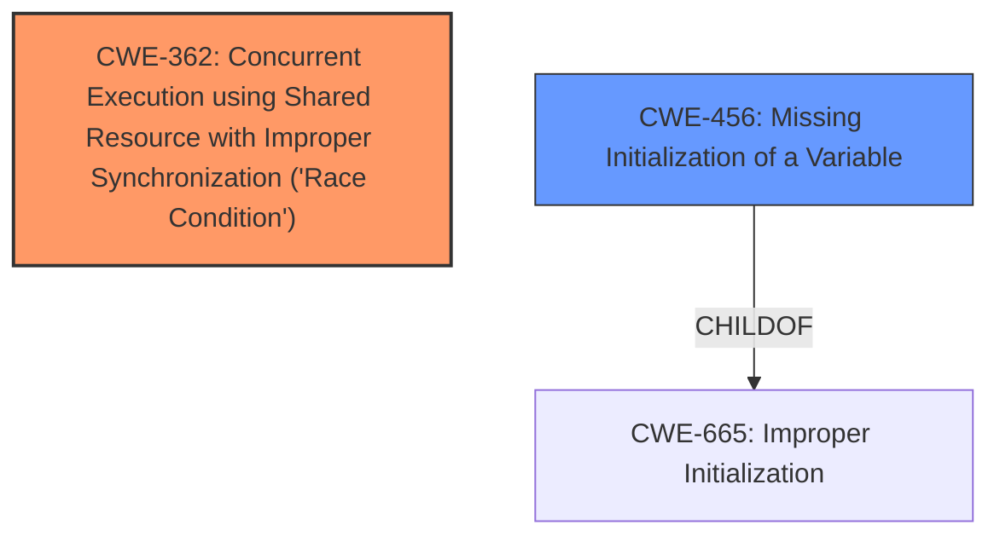

# Analysis Report for CVE-2025-21880

# Vulnerability Analysis Report: CVE-2025-21880

## Description

In the Linux kernel, the following vulnerability has been resolved drm/xe/userptr fix EFAULT handling Currently we treat EFAULT from hmm_range_fault() as a non-fatal error when called from xe_vm_userptr_pin() with the idea that we want to avoid killing the entire vm and chucking an error, under the assumption that the user just did an unmap or something, and has no intention of actually touching that memory from the GPU. At this point we have already zapped the PTEs so any access should generate a page fault, and if the pin fails there also it will then become fatal. However it looks like its possible for the userptr vma to still be on the rebind list in preempt_rebind_work_func(), if we had to retry the pin again due to something happening in the caller before we did the rebind step, but in the meantime needing to re-validate the userptr and this time hitting the EFAULT. This explains an internal user report of hitting [ 191.738349] WARNING CPU 1 PID 157 at drivers/gpu/drm/xe/xe_res_cursor.h158 xe_pt_stage_bind.constprop.0+0x60a/0x6b0 [xe] [ 191.738551] Workqueue xe-ordered-wq preempt_rebind_work_func [xe] [ 191.738616] RIP 0010xe_pt_stage_bind.constprop.0+0x60a/0x6b0 [xe] [ 191.738690] Call Trace [ 191.738692] [ 191.738694] ? show_regs+0x69/0x80 [ 191.738698] ? __warn+0x93/0x1a0 [ 191.738703] ? xe_pt_stage_bind.constprop.0+0x60a/0x6b0 [xe] [ 191.738759] ? report_bug+0x18f/0x1a0 [ 191.738764] ? handle_bug+0x63/0xa0 [ 191.738767] ? exc_invalid_op+0x19/0x70 [ 191.738770] ? asm_exc_invalid_op+0x1b/0x20 [ 191.738777] ? xe_pt_stage_bind.constprop.0+0x60a/0x6b0 [xe] [ 191.738834] ? ret_from_fork_asm+0x1a/0x30 [ 191.738849] bind_op_prepare+0x105/0x7b0 [xe] [ 191.738906] ? dma_resv_reserve_fences+0x301/0x380 [ 191.738912] xe_pt_update_ops_prepare+0x28c/0x4b0 [xe] [ 191.738966] ? kmemleak_alloc+0x4b/0x80 [ 191.738973] ops_execute+0x188/0x9d0 [xe] [ 191.739036] xe_vm_rebind+0x4ce/0x5a0 [xe] [ 191.739098] ? trace_hardirqs_on+0x4d/0x60 [ 191.739112] preempt_rebind_work_func+0x76f/0xd00 [xe] Followed by NPD, when running some workload, since the sg was never actually populated but the vma is still marked for rebind when it should be skipped for this special EFAULT case. This is confirmed to fix the user report. v2 (MattB) - Move earlier. v3 (MattB) - Update the commit message to make it clear that this indeed fixes the issue. (cherry picked from commit 6b93cb98910c826c2e2004942f8b060311e43618)

## Vulnerability Description Key Phrases

- **Component:** drm/xe/userptr
- **Product:** Linux kernel
- **Impact:** NPD, generate a page fault

## Analysis (with Relationship Data)

# Summary

| CWE ID | CWE Name | Confidence | CWE Abstraction Level | CWE Vulnerability Mapping Label | CWE-Vulnerability Mapping Notes |
|---|---|---|---|---|---|
| CWE-362 | Concurrent Execution using Shared Resource with Improper Synchronization ('Race Condition') | 0.75 | Class | Allowed-with-Review | Primary CWE |
| CWE-456 | Missing Initialization of a Variable | 0.6 | Variant | Allowed | Secondary Candidate |

## Evidence and Confidence

*   **Confidence Score:** 0.7
*   **Evidence Strength:** MEDIUM

## Relationship Analysis
The analysis reveals a hierarchical relationship where **CWE-456** (Missing Initialization of a Variable) is a child of **CWE-665** (Improper Initialization). Additionally, **CWE-362** (Concurrent Execution using Shared Resource with Improper Synchronization ('Race Condition')) represents a broader class of concurrency issues that may involve missing initialization.



## Vulnerability Chain
The vulnerability chain starts with a **race condition** where a userptr vma might still be on the rebind list in preempt_rebind_work_func(). If a retry of the pin occurs and the userptr needs re-validation, it can hit an EFAULT. This leads to a missing initialization of sg, ultimately resulting in NPD (Non-Page Data) and a page fault.

## Summary of Analysis
The initial assessment points towards a concurrency issue leading to a missing initialization. The vulnerability description states that "the userptr vma [can] still be on the rebind list in preempt_rebind_work_func()... if we had to retry the pin again... but in the meantime needing to re-validate the userptr and this time hitting the EFAULT." This indicates a potential **race condition** where the state of the vma is inconsistent due to concurrent operations. The consequence is that "the sg was never actually populated but the vma is still marked for rebind when it should be skipped," suggesting a **missing initialization** problem.

The retriever results suggest **CWE-362** (Concurrent Execution using Shared Resource with Improper Synchronization ('Race Condition')) and **CWE-456** (Missing Initialization of a Variable). **CWE-362** seems like a better fit for the primary cause, while **CWE-456** describes a possible consequence.

Therefore, the primary CWE is **CWE-362** and the secondary candidate is **CWE-456**.

Relevant CWE Information:

# Enhanced Context (25 CWEs)

## CWE-667: Improper Locking
**Abstraction Level**: Class
**Similarity Score**: 0.76
**Source**: dense

**Description**:
The product does not properly acquire or release a lock on a resource, leading to unexpected resource state changes and behaviors.

**Mapping Guidance**:
- Usage: Allowed-with-Review
- Rationale: This CWE entry is a Class and might have Base-level children that would be more appropriate

## CWE-362: Concurrent Execution using Shared Resource with Improper Synchronization ('Race Condition')
**Abstraction Level**: Class
**Similarity Score**: 0.76
**Source**: dense

**Description**:
The product contains a concurrent code sequence that requires temporary, exclusive access to a shared resource, but a timing window exists in which the shared resource can be modified by another code sequence operating concurrently.

**Mapping Guidance**:
- Usage: Allowed-with-Review
- Rationale: This CWE entry is a Class and might have Base-level children that would be more appropriate

## CWE-909: Missing Initialization of Resource
**Abstraction Level**: Class
**Similarity Score**: 0.75
**Source**: dense

**Description**:
The product does not initialize a critical resource.

**Mapping Guidance**:
- Usage: Allowed-with-Review
- Rationale: This CWE entry is a Class and might have Base-level children that would be more appropriate

## CWE-191: Integer Underflow (Wrap or Wraparound)
**Abstraction Level**: Base
**Similarity Score**: 0.75
**Source**: dense

**Description**:
The product subtracts one value from another, such that the result is less than the minimum allowable integer value, which produces a value that is not equal to the correct result.

**Mapping Guidance**:
- Usage: Allowed
- Rationale: This CWE entry is at the Base level of abstraction, which is a preferred level of abstraction for mapping to the root causes of vulnerabilities.

## CWE-125: Out-of-bounds Read
**Abstraction Level**: Base
**Similarity Score**: 0.75
**Source**: dense

**Description**:
The product reads data past the end, or before the beginning, of the intended buffer.

**Mapping Guidance**:
- Usage: Allowed
- Rationale: This CWE entry is at the Base level of abstraction, which is a preferred level of abstraction for mapping to the root causes of vulnerabilities.

## CWE-755: Improper Handling of Exceptional Conditions
**Abstraction Level**: Class
**Similarity Score**: 0.74
**Source**: dense

**Description**:
The product does not handle or incorrectly handles an exceptional condition.

**Mapping Guidance**:
- Usage: Discouraged
- Rationale: This CWE entry is a level-1 Class (i.e., a child of a Pillar). It might have lower-level children that would be more appropriate

## CWE-1285: Improper Validation of Specified Index, Position, or Offset in Input
**Abstraction Level**: Base
**Similarity Score**: 0.74
**Source**: dense

**Description**:
The product receives input that is expected to specify an index, position, or offset into an indexable resource such as a buffer or file, but it does not validate or incorrectly validates that the specified index/position/offset has the required properties.

**Mapping Guidance**:
- Usage: Allowed
- Rationale: This CWE entry is at the Base level of abstraction, which is a preferred level of abstraction for mapping to the root causes of vulnerabilities.

## CWE-703: Improper Check or Handling of Exceptional Conditions
**Abstraction Level**: Pillar
**Similarity Score**: 0.74
**Source**: dense

**Description**:
The product does not properly anticipate or handle exceptional conditions that rarely occur during normal operation of the product.

**Mapping Guidance**:
- Usage: Discouraged
- Rationale: This CWE entry is extremely high-level, a Pillar.

## CWE-252: Unchecked Return Value
**Abstraction Level**: Base
**Similarity Score**: 0.74
**Source**: dense

**Description**:
The product does not check the return value from a method or function, which can prevent it from detecting unexpected states and conditions.

**Mapping Guidance**:
- Usage: Allowed
- Rationale: This CWE entry is at the Base level of abstraction, which is a preferred level of abstraction for mapping to the root causes of vulnerabilities.

## CWE-824: Access of Uninitialized Pointer
**Abstraction Level**: Base
**Similarity Score**: 0.74
**Source**: dense

**Description**:
The product accesses or uses a pointer that has not been initialized.

**Mapping Guidance**:
- Usage: Allowed
- Rationale: This CWE entry is at the Base level of abstraction, which is a preferred level of abstraction for mapping to the root causes of vulnerabilities.

## CWE-191: Integer Underflow (Wrap or Wraparound)
**Abstraction Level**: Base
**Similarity Score**: 690.74
**Source**: sparse

**Description**:
The product subtracts one value from another, such that the result is less than the minimum allowable integer value, which produces a value that is not equal to the correct result.

**Mapping Guidance**:
- Usage: Allowed
- Rationale: This CWE entry is at the Base level of abstraction, which is a preferred level of abstraction for mapping to the root causes of vulnerabilities.

## CWE-61: UNIX Symbolic Link (Symlink) Following
**Abstraction Level**: Compound
**Similarity Score**: 667.89
**Source**: sparse

**Description**:
The product, when opening a file or directory, does not sufficiently account for when the file is a symbolic link that resolves to a target outside of the intended control sphere. This could allow an attacker to cause the product to operate on unauthorized files.

**Mapping Guidance**:
- Usage: Allowed
- Rationale: This is a well-known Composite of multiple weaknesses that must all occur simultaneously, although it is attack-oriented in nature.

## CWE-776: Improper Restriction of Recursive Entity References in DTDs ('XML Entity Expansion')
**Abstraction Level**:


## CWE Relationship Analysis

Current CWEs represent these abstraction levels: .


### Vulnerability Chain Analysis

**Chain starting from CWE-125:**
- 125 (Out-of-bounds Read) - ROOT


**Chain starting from CWE-667:**
- 667 (Improper Locking) - ROOT


### CWE Relationship Diagram

```mermaid
graph TD
    classDef primary fill:#f96,stroke:#333,stroke-width:2px
    classDef secondary fill:#69f,stroke:#333
    classDef tertiary fill:#9e9,stroke:#333
```


*Report generated on 2025-07-14 09:57:08*
