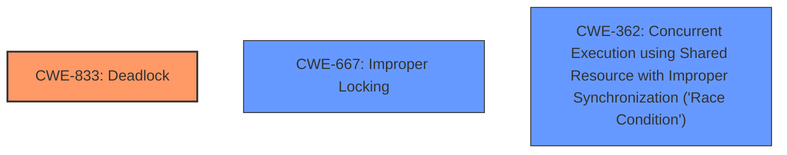

# Analysis Report for CVE-2025-21908

# Vulnerability Analysis Report: CVE-2025-21908

## Description

In the Linux kernel, the following vulnerability has been resolved NFS fix nfs_release_folio() to not deadlock via kcompactd writeback Add PF_KCOMPACTD flag and current_is_kcompactd() helper to check for it so nfs_release_folio() can skip calling nfs_wb_folio() from kcompactd. Otherwise NFS can deadlock waiting for kcompactd enduced writeback which recurses back to NFS (which triggers writeback to NFSD via NFS loopback mount on the same host, NFSD blocks waiting for XFSs call to __filemap_get_folio) 6070.550357] INFO task kcompactd058 blocked for more than 4435 seconds. {--- [58] kcompactd0 [] folio_wait_bit+0xe8/0x200 [] folio_wait_writeback+0x2b/0x80 [] nfs_wb_folio+0x80/0x1b0 [nfs] [] nfs_release_folio+0x68/0x130 [nfs] [] split_huge_page_to_list_to_order+0x362/0x840 [] migrate_pages_batch+0x43d/0xb90 [] migrate_pages_sync+0x9a/0x240 [] migrate_pages+0x93c/0x9f0 [] compact_zone+0x8e2/0x1030 [] compact_node+0xdb/0x120 [] kcompactd+0x121/0x2e0 [] kthread+0xcf/0x100 [] ret_from_fork+0x31/0x40 [] ret_from_fork_asm+0x1a/0x30 ---} [akpm@linux-foundation.org fix build]

## Vulnerability Description Key Phrases

- **Impact:** deadlock
- **Vector:** NFS loopback mount
- **Attacker:** kcompactd
- **Product:** Linux kernel
- **Component:** NFS fix nfs_release_folio()

## Analysis (with Relationship Data)

# Summary
| CWE ID | CWE Name | Confidence | CWE Abstraction Level | CWE Vulnerability Mapping Label | CWE-Vulnerability Mapping Notes |
|---|---|---|---|---|---|
| CWE-833 | Deadlock | 1.0 | Base | Allowed | Primary CWE |
| CWE-667 | Improper Locking | 0.7 | Class | Allowed-with-Review | Secondary Candidate |
| CWE-362 | Concurrent Execution using Shared Resource with Improper Synchronization ('Race Condition') | 0.6 | Class | Allowed-with-Review | Secondary Candidate |

## Evidence and Confidence

*   **Confidence Score:** 0.9
*   **Evidence Strength:** HIGH

## Relationship Analysis
The primary CWE is CWE-833, which is at the Base level. CWE-667 and CWE-362 are Class-level CWEs, which are parents of more specific Base-level CWEs. The vulnerability description points to a **deadlock** issue due to improper synchronization, but doesn't provide enough detail to pinpoint a specific type of improper locking or race condition.



## Vulnerability Chain
The vulnerability chain starts with a recursion from `kcompactd` to NFS, triggering writeback to NFSD via an NFS loopback mount. This causes NFSD to block waiting for an XFS call, ultimately leading to a **deadlock**. The root cause is the lack of proper handling of the recursive call from `kcompactd` within the NFS subsystem, which results in the **deadlock**.

## Summary of Analysis
The primary weakness is CWE-833 **Deadlock**. The vulnerability description clearly states a **deadlock** situation in the Linux kernel due to NFS waiting for `kcompactd` induced writeback, which recurses back to NFS. The fix involves skipping the call to `nfs_wb_folio()` from `kcompactd` to avoid the recursion.

The evidence is strong, as the description provides a call trace and explicitly mentions the **deadlock**. The Retriever Results also list CWE-833 as a potential match.

CWE-667 **Improper Locking** and CWE-362 **Concurrent Execution using Shared Resource with Improper Synchronization ('Race Condition')** are considered as secondary candidates because the **deadlock** is a consequence of some form of improper locking or synchronization issue, but the description doesn't provide enough detail to pinpoint the exact nature of the locking problem or race condition.

The selected CWEs are at the optimal level of specificity based on the provided information. CWE-833 directly addresses the **deadlock** condition, while CWE-667 and CWE-362 represent potential underlying causes but lack sufficient detail for definitive mapping.

Relevant CWE Information:

# Enhanced Context (25 CWEs)
The following CWEs were identified as potentially relevant to this vulnerability:

## CWE-833: Deadlock
**Abstraction Level**: Base
**Similarity Score**: 0.75
**Source**: dense

**Description**:
The product contains multiple threads or executable segments that are waiting for each other to release a necessary lock, resulting in **deadlock**.

**Mapping Guidance**:
- Usage: Allowed
- Rationale: This CWE entry is at the Base level of abstraction, which is a preferred level of abstraction for mapping to the root causes of vulnerabilities.

**Justification for Use**: The vulnerability description explicitly describes a **deadlock** scenario. The fix implemented addresses this **deadlock** by preventing a recursive call. The description aligns perfectly with the definition of CWE-833.

## CWE-667: Improper Locking
**Abstraction Level**: Class
**Similarity Score**: 0.74
**Source**: dense

**Description**:
The product does not properly acquire or release a lock on a resource, leading to unexpected resource state changes and behaviors.

**Mapping Guidance**:
- Usage: Allowed-with-Review
- Rationale: This CWE entry is a Class and might have Base-level children that would be more appropriate

**Justification for Consideration but Not Use as Primary**: While a **deadlock** often stems from **improper locking**, the description doesn't specify the exact locking mechanism that's failing. Therefore, CWE-667 is a potential contributing factor but not the most precise classification.

## CWE-362: Concurrent Execution using Shared Resource with Improper Synchronization ('Race Condition')
**Abstraction Level**: Class
**Similarity Score**: 0.71
**Source**: dense

**Description**:
The product contains a concurrent code sequence that requires temporary, exclusive access to a shared resource, but a timing window exists in which the shared resource can be modified by another code sequence operating concurrently.

**Mapping Guidance**:
- Usage: Allowed-with-Review
- Rationale: This CWE entry is a Class and might have Base-level children that would be more appropriate

**Justification for Consideration but Not Use as Primary**: The **deadlock** could be caused by a race condition, but the description doesn't provide sufficient evidence to confirm this. Therefore, it is less accurate than CWE-833.

## Other CWEs Considered and Rejected:

*   CWE-61, CWE-59, CWE-62, CWE-73: These CWEs relate to symlink/hard link issues, which are not present in the vulnerability description.
*   CWE-835: Loop with Unreachable Exit Condition ('Infinite Loop'): While related to potential resource exhaustion, the primary issue is a **deadlock**, not an infinite loop.
*   CWE-390, CWE-392: Detection/Missing Report of Error Condition: The issue is not about error reporting but rather a **deadlock** scenario.
*   CWE-401: Missing Release of Memory after Effective Lifetime: Memory leaks are not mentioned in the description.
*   CWE-703, CWE-755: Improper Handling of Exceptional Conditions: Too generic and doesn't describe the specific **deadlock** issue.
*   CWE-363: Race Condition Enabling Link Following: Involves race conditions with link following, which is not relevant here.
*   CWE-1322: Use of Blocking Code in Single-threaded, Non-blocking Context: While blocking is involved, the main problem is the **deadlock**, not the blocking itself.
*   CWE-386: Symbolic Name not Mapping to Correct Object: Not related to the described vulnerability.
*   CWE-416: Use After Free: No evidence of use-after-free issues in the description.


## CWE Relationship Analysis

Current CWEs represent these abstraction levels: .


### Vulnerability Chain Analysis

**Chain starting from CWE-390:**
- 390 (Detection of Error Condition Without Action) - ROOT


**Chain starting from CWE-392:**
- 392 (Missing Report of Error Condition) - ROOT


### CWE Relationship Diagram

```mermaid
graph TD
    classDef primary fill:#f96,stroke:#333,stroke-width:2px
    classDef secondary fill:#69f,stroke:#333
    classDef tertiary fill:#9e9,stroke:#333
```


*Report generated on 2025-07-14 09:59:36*
