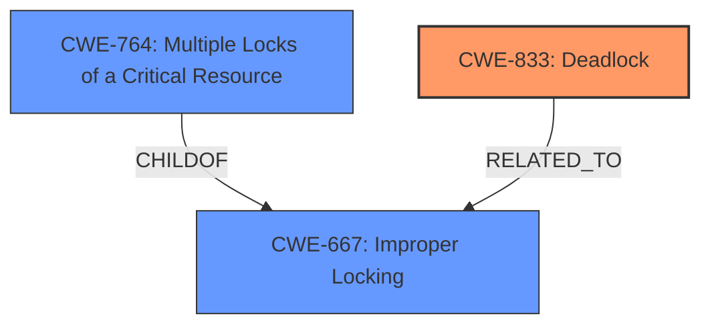

# Analysis Report for CVE-2025-21911

# Vulnerability Analysis Report: CVE-2025-21911

## Description

In the Linux kernel, the following vulnerability has been resolved drm/imagination avoid deadlock on fence release Do scheduler queue fence release processing on a workqueue, rather than in the release function itself. Fixes deadlock issues such as the following [ 607.400437] ============================================ [ 607.405755] WARNING possible **recursive locking** detected [ 607.415500] -------------------------------------------- [ 607.420817] westonzfq0/24149 is trying to acquire lock [ 607.426131] ffff000017d041a0 (reservation_ww_class_mutex){+.+.}-{33}, at pvr_gem_object_vunmap+0x40/0xc0 [powervr] [ 607.436728] but task is already holding lock [ 607.442554] ffff000017d105a0 (reservation_ww_class_mutex){+.+.}-{33}, at dma_buf_ioctl+0x250/0x554 [ 607.451727] other info that might help us debug this [ 607.458245] Possible unsafe locking scenario [ 607.464155] CPU0 [ 607.466601] ---- [ 607.469044] lock(reservation_ww_class_mutex) [ 607.473584] lock(reservation_ww_class_mutex) [ 607.478114] *** DEADLOCK ***

## Vulnerability Description Key Phrases

- **Rootcause:** recursive locking
- **Weakness:** possible recursive locking
- **Impact:** deadlock
- **Product:** Linux kernel
- **Component:** drm/imagination

## Analysis (with Relationship Data)

# Summary
| CWE ID | CWE Name | Confidence | CWE Abstraction Level | CWE Vulnerability Mapping Label | CWE-Vulnerability Mapping Notes |
|---|---|---|---|---|---|
| CWE-833 | Deadlock | 0.9 | Base | Primary | Allowed |
| CWE-667 | Improper Locking | 0.8 | Class | Secondary | Allowed-with-Review |
| CWE-764 | Multiple Locks of a Critical Resource | 0.7 | Base | Secondary | Allowed |

## Evidence and Confidence

*   **Confidence Score:** 0.9
*   **Evidence Strength:** HIGH

## Relationship Analysis
The primary weakness is **CWE-833 Deadlock**, a base-level CWE. The vulnerability description explicitly mentions "***DEADLOCK***". **CWE-667 Improper Locking** is a class-level CWE and a parent of several more specific locking issues, including **CWE-764 Multiple Locks of a Critical Resource**. **CWE-764** is a child of **CWE-667**. The recursive locking mentioned in the vulnerability description could lead to a deadlock if not handled properly.



## Vulnerability Chain
The vulnerability chain starts with **CWE-667 Improper Locking**, potentially leading to **CWE-764 Multiple Locks of a Critical Resource**, and culminating in **CWE-833 Deadlock**. The root cause is the improper management of locks, which results in a deadlock condition.

## Summary of Analysis
The analysis is based on the provided vulnerability description, which clearly states the occurrence of a deadlock due to recursive locking. The primary CWE is **CWE-833 Deadlock**, as it represents the final outcome of the vulnerability. The supporting CWEs, **CWE-667 Improper Locking** and **CWE-764 Multiple Locks of a Critical Resource**, describe the conditions that lead to the deadlock.

The evidence supporting this assessment is strong, as the vulnerability description includes the phrase "***DEADLOCK***" and mentions "***recursive locking***".

The retriever results also support this analysis, with **CWE-667 Improper Locking** and **CWE-833 Deadlock** being among the top matches.

Relevant CWE Information:

# Enhanced Context (25 CWEs)
The following CWEs were identified as potentially relevant to this vulnerability:

## CWE-667: Improper Locking
**Abstraction Level**: Class
**Similarity Score**: 0.80
**Source**: dense

**Description**:
The product does not properly acquire or release a lock on a resource, leading to unexpected resource state changes and behaviors.

**Mapping Guidance**:
- Usage: Allowed-with-Review
- Rationale: This CWE entry is a Class and might have Base-level children that would be more appropriate

## CWE-833: Deadlock
**Abstraction Level**: Base
**Similarity Score**: 0.77
**Source**: dense

**Description**:
The product contains multiple threads or executable segments that are waiting for each other to release a necessary lock, resulting in deadlock.

**Mapping Guidance**:
- Usage: Allowed
- Rationale: This CWE entry is at the Base level of abstraction, which is a preferred level of abstraction for mapping to the root causes of vulnerabilities.

## CWE-413: Improper Resource Locking
**Abstraction Level**: Base
**Similarity Score**: 0.75
**Source**: dense

**Description**:
The product does not lock or does not correctly lock a resource when the product must have exclusive access to the resource.

**Mapping Guidance**:
- Usage: Allowed
- Rationale: This CWE entry is at the Base level of abstraction, which is a preferred level of abstraction for mapping to the root causes of vulnerabilities.

## CWE-404: Improper Resource Shutdown or Release
**Abstraction Level**: Class
**Similarity Score**: 0.73
**Source**: dense

**Description**:
The product does not release or incorrectly releases a resource before it is made available for re-use.

**Mapping Guidance**:
- Usage: Allowed-with-Review
- Rationale: This CWE entry is a Class and might have Base-level children that would be more appropriate

## CWE-703: Improper Check or Handling of Exceptional Conditions
**Abstraction Level**: Pillar
**Similarity Score**: 0.72
**Source**: dense

**Description**:
The product does not properly anticipate or handle exceptional conditions that rarely occur during normal operation of the product.

**Mapping Guidance**:
- Usage: Discouraged
- Rationale: This CWE entry is extremely high-level, a Pillar.

## CWE-665: Improper Initialization
**Abstraction Level**: Class
**Similarity Score**: 0.72
**Source**: dense

**Description**:
The product does not initialize or incorrectly initializes a resource, which might leave the resource in an unexpected state when it is accessed or used.

**Mapping Guidance**:
- Usage: Discouraged
- Rationale: This CWE entry is a level-1 Class (i.e., a child of a Pillar). It might have lower-level children that would be more appropriate

## CWE-362: Concurrent Execution using Shared Resource with Improper Synchronization ('Race Condition')
**Abstraction Level**: Class
**Similarity Score**: 0.71
**Source**: dense

**Description**:
The product contains a concurrent code sequence that requires temporary, exclusive access to a shared resource, but a timing window exists in which the shared resource can be modified by another code sequence operating concurrently.

**Mapping Guidance**:
- Usage: Allowed-with-Review
- Rationale: This CWE entry is a Class and might have Base-level children that would be more appropriate

## CWE-824: Access of Uninitialized Pointer
**Abstraction Level**: Base
**Similarity Score**: 0.71
**Source**: dense

**Description**:
The product accesses or uses a pointer that has not been initialized.

**Mapping Guidance**:
- Usage: Allowed
- Rationale: This CWE entry is at the Base level of abstraction, which is a preferred level of abstraction for mapping to the root causes of vulnerabilities.

## CWE-367: Time-of-check Time-of-use (TOCTOU) Race Condition
**Abstraction Level**: Base
**Similarity Score**: 0.71
**Source**: dense

**Description**:
The product checks the state of a resource before using that resource, but the resource's state can change between the check and the use in a way that invalidates the results of the check. This can cause the product to perform invalid actions when the resource is in an unexpected state.

**Mapping Guidance**:
- Usage: Allowed
- Rationale: This CWE entry is at the Base level of abstraction, which is a preferred level of abstraction for mapping to the root causes of vulnerabilities.

## CWE-909: Missing Initialization of Resource
**Abstraction Level**: Class
**Similarity Score**: 0.71
**Source**: dense

**Description**:
The product does not initialize a critical resource.

**Mapping Guidance**:
- Usage: Allowed-with-Review
- Rationale: This CWE entry is a Class and might have Base-level children that would be more appropriate

## CWE-667: Improper Locking
**Abstraction Level**: Class
**Similarity Score**: 593.81
**Source**: sparse

**Description**:
The product does not properly acquire or release a lock on a resource, leading to unexpected resource state changes and behaviors.

**Mapping Guidance**:
- Usage: Allowed-with-Review
- Rationale: This CWE entry is a Class and might have Base-level children that would be more appropriate

## CWE-833: Deadlock
**Abstraction Level**: Base
**Similarity Score**: 466.65
**Source**: sparse

**Description**:
The product contains multiple threads or executable segments that are waiting for each other to release a necessary lock, resulting in deadlock.

**Mapping Guidance**:
- Usage: Allowed
- Rationale: This CWE entry is at the Base level of abstraction, which is a preferred level of abstraction for mapping to the root causes of vulnerabilities.

## CWE-764: Multiple Locks of a Critical Resource
**Abstraction Level**: Base
**Similarity Score**: 443.92
**Source**: sparse

**Description**:
The product locks a critical resource more times than intended, leading to an unexpected state in the system.

**Mapping Guidance**:
- Usage: Allowed
- Rationale: This CWE entry is at the Base level of abstraction, which is a preferred level of abstraction for mapping to the root causes of vulnerabilities.

## CWE-413:


## CWE Relationship Analysis

Current CWEs represent these abstraction levels: .


### Vulnerability Chain Analysis

**Chain starting from CWE-404:**
- 404 (Improper Resource Shutdown or Release) - ROOT


**Chain starting from CWE-667:**
- 667 (Improper Locking) - ROOT


### CWE Relationship Diagram

```mermaid
graph TD
    classDef primary fill:#f96,stroke:#333,stroke-width:2px
    classDef secondary fill:#69f,stroke:#333
    classDef tertiary fill:#9e9,stroke:#333
```


*Report generated on 2025-07-14 09:59:57*
