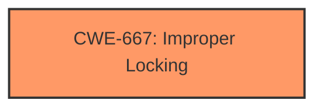

# Analysis for CVE-2025-21912

# Summary
| CWE ID    | CWE Name                                                                                          | Confidence | CWE Abstraction Level | CWE Vulnerability Mapping Label | CWE-Vulnerability Mapping Notes |
| :--------- | :------------------------------------------------------------------------------------------------- | :---------- | :---------------------- | :------------------------------ | :------------------------------ |
| CWE-667     | Improper Locking                                                                                 | 0.9        | Class                  | Primary                         | Allowed-with-Review           |

## Evidence and Confidence

*   **Confidence Score:** 0.9
*   **Evidence Strength:** HIGH

## Relationship Analysis
The primary relationship that influenced the decision was the hierarchical structure. While other CWEs like CWE-400, CWE-306, and CWE-770 were considered based on retriever results, they did not directly address the **root cause** which is the **improper locking** mechanism. CWE-667 is at the Class level, but more specific Base-level children were not evident in the provided description.

## Vulnerability Chain
The vulnerability chain starts with the **improper locking** (**CWE-667**), leading to an **invalid wait context** and spurious messages.

## Summary of Analysis
The assessment is primarily based on the provided evidence, specifically the key phrase "**Invalid wait context**" and the description indicating the use of `raw_spinlock` to protect register access. The report explicitly states the issue arises when spinlock debugging is enabled, further pointing towards a locking problem.

The selection of **CWE-667** is justified because the vulnerability description highlights a problem with the locking mechanism used to serialize register access. While the retriever results suggest other CWEs, they don't directly address the **root cause** of the issue. **CWE-667** is at the optimal level of specificity given the available information; a more specific CWE would require more detailed information about the exact type of locking failure.

Relevant CWE Information:

# Enhanced Context (25 CWEs)
The following CWEs were identified as potentially relevant to this vulnerability:

## CWE-667: Improper Locking
**Abstraction Level**: Class
**Similarity Score**: 0.79
**Source**: dense

**Description**:
The product does not properly acquire or release a lock on a resource, leading to unexpected resource state changes and behaviors.

**Mapping Guidance**:
- Usage: Allowed-with-Review
- Rationale: This CWE entry is a Class and might have Base-level children that would be more appropriate

# Vulnerability Description
In the Linux kernel, the following vulnerability has been resolved gpio rcar Use raw_spinlock to protect register access Use raw_spinlock in order to fix spurious messages about invalid context when spinlock debugging is enabled. The lock is only used to serialize register access. [ 4.239592] ============================= [ 4.239595] [ BUG **Invalid wait context** ] [ 4.239599] 6.13.0-rc7-arm64-renesas-05496-gd088502a519f #35 Not tainted [ 4.239603] ----------------------------- [ 4.239606] kworker/u85/76 is trying to lock [ 4.239609] ffff0000091898a0 (&p->lock){....}-{33}, at gpio_rcar_config_interrupt_input_mode+0x34/0x164 [ 4.239641] other info that might help us debug this [ 4.239643] context-{55} [ 4.239646] 5 locks held by kworker/u85/76 [ 4.239651] #0 ffff0000080fb148 ((wq_completion)async){+.+.}-{00}, at process_one_work+0x190/0x62c [ 4.250180] OF /soc/sound@ec500000/ports/port@0/endpoint Read of boolean property frame-master with a value. [ 4.254094] #1 ffff80008299bd80 ((work_completion)(&entry->work)){+.+.}-{00}, at process_one_work+0x1b8/0x62c [ 4.254109] #2 ffff00000920c8f8 [ 4.258345] OF /soc/sound@ec500000/ports/port@1/endpoint Read of boolean property bitclock-master with a value. [ 4.264803] (&dev->mutex){....}-{44}, at __device_attach_async_helper+0x3c/0xdc [ 4.264820] #3 ffff00000a50ca40 (request_class#2){+.+.}-{44}, at __setup_irq+0xa0/0x690 [ 4.264840] #4 [ 4.268872] OF /soc/sound@ec500000/ports/port@1/endpoint Read of boolean property frame-master with a value. [ 4.273275] ffff00000a50c8c8 (lock_class){....}-{22}, at __setup_irq+0xc4/0x690 [ 4.296130] renesas_sdhi_internal_dmac ee100000.mmc mmc1 base at 0x00000000ee100000, max clock rate 200 MHz [ 4.304082] stack backtrace [ 4.304086] CPU 1 UID 0 PID 76 Comm kworker/u85 Not tainted 6.13.0-rc7-arm64-renesas-05496-gd088502a519f #35 [ 4.304092] Hardware name Renesas Salvator-X 2nd version board based on r8a77965 (DT) [ 4.304097] Workqueue async async_run_entry_fn [ 4.304106] Call trace [ 4.304110] show_stack+0x14/0x20 (C) [ 4.304122] dump_stack_lvl+0x6c/0x90 [ 4.304131] dump_stack+0x14/0x1c [ 4.304138] __lock_acquire+0xdfc/0x1584 [ 4.426274] lock_acquire+0x1c4/0x33c [ 4.429942] _raw_spin_lock_irqsave+0x5c/0x80 [ 4.434307] gpio_rcar_config_interrupt_input_mode+0x34/0x164 [ 4.440061] gpio_rcar_irq_set_type+0xd4/0xd8 [ 4.444422] __irq_set_trigger+0x5c/0x178 [ 4.448435] __setup_irq+0x2e4/0x690 [ 4.452012] request_threaded_irq+0xc4/0x190 [ 4.456285] devm_request_threaded_irq+0x7c/0xf4 [ 4.459398] ata1 link resume succeeded after 1 retries [ 4.460902] mmc_gpiod_request_cd_irq+0x68/0xe0 [ 4.470660] mmc_start_host+0x50/0xac [ 4.474327] mmc_add_host+0x80/0xe4 [ 4.477817] tmio_mmc_host_probe+0x2b0/0x4