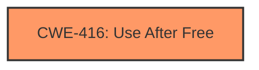

# Analysis Report for CVE-2025-21928

# Vulnerability Analysis Report: CVE-2025-21928

## Description

In the Linux kernel, the following vulnerability has been resolved HID intel-ish-hid Fix **use-after-free** issue in ishtp_hid_remove() The system can experience a random crash a few minutes after the driver is removed. This issue occurs due to **improper handling of memory freeing** in the ishtp_hid_remove() function. The function currently frees the `driver_data` directly within the loop that destroys the HID devices, which can lead to accessing freed memory. Specifically, `hid_destroy_device()` uses `driver_data` when it calls `hid_ishtp_set_feature()` to power off the sensor, so freeing `driver_data` beforehand can result in accessing invalid memory. This patch resolves the issue by storing the `driver_data` in a temporary variable before calling `hid_destroy_device()`, and then freeing the `driver_data` after the device is destroyed.

## Vulnerability Description Key Phrases

- **Rootcause:** improper handling of memory freeing
- **Weakness:** use-after-free
- **Impact:** random crash
- **Product:** Linux kernel
- **Component:** ishtp_hid_remove() function

## Analysis (with Relationship Data)

# Summary
| CWE ID  | CWE Name                                                                                   | Confidence | CWE Abstraction Level | CWE Vulnerability Mapping Label | CWE-Vulnerability Mapping Notes |
|---------|--------------------------------------------------------------------------------------------|------------|-----------------------|---------------------------------|------------------------------------|
| CWE-416 | Use After Free                                                                             | 1.0        | Variant               | Allowed                         | Primary CWE                       |

## Evidence and Confidence

*   **Confidence Score:** 1.0
*   **Evidence Strength:** HIGH

## Relationship Analysis
The primary identified weakness is CWE-416, "Use After Free," which is a variant-level CWE. The analysis did not identify any parent or child relationships that would suggest a more appropriate CWE. While several other CWEs were considered, none matched the provided vulnerability description as accurately as CWE-416.



## Vulnerability Chain
The vulnerability chain starts with **improper handling of memory freeing** which leads to a **use-after-free** condition. The impact is a system crash. The chain is: Incorrect Memory Handling -> Use After Free -> System Crash.

## Summary of Analysis
The primary weakness is a **use-after-free** vulnerability. The vulnerability occurs because the `driver_data` is freed before it is used by `hid_destroy_device()`. The provided evidence clearly supports the selection of CWE-416, "Use After Free," as the most appropriate CWE.

The vulnerability description includes the key phrase "**use-after-free**," and the root cause is identified as "**improper handling of memory freeing**." The retriever results also list CWE-416 as the top match.

Other CWEs considered but not selected:

*   CWE-362: Concurrent Execution using Shared Resource with Improper Synchronization ('Race Condition') - This CWE was not selected because the vulnerability is not caused by concurrent execution.
*   CWE-667: Improper Locking - This CWE was not selected because the vulnerability is not caused by improper locking.
*   CWE-415: Double Free - This CWE was not selected because the memory is not freed twice.
*   CWE-367: Time-of-check Time-of-use (TOCTOU) Race Condition - This CWE was not selected because it involves a race condition between a check and a use, which is not described in the vulnerability.
*   CWE-401: Missing Release of Memory after Effective Lifetime - This CWE was not selected because the memory is being freed, but at the wrong time.
*   CWE-908: Use of Uninitialized Resource - This CWE was not selected because the resource is not uninitialized, it is freed prematurely.

Relevant CWE Information:

# Enhanced Context (25 CWEs)
The following CWEs were identified as potentially relevant to this vulnerability:

## CWE-908: Use of Uninitialized Resource
**Abstraction Level**: Base
**Similarity Score**: 0.75
**Source**: dense

**Description**:
The product uses or accesses a resource that has not been initialized.

**Mapping Guidance**:
- Usage: Allowed
- Rationale: This CWE entry is at the Base level of abstraction, which is a preferred level of abstraction for mapping to the root causes of vulnerabilities.


## CWE-824: Access of Uninitialized Pointer
**Abstraction Level**: Base
**Similarity Score**: 0.74
**Source**: dense

**Description**:
The product accesses or uses a pointer that has not been initialized.

**Mapping Guidance**:
- Usage: Allowed
- Rationale: This CWE entry is at the Base level of abstraction, which is a preferred level of abstraction for mapping to the root causes of vulnerabilities.


## CWE-667: Improper Locking
**Abstraction Level**: Class
**Similarity Score**: 0.74
**Source**: dense

**Description**:
The product does not properly acquire or release a lock on a resource, leading to unexpected resource state changes and behaviors.

**Mapping Guidance**:
- Usage: Allowed-with-Review
- Rationale: This CWE entry is a Class and might have Base-level children that would be more appropriate


## CWE-362: Concurrent Execution using Shared Resource with Improper Synchronization ('Race Condition')
**Abstraction Level**: Class
**Similarity Score**: 0.73
**Source**: dense

**Description**:
The product contains a concurrent code sequence that requires temporary, exclusive access to a shared resource, but a timing window exists in which the shared resource can be modified by another code sequence operating concurrently.

**Mapping Guidance**:
- Usage: Allowed-with-Review
- Rationale: This CWE entry is a Class and might have Base-level children that would be more appropriate


## CWE-131: Incorrect Calculation of Buffer Size
**Abstraction Level**: Base
**Similarity Score**: 0.73
**Source**: dense

**Description**:
The product does not correctly calculate the size to be used when allocating a buffer, which could lead to a buffer overflow.

**Mapping Guidance**:
- Usage: Allowed
- Rationale: This CWE entry is at the Base level of abstraction, which is a preferred level of abstraction for mapping to the root causes of vulnerabilities.


## CWE-415: Double Free
**Abstraction Level**: Variant
**Similarity Score**: 0.73
**Source**: dense

**Description**:
The product calls free() twice on the same memory address, potentially leading to modification of unexpected memory locations.

**Mapping Guidance**:
- Usage: Allowed
- Rationale: This CWE entry is at the Variant level of abstraction, which is a preferred level of abstraction for mapping to the root causes of vulnerabilities.


## CWE-755: Improper Handling of Exceptional Conditions
**Abstraction Level**: Class
**Similarity Score**: 0.73
**Source**: dense

**Description**:
The product does not handle or incorrectly handles an exceptional condition.

**Mapping Guidance**:
- Usage: Discouraged
- Rationale: This CWE entry is a level-1 Class (i.e., a child of a Pillar). It might have lower-level children that would be more appropriate


## CWE-665: Improper Initialization
**Abstraction Level**: Class
**Similarity Score**: 0.72
**Source**: dense

**Description**:
The product does not initialize or incorrectly initializes a resource, which might leave the resource in an unexpected state when it is accessed or used.

**Mapping Guidance**:
- Usage: Discouraged
- Rationale: This CWE entry is a level-1 Class (i.e., a child of a Pillar). It might have lower-level children that would be more appropriate


## CWE-909: Missing Initialization of Resource
**Abstraction Level**: Class
**Similarity Score**: 0.72
**Source**: dense

**Description**:
The product does not initialize a critical resource.

**Mapping Guidance**:
- Usage: Allowed-with-Review
- Rationale: This CWE entry is a Class and might have Base-level children that would be more appropriate


## CWE-416: Use After Free
**Abstraction Level**: Variant
**Similarity Score**: 0.72
**Source**: dense

**Description**:
The product reuses or references memory after it has been freed. At some point afterward, the memory may be allocated again and saved in another pointer, while the original pointer references a location somewhere within the new allocation. Any operations using the original pointer are no longer valid because the memory "belongs" to the code that operates on the new pointer.

**Mapping Guidance**:
- Usage: Allowed
- Rationale: This CWE entry is at the Variant level of abstraction, which is a preferred level of abstraction for mapping to the root causes of vulnerabilities.


## CWE-362: Concurrent Execution using Shared Resource with Improper Synchronization ('Race Condition')
**Abstraction Level**: Class
**Similarity Score**: 577.31
**Source**: sparse

**Description**:
The product contains a concurrent code sequence that requires temporary, exclusive access to a shared resource, but a timing window exists in which the shared resource can be modified by another code sequence operating concurrently.

**Mapping Guidance**:
- Usage: Allowed-with-Review
- Rationale: This CWE entry is a Class and might have Base-level children that would be more appropriate


## CWE-415: Double Free
**Abstraction Level**: Variant
**Similarity Score**: 540.12
**Source**: sparse

**Description**:
The product calls free() twice on the same memory address, potentially leading to modification of unexpected memory locations.

**Mapping Guidance**:
- Usage: Allowed
- Rationale: This CWE entry is at the Variant level of abstraction, which is a preferred level of abstraction for mapping to the root causes of vulnerabilities.


## CWE-667: Improper Locking
**Abstraction Level**: Class
**Similarity Score**: 533.78
**Source**: sparse

**Description**:
The product does not properly acquire or release a lock on a resource, leading to unexpected resource state changes and behaviors.

**Mapping Guidance**:
- Usage: Allowed-with-Review
- Rationale: This CWE entry is a Class and might have Base-level children that would be more appropriate


## CWE


## CWE Relationship Analysis

Current CWEs represent these abstraction levels: .


### Vulnerability Chain Analysis

**Chain starting from CWE-416:**
- 416 (Use After Free) - ROOT


**Chain starting from CWE-131:**
- 131 (Incorrect Calculation of Buffer Size) - ROOT


### CWE Relationship Diagram

```mermaid
graph TD
    classDef primary fill:#f96,stroke:#333,stroke-width:2px
    classDef secondary fill:#69f,stroke:#333
    classDef tertiary fill:#9e9,stroke:#333
```


*Report generated on 2025-07-14 10:01:02*
