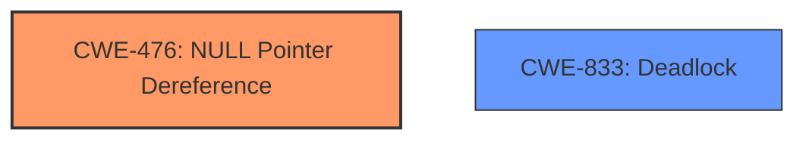

# Analysis for CVE-2025-21933

# Summary
| CWE ID | CWE Name | Confidence | CWE Abstraction Level | CWE Vulnerability Mapping Label | CWE-Vulnerability Mapping Notes |
|---|---|---|---|---|---|
| CWE-476 | NULL Pointer Dereference | 1.0 | Base | Primary | Allowed |
| CWE-833 | Deadlock | 0.5 | Base | Secondary Candidate | Allowed |

## Evidence and Confidence

*   **Confidence Score:** 0.8
*   **Evidence Strength:** HIGH

## Relationship Analysis
The primary relationship identified is the hierarchical structure with CWE-476 ([CWE-476: NULL Pointer Dereference](https://cwe.mitre.org/data/definitions/476.html)) being a specific type of dereference error. The retriever results and the vulnerability description clearly indicate a **NULL pointer dereference**, making CWE-476 the most appropriate choice. There is also a mention of potential deadlock, so CWE-833 ([CWE-833: Deadlock](https://cwe.mitre.org/data/definitions/833.html)) is a secondary candidate.

## Vulnerability Chain
The vulnerability chain starts with a call to `update_mmu_cache_range()` where the `vmf` parameter is NULL. This leads to a **NULL pointer dereference** in `adjust_pte()`. The description also mentions a potential deadlock scenario, where two vmas map to the same PTE page.

## Summary of Analysis
The primary weakness is a **NULL pointer dereference** (CWE-476) in the Linux kernel. The vulnerability description explicitly states this issue. The provided fix addresses the condition that leads to the **NULL pointer dereference**. The mention of potential deadlock led to the inclusion of CWE-833 as a secondary candidate.

The evidence supporting CWE-476 is strong, with the description stating "**NULL pointer dereference issue**" and "**NULL pointer dereference** at virtual address 00000030".

CWE-476 is at the optimal level of specificity (Base) because it directly describes the root cause of the vulnerability.

Relevant CWE Information:

# Enhanced Context (25 CWEs)
The following CWEs were identified as potentially relevant to this vulnerability:

## CWE-476: NULL Pointer Dereference
**Abstraction Level**: Base
**Similarity Score**: 0.78
**Source**: dense

**Description**:
The product dereferences a pointer that it expects to be valid but is NULL.

**Mapping Guidance**:
- Usage: Allowed
- Rationale: This CWE entry is at the Base level of abstraction, which is a preferred level of abstraction for mapping to the root causes of vulnerabilities.

*Technical Explanation*: The vulnerability occurs when the code attempts to dereference a **NULL** pointer, leading to a crash or unexpected behavior.
*Security Implications*: This can lead to denial of service (DoS) due to kernel crashes.
*Relationship Analysis*: CWE-476 is a Base-level CWE, providing a specific description of the error.
*Mapping Guidance Analysis*: The mapping guidance recommends using this CWE, as it is at the Base level of abstraction.

## CWE-667: Improper Locking
**Abstraction Level**: Class
**Similarity Score**: 0.78
**Source**: dense

**Description**:
The product does not properly acquire or release a lock on a resource, leading to unexpected resource state changes and behaviors.

**Mapping Guidance**:
- Usage: Allowed-with-Review
- Rationale: This CWE entry is a Class and might have Base-level children that would be more appropriate

*Technical Explanation*: The description mentions that a deadlock could occur if locks are not handled properly when two vmas map to the same PTE page.
*Security Implications*: Deadlocks can cause denial of service by halting the system or specific processes.
*Relationship Analysis*: This is a Class-level CWE, and while it could contribute to the overall issue, it's not the primary root cause.

## CWE-824: Access of Uninitialized Pointer
**Abstraction Level**: Base
**Similarity Score**: 0.78
**Source**: dense

**Description**:
The product accesses or uses a pointer that has not been initialized.

**Mapping Guidance**:
- Usage: Allowed
- Rationale: This CWE entry is at the Base level of abstraction, which is a preferred level of abstraction for mapping to the root causes of vulnerabilities.

*Technical Explanation*: This CWE describes accessing a pointer before it's initialized. However, the given vulnerability is about dereferencing a **NULL** pointer, not an uninitialized one.

## CWE-822: Untrusted Pointer Dereference
**Abstraction Level**: Base
**Similarity Score**: 0.77
**Source**: dense

**Description**:
The product obtains a value from an untrusted source, converts this value to a pointer, and dereferences the resulting pointer.

**Mapping Guidance**:
- Usage: Allowed
- Rationale: This CWE entry is at the Base level of abstraction, which is a preferred level of abstraction for mapping to the root causes of vulnerabilities.

*Technical Explanation*: This CWE involves dereferencing a pointer derived from an untrusted source. This is not the case in the given vulnerability.

## CWE-252: Unchecked Return Value
**Abstraction Level**: Base
**Similarity Score**: 0.77
**Source**: dense

**Description**:
The product does not check the return value from a method or function, which can prevent it from detecting unexpected states and conditions.

**Mapping Guidance**:
- Usage: Allowed
- Rationale: This CWE entry is at the Base level of abstraction, which is a preferred level of abstraction for mapping to the root causes of vulnerabilities.

*Technical Explanation*: While an unchecked return value could lead to a **NULL** pointer, it is not the direct cause of the vulnerability described.

## CWE-909: Missing Initialization of Resource
**Abstraction Level**: Class
**Similarity Score**: 0.77
**Source**: dense

**Description**:
The product does not initialize a critical resource.

**Mapping Guidance**:
- Usage: Allowed-with-Review
- Rationale: This CWE entry is a Class and might have Base-level children that would be more appropriate

*Technical Explanation*: This CWE describes a missing initialization, which is not the direct cause of the **NULL pointer dereference** described.

## CWE-131: Incorrect Calculation of Buffer Size
**Abstraction Level**: Base
**Similarity Score**: 0.75
**Source**: dense

**Description**:
The product does not correctly calculate the size to be used when allocating a buffer, which could lead to a buffer overflow.

**Mapping Guidance**:
- Usage: Allowed
- Rationale: This CWE entry is at the Base level of abstraction, which is a preferred level of abstraction for mapping to the root causes of vulnerabilities.

*Technical Explanation*: This CWE is related to buffer size calculations, not **NULL pointer dereferences**.

## CWE-665: Improper Initialization
**Abstraction Level**: Class
**Similarity Score**: 0.75
**Source**: dense

**Description**:
The product does not initialize or incorrectly initializes a resource, which might leave the resource in an unexpected state when it is accessed or used.

**Mapping Guidance**:
- Usage: Discouraged
- Rationale: This CWE entry is a level-1 Class (i.e., a child of a Pillar). It might have lower-level children that would be more appropriate

*Technical Explanation*: This is a broader initialization issue and not as specific as a **NULL pointer dereference**.

## CWE-404: Improper Resource Shutdown or Release
**Abstraction Level**: Class
**Similarity Score**: 0.75
**Source**: dense

**Description**:
The product does not release or incorrectly releases a resource before it is made available for re-use.

**Mapping Guidance**:
- Usage: Allowed-with-Review
- Rationale: This CWE entry is a Class and might have Base-level children that would be more appropriate

*Technical Explanation*: This CWE relates to resource release issues, not **NULL pointer dereferences**.

## CWE-1285: Improper Validation of Specified Index, Position, or Offset in Input
**Abstraction Level**: Base
**Similarity Score**: 0.75
**Source**: dense

**Description**:
The product receives input that is expected to specify an index, position, or offset into an indexable resource such as a buffer or file, but it does not validate or incorrectly validates that the specified index/position/offset has the required properties.

*Technical Explanation*: The vulnerability is due to a **NULL pointer dereference** not improper input validation.

## CWE-908: Use of Uninitialized Resource
**Abstraction Level**: Base
**Similarity Score**: 505.60
**Source**: sparse

**Description**:
The product uses or accesses a resource that has not been initialized.

*Technical Explanation*: The vulnerability is due to a **