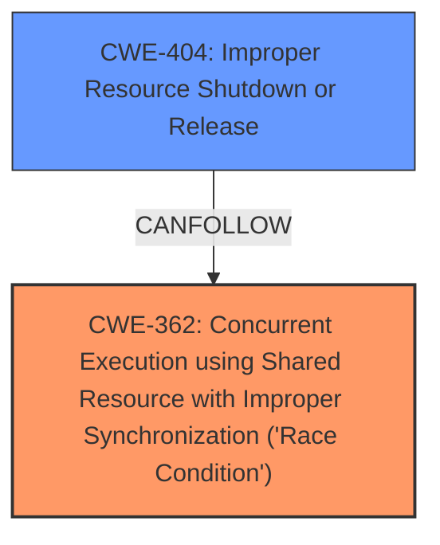

# Analysis for CVE-2025-21938

# Summary
| CWE ID | CWE Name | Confidence | CWE Abstraction Level | CWE Vulnerability Mapping Label | CWE-Vulnerability Mapping Notes |
|---|---|---|---|---|---|
| CWE-362 | Concurrent Execution using Shared Resource with Improper Synchronization ('Race Condition') | 0.9 | Class | Allowed-with-Review | Primary CWE. The vulnerability occurs due to multiple connection requests attempting to create an implicit mptcp endpoint in parallel leading to a race condition.|
| CWE-404 | Improper Resource Shutdown or Release | 0.7 | Class | Allowed-with-Review | Secondary CWE. The concurrent new_local_addr calls may delete the address entry created by the previous caller.|

## Evidence and Confidence

*   **Confidence Score:** 0.8
*   **Evidence Strength:** HIGH

## Relationship Analysis
The primary CWE is CWE-362, a class-level weakness describing a race condition. CWE-404 is a Class-level weakness, which is a potential consequence of the race condition where resources are improperly released.

## Vulnerability Chain
The vulnerability chain starts with a **race condition** (CWE-362) due to concurrent connection requests. This leads to the potential improper release of resources (CWE-404).

## Summary of Analysis
The primary weakness is a **race condition** (CWE-362) in the `mptcp_pm_nl_append_new_local_addr` function. Multiple connection requests, processed concurrently, can lead to one caller deleting an address entry created by another, resulting in an improper resource shutdown or release (CWE-404).

The evidence from the vulnerability description includes: "If multiple connection requests attempt to create an implicit mptcp endpoint in parallel, more than one caller may end up in mptcp_pm_nl_append_new_local_addr because none found the address in local_addr_list during their call to mptcp_pm_nl_get_local_id. In this case, the concurrent new_local_addr calls may delete the address entry created by the previous caller."

The graph relationship shows that CWE-404 can follow CWE-362.

CWE-362 is chosen as the primary CWE because the **race condition** is the root cause of the issue. The deletion of the address entry (CWE-404) is a consequence of the **race condition**.

I considered other CWEs from the Retriever Results, but they were not as relevant.
- CWE-911: Improper Update of Reference Count - While reference counting might be involved, the core issue is the **race condition** itself.
- CWE-909: Missing Initialization of Resource - This doesn't fit the scenario described.
- CWE-667: Improper Locking - While locking might help prevent the **race condition**, the description doesn't explicitly mention improper locking.
- CWE-415: Double Free - This is a specific type of memory error, and the description doesn't explicitly state that memory is being freed twice.

Relevant CWE Information:
*   CWE-362: Concurrent Execution using Shared Resource with Improper Synchronization ('Race Condition')
*   CWE-404: Improper Resource Shutdown or Release