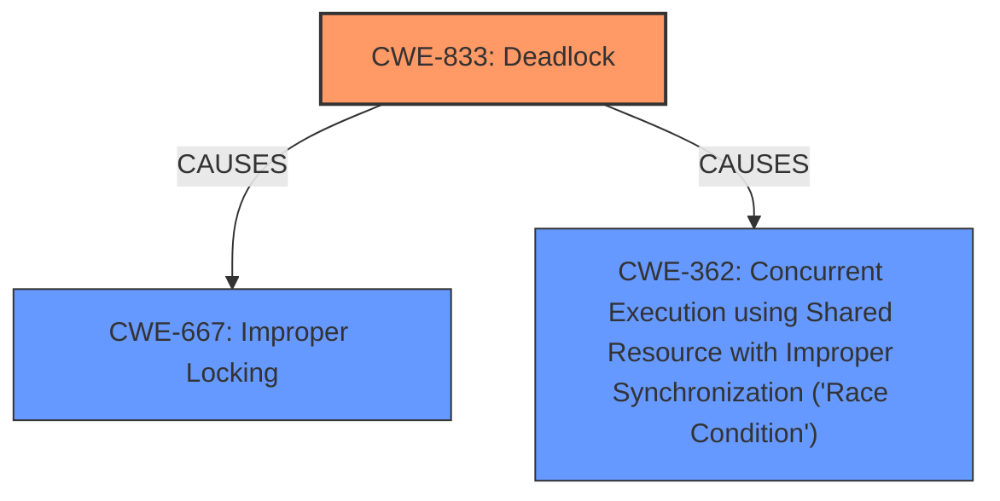

# Enhanced Analysis for CVE-2025-21986

# Summary
| CWE ID | CWE Name | Confidence | CWE Abstraction Level | CWE Vulnerability Mapping Label | CWE-Vulnerability Mapping Notes |
|---|---|---|---|---|---|
| CWE-833 | Deadlock | 0.9 | Base | Primary | Allowed |
| CWE-667 | Improper Locking | 0.7 | Class | Secondary | Allowed-with-Review |
| CWE-362 | Concurrent Execution using Shared Resource with Improper Synchronization ('Race Condition') | 0.6 | Class | Secondary | Allowed-with-Review |

## Evidence and Confidence

*   **Confidence Score:** 0.8
*   **Evidence Strength:** HIGH

## Relationship Analysis
The primary CWE selected is CWE-833 (Deadlock), a Base level CWE. It is related to CWE-667 (Improper Locking) and CWE-362 (Concurrent Execution using Shared Resource with Improper Synchronization ('Race Condition')), both Class level CWEs, which are considered as contributing factors or prerequisites to the deadlock condition. CWE-833 is a more specific consequence of improper locking or race conditions. The hierarchical relationships influenced the decision to prioritize CWE-833 as it directly reflects the described deadlock scenario.



## Vulnerability Chain
The vulnerability chain starts with the **improper locking** mechanism, specifically a read-write semaphore being acquired recursively. This leads to a **race condition** where multiple threads or executable segments are waiting for each other to release a lock. The final impact is a **deadlock** condition, causing lockdep warnings and potentially system instability.

## Summary of Analysis
The initial analysis focused on identifying the root cause and the resulting impact described in the vulnerability. The description clearly indicates a **recursive locking** issue leading to a **deadlock**. The evidence is strong due to the inclusion of a detailed stack backtrace and lockdep warnings.

The retriever results suggested CWE-667 (Improper Locking) and CWE-362 (Concurrent Execution using Shared Resource with Improper Synchronization ('Race Condition')), however, the vulnerability description explicitly states "***DEADLOCK***" which makes CWE-833 a better, more specific fit. The relationship analysis confirmed that CWE-667 and CWE-362 can contribute to a deadlock, but the final state is best represented by CWE-833.

The selection of CWE-833 is based on the direct evidence of a deadlock and the principle of selecting the most specific CWE. The other CWEs were considered but deemed secondary as they describe contributing factors rather than the ultimate vulnerability.

Relevant CWE Information:

# Enhanced Context (25 CWEs)
The following CWEs were identified as potentially relevant to this vulnerability:

## CWE-667: Improper Locking
**Abstraction Level**: Class
**Similarity Score**: 0.81
**Source**: dense

**Description**:
The product does not properly acquire or release a lock on a resource, leading to unexpected resource state changes and behaviors.

**Mapping Guidance**:
- Usage: Allowed-with-Review
- Rationale: This CWE entry is a Class and might have Base-level children that would be more appropriate

**Technical Explanation:** The vulnerability description indicates a blocking notification chain using a read-write semaphore that is acquired recursively, suggesting an issue with how locks are acquired or released. This aligns with the characteristics of CWE-667. While it's a contributing factor, the end result is a deadlock, making CWE-833 a better primary choice.

**Security Implications:** Improper locking can lead to race conditions, data corruption, and denial of service.

**Influence of Mapping Guidance:** The "Allowed-with-Review" usage suggests considering more specific Base-level children, which led to the selection of CWE-833.

## CWE-833: Deadlock
**Abstraction Level**: Base
**Similarity Score**: 0.78
**Source**: dense

**Description**:
The product contains multiple threads or executable segments that are waiting for each other to release a necessary lock, resulting in deadlock.

**Mapping Guidance**:
- Usage: Allowed
- Rationale: This CWE entry is at the Base level of abstraction, which is a preferred level of abstraction for mapping to the root causes of vulnerabilities.

**Technical Explanation:** The vulnerability description explicitly states "***DEADLOCK***" and provides a stack backtrace showing threads waiting for each other to release locks. This directly matches the definition of CWE-833.

**Security Implications:** Deadlocks can lead to denial of service, system instability, and data corruption.

**Influence of Mapping Guidance:** The "Allowed" usage and Base level of abstraction support the selection of CWE-833 as the primary CWE.

## CWE-362: Concurrent Execution using Shared Resource with Improper Synchronization ('Race Condition')
**Abstraction Level**: Class
**Similarity Score**: 684.32
**Source**: sparse

**Description**:
The product contains a concurrent code sequence that requires temporary, exclusive access to a shared resource, but a timing window exists in which the shared resource can be modified by another code sequence operating concurrently.

**Mapping Guidance**:
- Usage: Allowed-with-Review
- Rationale: This CWE entry is a Class and might have Base-level children that would be more appropriate

**Technical Explanation:** The recursive locking scenario suggests a potential race condition where multiple threads are attempting to access the same resource without proper synchronization. While the end result is a deadlock, the race condition is a contributing factor.

**Security Implications:** Race conditions can lead to data corruption, unexpected behavior, and denial of service.

**Influence of Mapping Guidance:** The "Allowed-with-Review" usage suggests considering more specific Base-level children, which led to prioritizing CWE-833.

## CWE-772: Missing Release of Resource after Effective Lifetime
**Abstraction Level**: base
**Similarity Score**: 2.21
**Source**: graph

**Description**:
CWE-772: Missing Release of Resource after Effective Lifetime

**Mapping Guidance**:
- Usage: Allowed
- Rationale: This CWE entry is at the Base level of abstraction, which is a preferred level of abstraction for mapping to the root causes of vulnerabilities.

**Technical Explanation:** This CWE was considered because deadlocks can sometimes occur if resources are not released properly. However, the primary issue described is the recursive acquisition of locks, not a general failure to release resources.

**Security Implications:** Resource leaks can lead to denial of service and system instability.

**Influence of Mapping Guidance:** While relevant in some deadlock scenarios, it does not directly apply to the recursive locking described in the vulnerability, so it was not selected.


## CWE Relationship Analysis

Current CWEs represent these abstraction levels: .


### Vulnerability Chain Analysis

**Chain starting from CWE-667:**
- 667 (Improper Locking) - ROOT


**Chain starting from CWE-833:**
- 833 (Deadlock) - ROOT


### CWE Relationship Diagram

```mermaid
graph TD
    classDef primary fill:#f96,stroke:#333,stroke-width:2px
    classDef secondary fill:#69f,stroke:#333
    classDef tertiary fill:#9e9,stroke:#333
```