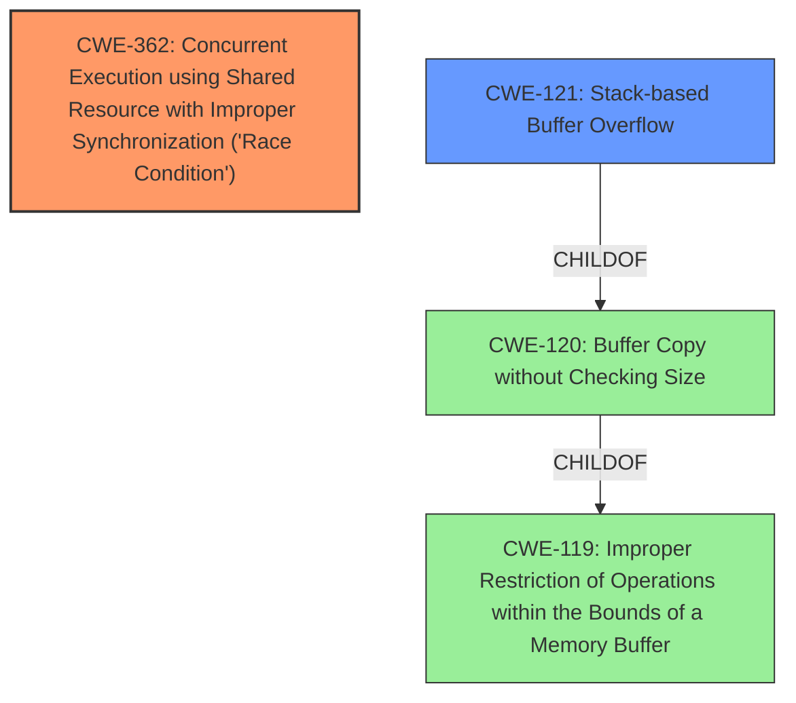

# Raw Analyzer Response for CVE-2025-22036

# Summary
| CWE ID | CWE Name | Confidence | CWE Abstraction Level | CWE Vulnerability Mapping Label | CWE-Vulnerability Mapping Notes |
|---|---|---|---|---|---|
| CWE-362 | Concurrent Execution using Shared Resource with Improper Synchronization ('Race Condition') | 0.9 | Class | Allowed-with-Review | Primary CWE. The vulnerability description explicitly mentions a race condition. |
| CWE-121 | Stack-based Buffer Overflow | 0.7 | Variant | Allowed | Secondary Candidate. The vulnerability mentions stack corruption and buffer_head UAF. Though a UAF is more specific, a stack based overflow is a plausible root cause. |

## Evidence and Confidence

*   **Confidence Score:** 0.8
*   **Evidence Strength:** MEDIUM

## Relationship Analysis
The primary CWE is CWE-362, which is a Class level CWE. While more specific race condition CWEs exist (e.g., CWE-367), the description doesn't provide sufficient details to narrow it down. CWE-121 is a Variant of CWE-120 (Buffer Copy without Checking Size), which in turn is a ChildOf CWE-119 (Improper Restriction of Operations within the Bounds of a Memory Buffer).

## Vulnerability Chain
The vulnerability chain starts with a **race condition** (CWE-362). This **race condition** leads to a use-after-free on a `buffer_head` structure, potentially causing a stack-based buffer overflow (CWE-121) and resulting in **stack corruption**. The patch prevents calling `bh_read()` with an on-stack `buffer_head`, thus addressing the **race condition** and preventing the subsequent memory corruption.

## Summary of Analysis
The analysis is primarily based on the vulnerability description, which explicitly mentions a **race condition** and **stack corruption**. The retriever results also highlight CWE-362 as the most relevant. Given the limited information, selecting the Class-level CWE-362 is appropriate. The secondary candidate, CWE-121, is included because the **stack corruption** described could be caused by a buffer overflow, though it is speculative without further detail on the exact cause of the **stack corruption**. The provided evidence supports these classifications, although more detailed information about the memory corruption would increase confidence in the secondary CWE selection.

Relevant CWE Information:

# Enhanced Context (25 CWEs)
The following CWEs were identified as potentially relevant to this vulnerability:

## CWE-362: Concurrent Execution using Shared Resource with Improper Synchronization ('Race Condition')
**Abstraction Level**: Class
**Similarity Score**: 0.76
**Source**: dense

**Description**:
The product contains a concurrent code sequence that requires temporary, exclusive access to a shared resource, but a timing window exists in which the shared resource can be modified by another code sequence operating concurrently.

**Mapping Guidance**:
- Usage: Allowed-with-Review
- Rationale: This CWE entry is a Class and might have Base-level children that would be more appropriate

## CWE-121: Stack-based Buffer Overflow
The product writes beyond the end of a buffer located on the stack.

### Technical Explanation:

CWE-362 Concurrent Execution using Shared Resource with Improper Synchronization ('Race Condition'): The core of the vulnerability lies in the **race condition** that occurs when accessing the `buffer_head` structure. Multiple threads or processes may attempt to access or modify the same memory location concurrently without proper synchronization mechanisms in place. This improper synchronization can lead to unpredictable and erroneous behavior, including memory corruption. The security implication is that an attacker could potentially manipulate the timing of these concurrent operations to trigger the **race condition** and cause the system to enter an undesirable state, such as denial of service or arbitrary code execution.

CWE-121 Stack-based Buffer Overflow: The **stack corruption** described in the vulnerability could arise if a buffer on the stack is overflowed due to incorrect size calculations or missing bounds checks when writing data to it. This can overwrite adjacent stack frames, potentially corrupting return addresses or other critical data, leading to control-flow hijacking or arbitrary code execution.