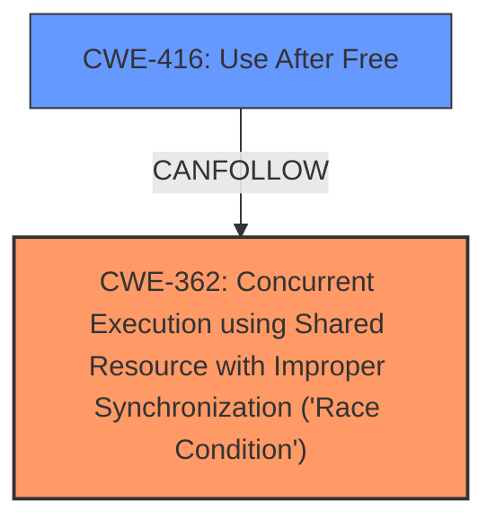

# Enhanced Analysis for CVE-2025-22040

# Summary
| CWE ID | CWE Name | Confidence | CWE Abstraction Level | CWE Vulnerability Mapping Label | CWE-Vulnerability Mapping Notes |
|---|---|---|---|---|---|
| CWE-362 | Concurrent Execution using Shared Resource with Improper Synchronization ('Race Condition') | 0.9 | Class | Allowed-with-Review | Primary CWE: The description explicitly states a **race condition** exists. |
| CWE-416 | Use After Free | 0.9 | Variant | Allowed | Secondary: The **use-after-free** condition is a direct consequence of the race condition. |

## Evidence and Confidence

*   **Confidence Score:** 0.9
*   **Evidence Strength:** HIGH

## Relationship Analysis
The vulnerability is a **use-after-free** caused by a **race condition**. CWE-362 is a Class-level CWE that describes race conditions in general. CWE-416 is a Variant-level CWE that describes the **use-after-free** weakness.



## Vulnerability Chain
The vulnerability chain starts with a **race condition** (CWE-362), which leads to a **use-after-free** (CWE-416).
- The **race condition** allows the session to be freed prematurely.
- Subsequently, a component attempts to use the freed session, resulting in a **use-after-free**.

## Summary of Analysis
The primary weakness is the **race condition** (CWE-362), which allows the session to be freed before it should be. This leads to a **use-after-free** (CWE-416) when the freed session is accessed. The evidence is strong because the vulnerability description explicitly mentions both the **race condition** and the **use-after-free**.
The "Retriever Results" highlight the relevance of CWE-362 and CWE-416, further reinforcing the selection.

Relevant CWE Information:

# Enhanced Context (25 CWEs)
The following CWEs were identified as potentially relevant to this vulnerability:

## CWE-362: Concurrent Execution using Shared Resource with Improper Synchronization ('Race Condition')
**Abstraction Level**: Class
**Similarity Score**: 0.74
**Source**: dense

**Description**:
The product contains a concurrent code sequence that requires temporary, exclusive access to a shared resource, but a timing window exists in which the shared resource can be modified by another code sequence operating concurrently.

**Mapping Guidance**:
- Usage: Allowed-with-Review
- Rationale: This CWE entry is a Class and might have Base-level children that would be more appropriate

## CWE-416: Use After Free
**Abstraction Level**: variant
**Similarity Score**: 3.89
**Source**: graph

**Description**:
CWE-416: Use After Free

**Mapping Guidance**:
- Usage: Allowed
- Rationale: This CWE entry is at the Variant level of abstraction, which is a preferred level of abstraction for mapping to the root causes of vulnerabilities.

**Relationships**:
- CANFOLLOW -> CWE-754
- CANFOLLOW -> CWE-364
- CANFOLLOW -> CWE-362
- CANFOLLOW -> CWE-1265
- CANPRECEDE -> CWE-123

I considered CWE-367 Time-of-check Time-of-use (TOCTOU) Race Condition, but this is not a TOCTOU vulnerability, since the state of the resource is not explicitly checked before it is used.
I also considered CWE-667 Improper Locking, but there is no specific mention of locking issues in the description.
I also considered CWE-415 Double Free, but there is no double free mentioned in the vulnerability description.

CWE-362 Concurrent Execution using Shared Resource with Improper Synchronization ('Race Condition'): The vulnerability description explicitly mentions "There is a **race condition** between session setup and ksmbd_sessions_deregister". This directly aligns with CWE-362, which describes scenarios where concurrent execution leads to improper synchronization when accessing a shared resource (the session). The security implication is that a session can be freed prematurely, leading to subsequent errors.
CWE-416 Use After Free: The vulnerability description states "...ksmbd fix session **use-after-free** in multichannel connection... The session can be freed before the connection is added to channel list of session." This clearly indicates a **use-after-free** condition, which is precisely what CWE-416 describes. After the session is freed, a component attempts to use it, resulting in the vulnerability.


## CWE Relationship Analysis

Current CWEs represent these abstraction levels: .


### Vulnerability Chain Analysis

**Chain starting from CWE-123:**
- 123 (Write-what-where Condition) - ROOT


**Chain starting from CWE-416:**
- 416 (Use After Free) - ROOT


### CWE Relationship Diagram

```mermaid
graph TD
    classDef primary fill:#f96,stroke:#333,stroke-width:2px
    classDef secondary fill:#69f,stroke:#333
    classDef tertiary fill:#9e9,stroke:#333
```