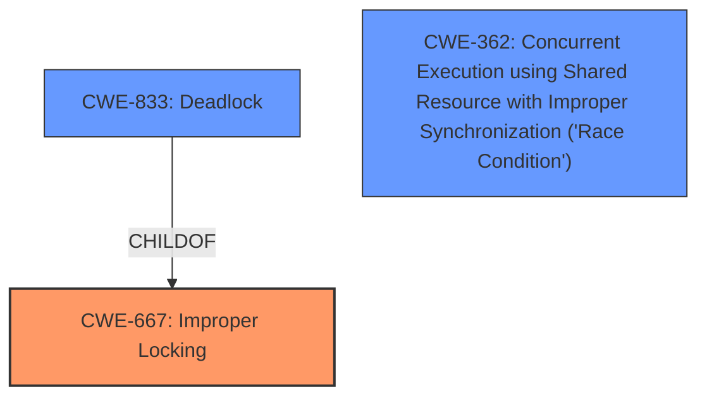

# Analysis Report for CVE-2025-22053

# Vulnerability Analysis Report: CVE-2025-22053

## Description

In the Linux kernel, the following vulnerability has been resolved net ibmveth make veth_pool_store stop hanging v2 - Created a single error handling unlock and exit in veth_pool_store - Greatly expanded commit message with previous explanatory-only text Summary Use rtnl_mutex to synchronize veth_pool_store with itself, ibmveth_close and ibmveth_open, preventing multiple calls in a row to napi_disable. Background Two (or more) threads could call veth_pool_store through writing to /sys/devices/vio/30000002/pool*/*. You can do this easily with a little shell script. This causes a hang. I configured LOCKDEP, compiled ibmveth.c with DEBUG, and built a new kernel. I ran this test again and saw Setting pool0/active to 0 Setting pool1/active to 1 [ 73.911067][ T4365] ibmveth 30000002 eth0 close starting Setting pool1/active to 1 Setting pool1/active to 0 [ 73.911367][ T4366] ibmveth 30000002 eth0 close starting [ 73.916056][ T4365] ibmveth 30000002 eth0 close complete [ 73.916064][ T4365] ibmveth 30000002 eth0 open starting [ 110.808564][ T712] systemd-journald[712] Sent WATCHDOG=1 notification. [ 230.808495][ T712] systemd-journald[712] Sent WATCHDOG=1 notification. [ 243.683786][ T123] INFO task stress.sh4365 blocked for more than 122 seconds. [ 243.683827][ T123] Not tainted 6.14.0-01103-g2df0c02dab82-dirty #8 [ 243.683833][ T123] echo 0 > /proc/sys/kernel/hung_task_timeout_secs disables this message. [ 243.683838][ T123] taskstress.sh stateD stack28096 pid4365 tgid4365 ppid4364 task_flags0x400040 flags0x00042000 [ 243.683852][ T123] Call Trace [ 243.683857][ T123] [c00000000c38f690] [0000000000000001] 0x1 (unreliable) [ 243.683868][ T123] [c00000000c38f840] [c00000000001f908] __switch_to+0x318/0x4e0 [ 243.683878][ T123] [c00000000c38f8a0] [c000000001549a70] __schedule+0x500/0x12a0 [ 243.683888][ T123] [c00000000c38f9a0] [c00000000154a878] schedule+0x68/0x210 [ 243.683896][ T123] [c00000000c38f9d0] [c00000000154ac80] schedule_preempt_disabled+0x30/0x50 [ 243.683904][ T123] [c00000000c38fa00] [c00000000154dbb0] __mutex_lock+0x730/0x10f0 [ 243.683913][ T123] [c00000000c38fb10] [c000000001154d40] napi_enable+0x30/0x60 [ 243.683921][ T123] [c00000000c38fb40] [c000000000f4ae94] ibmveth_open+0x68/0x5dc [ 243.683928][ T123] [c00000000c38fbe0] [c000000000f4aa20] veth_pool_store+0x220/0x270 [ 243.683936][ T123] [c00000000c38fc70] [c000000000826278] sysfs_kf_write+0x68/0xb0 [ 243.683944][ T123] [c00000000c38fcb0] [c0000000008240b8] kernfs_fop_write_iter+0x198/0x2d0 [ 243.683951][ T123] [c00000000c38fd00] [c00000000071b9ac] vfs_write+0x34c/0x650 [ 243.683958][ T123] [c00000000c38fdc0] [c00000000071bea8] ksys_write+0x88/0x150 [ 243.683966][ T123] [c00000000c38fe10] [c0000000000317f4] system_call_exception+0x124/0x340 [ 243.683973][ T123] [c00000000c38fe50] [c00000000000d05c] system_call_vectored_common+0x15c/0x2ec ... [ 243.684087][ T123] Showing all locks held in the system [ 243.684095][ T123] 1 lock held by khungtaskd/123 [ 243.684099][ T123] #0 c00000000278e370 (rcu_read_lock){....}-{12}, at debug_show_all_locks+0x50/0x248 [ 243.684114][ T123] 4 locks held by stress.sh/4365 [ 243.684119][ T123] #0 c00000003a4cd3f8 (sb_writers#3){.+.+}-{00}, at ksys_write+0x88/0x150 [ 243.684132][ T123] #1 c000000041aea888 (&of->mutex#2){+.+.}-{33}, at kernfs_fop_write_iter+0x154/0x2d0 [ 243.684143][ T123] #2 c0000000366fb9a8 (kn->active#64){.+.+}-{00}, at kernfs_fop_write_iter+0x160/0x2d0 [ 243.684155][ T123] #3 c000000035ff4cb8 (&dev->lock){+.+.}-{33}, at napi_enable+0x30/0x60 [ 243.684166][ T123] 5 locks held by stress.sh/4366 [ 243.684170][ T123] #0 c00000003a4cd3f8 (sb_writers#3){.+.+}-{00}, at ksys_write+0x88/0x150 [ 243. ---truncated---

## Vulnerability Description Key Phrases

- **Impact:** hang
- **Vector:** writing to /sys/devices/vio/30000002/pool*/*
- **Attacker:** multiple threads
- **Product:** Linux kernel
- **Component:** net ibmveth

## Analysis (with Relationship Data)

# Summary
| CWE ID | CWE Name | Confidence | CWE Abstraction Level | CWE Vulnerability Mapping Label | CWE-Vulnerability Mapping Notes |
|---|---|---|---|---|---|
| CWE-667 | Improper Locking | 0.9 | Class | Primary CWE | Allowed-with-Review |
| CWE-833 | Deadlock | 0.7 | Base | Secondary Candidate CWE | Allowed |
| CWE-362 | Concurrent Execution using Shared Resource with Improper Synchronization ('Race Condition') | 0.6 | Class | Secondary Candidate CWE | Allowed-with-Review |

## Evidence and Confidence

*   **Confidence Score:** 0.8
*   **Evidence Strength:** MEDIUM

## Relationship Analysis
The primary identified weakness is CWE-667 Improper Locking. This is a Class-level CWE, and the provided description aligns with the general concept of lock mismanagement. CWE-833 Deadlock is a Base-level CWE and a child of CWE-667, representing a specific consequence of improper locking. CWE-362 Concurrent Execution using Shared Resource with Improper Synchronization ('Race Condition') is a Class-level CWE that represents a different consequence of missing or improper synchronization.



## Vulnerability Chain
The vulnerability chain starts with multiple threads attempting to access the same resource. Due to **improper locking** (CWE-667) mechanisms in `veth_pool_store`, a **deadlock** (CWE-833) occurs, leading to a system hang. The **concurrent execution using shared resource with improper synchronization** (CWE-362) leads to the **improper locking** (CWE-667).

## Summary of Analysis
The vulnerability description clearly indicates a **hang** caused by concurrent access to a shared resource. The stack trace implicates `napi_enable` and `veth_pool_store`, suggesting a locking issue. The core of the vulnerability is that multiple threads can call `veth_pool_store` concurrently, leading to a **deadlock** (CWE-833) because of **improper locking** (CWE-667). The provided evidence points to a synchronization problem involving a mutex.

The primary mapping is CWE-667 Improper Locking because the core issue is the mismanagement of locks, which enables the deadlock. The description states, "Use rtnl_mutex to synchronize veth_pool_store with itself, ibmveth_close and ibmveth_open, preventing multiple calls in a row to napi_disable." This supports the claim that there was **improper locking** mechanisms that could be exploited by multiple threads.

CWE-833 Deadlock is considered a secondary candidate because it describes the direct consequence of the improper locking.

CWE-362 Concurrent Execution using Shared Resource with Improper Synchronization ('Race Condition') is also considered a secondary candidate, because a race condition is a prerequisite to the **improper locking** condition.

The retriever results also suggest CWE-667 and CWE-833 as possibilities.

The selected CWEs are at an appropriate level of specificity. CWE-667 captures the general class of **improper locking**, while CWE-833 represents the more specific outcome of a deadlock.
# Enhanced Context (25 CWEs)
The following CWEs were identified as potentially relevant to this vulnerability:

## CWE-667: Improper Locking
**Abstraction Level**: Class
**Similarity Score**: 0.79
**Source**: dense

**Description**:
The product does not properly acquire or release a lock on a resource, leading to unexpected resource state changes and behaviors.

**Mapping Guidance**:
- Usage: Allowed-with-Review
- Rationale: This CWE entry is a Class and might have Base-level children that would be more appropriate

## CWE-833: Deadlock
**Abstraction Level**: Base
**Similarity Score**: 0.75
**Source**: dense

**Description**:
The product contains multiple threads or executable segments that are waiting for each other to release a necessary lock, resulting in deadlock.

**Mapping Guidance**:
- Usage: Allowed
- Rationale: This CWE entry is at the Base level of abstraction, which is a preferred level of abstraction for mapping to the root causes of vulnerabilities.

## CWE-362: Concurrent Execution using Shared Resource with Improper Synchronization ('Race Condition')
**Abstraction Level**: Class
**Similarity Score**: 0.75
**Source**: dense

**Description**:
The product contains a concurrent code sequence that requires temporary, exclusive access to a shared resource, but a timing window exists in which the shared resource can be modified by another code sequence operating concurrently.

**Mapping Guidance**:
- Usage: Allowed-with-Review
- Rationale: This CWE entry is a Class and might have Base-level children that would be more appropriate

## CWE-755: Improper Handling of Exceptional Conditions
**Abstraction Level**: Class
**Similarity Score**: 0.75
**Source**: dense

**Description**:
The product does not handle or incorrectly handles an exceptional condition.

**Mapping Guidance**:
- Usage: Discouraged
- Rationale: This CWE entry is a level-1 Class (i.e., a child of a Pillar). It might have lower-level children that would be more appropriate

## CWE-703: Improper Check or Handling of Exceptional Conditions
**Abstraction Level**: Pillar
**Similarity Score**: 0.75
**Source**: dense

**Description**:
The product does not properly anticipate or handle exceptional conditions that rarely occur during normal operation of the product.

**Mapping Guidance**:
- Usage: Discouraged
- Rationale: This CWE entry is extremely high-level, a Pillar.

## CWE-404: Improper Resource Shutdown or Release
**Abstraction Level**: Class
**Similarity Score**: 0.75
**Source**: dense

**Description**:
The product does not release or incorrectly releases a resource before it is made available for re-use.

**Mapping Guidance**:
- Usage: Allowed-with-Review
- Rationale: This CWE entry is a Class and might have Base-level children that would be more appropriate

## CWE-754: Improper Check for Unusual or Exceptional Conditions
**Abstraction Level**: Class
**Similarity Score**: 0.74
**Source**: dense

**Description**:
The product does not check or incorrectly checks for unusual or exceptional conditions that are not expected to occur frequently during day to day operation of the product.

**Mapping Guidance**:
- Usage: Allowed-with-Review
- Rationale: This CWE entry is a Class and might have Base-level children that would be more appropriate

## CWE-252: Unchecked Return Value
**Abstraction Level**: Base
**Similarity Score**: 0.74
**Source**: dense

**Description**:
The product does not check the return value from a method or function, which can prevent it from detecting unexpected states and conditions.

**Mapping Guidance**:
- Usage: Allowed
- Rationale: This CWE entry is at the Base level of abstraction, which is a preferred level of abstraction for mapping to the root causes of vulnerabilities.

## CWE-617: Reachable Assertion
**Abstraction Level**: Base
**Similarity Score**: 0.74
**Source**: dense

**Description**:
The product contains an assert() or similar statement that can be triggered by an attacker, which leads to an application exit or other behavior that is more severe than necessary.

**Mapping Guidance**:
- Usage: Allowed
- Rationale: This CWE entry is at the Base level of abstraction, which is a preferred level of abstraction for mapping to the root causes of vulnerabilities.

## CWE-696: Incorrect Behavior Order
**Abstraction Level**: Class
**Similarity Score**: 0.74
**Source**: dense

**Description**:
The product performs multiple related behaviors, but the behaviors are performed in the wrong order in ways which may produce resultant weaknesses.

**Mapping Guidance**:
- Usage: Allowed-with-Review
- Rationale: This CWE entry is a Class and might have Base-level children that would be more appropriate

## CWE-243: Creation of chroot Jail Without Changing Working Directory
**Abstraction Level**: Variant
**Similarity Score**: 680.04
**Source**: sparse

**Description**:
The product uses the chroot() system call to create a jail, but does not change the working directory afterward. This does not prevent access to files outside of the jail.

**Mapping Guidance**:
- Usage: Allowed
- Rationale: This CWE entry is at the Variant level of abstraction, which is a preferred level of abstraction for mapping to the root causes of vulnerabilities.

## CWE-667: Improper Locking
**


## CWE Relationship Analysis

Current CWEs represent these abstraction levels: .


### Vulnerability Chain Analysis

**Chain starting from CWE-617:**
- 617 (Reachable Assertion) - ROOT


**Chain starting from CWE-243:**
- 243 (Creation of chroot Jail Without Changing Working Directory) - ROOT


### CWE Relationship Diagram

```mermaid
graph TD
    classDef primary fill:#f96,stroke:#333,stroke-width:2px
    classDef secondary fill:#69f,stroke:#333
    classDef tertiary fill:#9e9,stroke:#333
```


*Report generated on 2025-07-14 10:09:01*
