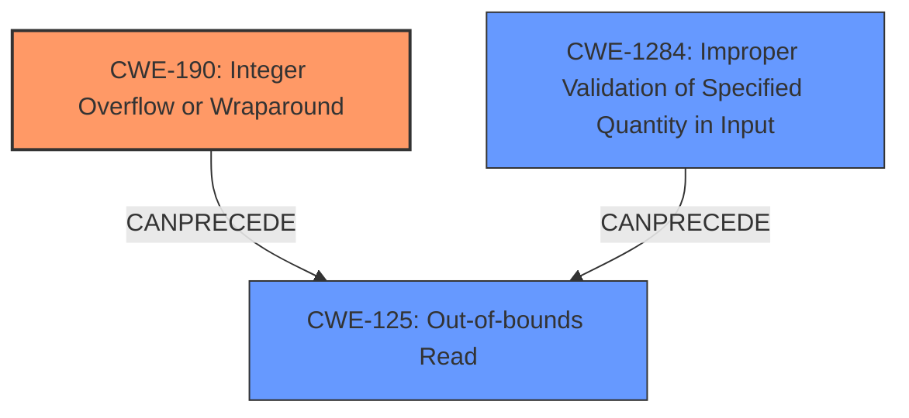

# Enhanced Analysis for CVE-2025-22055

# Summary
| CWE ID   | CWE Name                                                     | Confidence | CWE Abstraction Level | CWE Vulnerability Mapping Label | CWE-Vulnerability Mapping Notes |
| :-------- | :----------------------------------------------------------- | :--------- | :-------------------- | :------------------------------ | :------------------------------ |
| CWE-190 | Integer Overflow or Wraparound                                           | 0.90       | Base                  | Primary                         | Allowed                       |
| CWE-125 | Out-of-bounds Read                                       | 0.80       | Base                  | Secondary                       | Allowed                       |
| CWE-1284 | Improper Validation of Specified Quantity in Input                                      | 0.60       | Base                  | Secondary                       | Allowed                       |

## Evidence and Confidence

*   **Confidence Score:** 0.85
*   **Evidence Strength:** HIGH

## Relationship Analysis
The primary weakness is an **integer overflow** (CWE-190) when calculating the length of the `geneve_opt`. This can lead to an out-of-bounds read (CWE-125) because the incorrect length calculation results in reading memory beyond the allocated buffer. CWE-1284 is also relevant because the input is not properly validated to ensure the quantity (length) is within the required properties. CWE-190 can precede CWE-125. CWE-1284 can precede CWE-789 (Memory Allocation with Excessive Size Value) based on its relationships. The abstraction levels are all Base/Variant levels, which are preferable for root cause analysis.



## Vulnerability Chain
1.  The vulnerability begins with an **integer overflow** (CWE-190) in the calculation of the length of `geneve_opt`.
2.  This **incorrect** length calculation leads to an **improper** validation of the specified quantity in the input (CWE-1284).
3.  The **improper** validation causes a heap out-of-bounds read (CWE-125) during parsing, as the system attempts to read data beyond the buffer's boundaries.

## Summary of Analysis
The primary **root cause** of this vulnerability is the **integer overflow** (CWE-190) within the length calculation for `geneve_opt`. The vulnerability description explicitly mentions the **integer overflow** and how it leads to a heap out-of-bounds read, which confirms CWE-190's role as the initial flaw. The other aspect is the **improper** validation of the input length (CWE-1284) which allows the overflow to occur in the first place. Finally, the ultimate impact is the heap out-of-bounds read (CWE-125), which results from the **integer overflow** leading to read beyond buffer boundaries.

The selection of CWE-190 is based on the explicit mention of **integer overflow** as the **root cause**. The vulnerability description states that the **integer overflow** can "fake a zero length option and confuse the parsing logic," which is direct evidence.

CWE-125 is a direct consequence of the **integer overflow**, as it results in the system attempting to read beyond the bounds of the allocated memory.

CWE-1284 is included because the system does not properly validate the size or length of the input, which would have prevented the **integer overflow** from occurring.

Other CWEs Considered:

*   CWE-20: Improper Input Validation was considered but is too high-level. CWE-1284 is a more specific child of CWE-20.
*   CWE-770: Allocation of Resources Without Limits or Throttling was considered, but the primary issue is not related to resource allocation, but rather the **integer overflow** and subsequent out-of-bounds read.
*   CWE-121: Stack-based Buffer Overflow was considered, but the crash log indicates a slab-out-of-bounds read, which suggests a heap-based issue rather than a stack-based one.


## CWE Relationship Analysis

Current CWEs represent these abstraction levels: .


### Vulnerability Chain Analysis

**Chain starting from CWE-1284:**
- 1284 (Improper Validation of Specified Quantity in Input) - ROOT


**Chain starting from CWE-121:**
- 121 (Stack-based Buffer Overflow) - ROOT


### CWE Relationship Diagram

```mermaid
graph TD
    classDef primary fill:#f96,stroke:#333,stroke-width:2px
    classDef secondary fill:#69f,stroke:#333
    classDef tertiary fill:#9e9,stroke:#333
```