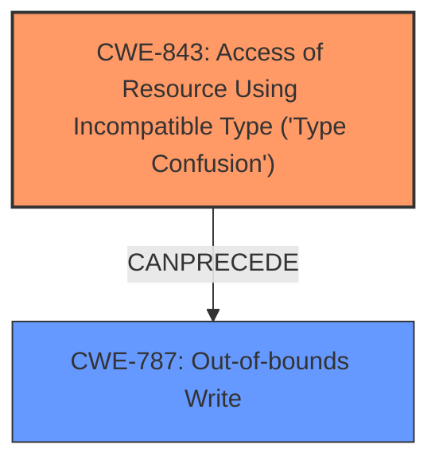

# Analysis Report for CVE-2025-22056

# Vulnerability Analysis Report: CVE-2025-22056

## Description

In the Linux kernel, the following vulnerability has been resolved netfilter nft_tunnel fix geneve_opt **type confusion** addition When handling multiple NFTA_TUNNEL_KEY_OPTS_GENEVE attributes, the parsing logic should place every geneve_opt structure one by one compactly. Hence, when deciding the next geneve_opt position, the pointer addition should be in units of char *. However, the current implementation erroneously does type conversion before the addition, which will lead to heap out-of-bounds write. [ 6.989857] ================================================================== [ 6.990293] BUG KASAN slab-out-of-bounds in nft_tunnel_obj_init+0x977/0xa70 [ 6.990725] Write of size 124 at addr ffff888005f18974 by task poc/178 [ 6.991162] [ 6.991259] CPU 0 PID 178 Comm poc-oob-write Not tainted 6.1.132 #1 [ 6.991655] Hardware name QEMU Standard PC (i440FX + PIIX, 1996), BIOS rel-1.16.0-0-gd239552ce722-prebuilt.qemu.org 04/01/2014 [ 6.992281] Call Trace [ 6.992423] [ 6.992586] dump_stack_lvl+0x44/0x5c [ 6.992801] print_report+0x184/0x4be [ 6.993790] kasan_report+0xc5/0x100 [ 6.994252] kasan_check_range+0xf3/0x1a0 [ 6.994486] memcpy+0x38/0x60 [ 6.994692] nft_tunnel_obj_init+0x977/0xa70 [ 6.995677] nft_obj_init+0x10c/0x1b0 [ 6.995891] nf_tables_newobj+0x585/0x950 [ 6.996922] nfnetlink_rcv_batch+0xdf9/0x1020 [ 6.998997] nfnetlink_rcv+0x1df/0x220 [ 6.999537] netlink_unicast+0x395/0x530 [ 7.000771] netlink_sendmsg+0x3d0/0x6d0 [ 7.001462] __sock_sendmsg+0x99/0xa0 [ 7.001707] ____sys_sendmsg+0x409/0x450 [ 7.002391] ___sys_sendmsg+0xfd/0x170 [ 7.003145] __sys_sendmsg+0xea/0x170 [ 7.004359] do_syscall_64+0x5e/0x90 [ 7.005817] entry_SYSCALL_64_after_hwframe+0x6e/0xd8 [ 7.006127] RIP 00330x7ec756d4e407 [ 7.006339] Code 48 89 fa 4c 89 df e8 38 aa 00 00 8b 93 08 03 00 00 59 5e 48 83 f8 fc 74 1a 5b c3 0f 1f 84 00 00 00 00 00 48 8b 44 24 10 0f 05 c3 0f 1f 80 00 00 00 00 83 e2 39 83 faf [ 7.007364] RSP 002b00007ffed5d46760 EFLAGS 00000202 ORIG_RAX 000000000000002e [ 7.007827] RAX ffffffffffffffda RBX 00007ec756cc4740 RCX 00007ec756d4e407 [ 7.008223] RDX 0000000000000000 RSI 00007ffed5d467f0 RDI 0000000000000003 [ 7.008620] RBP 00007ffed5d468a0 R08 0000000000000000 R09 0000000000000000 [ 7.009039] R10 0000000000000000 R11 0000000000000202 R12 0000000000000000 [ 7.009429] R13 00007ffed5d478b0 R14 00007ec756ee5000 R15 00005cbd4e655cb8 Fix this bug with correct pointer addition and conversion in parse and dump code.

## Vulnerability Description Key Phrases

- **Component:** netfilter nft_tunnel
- **Rootcause:** type confusion
- **Weakness:** heap out-of-bounds write, slab-out-of-bounds write
- **Product:** Linux kernel
- **Version:** 6.1.132

## Analysis (with Relationship Data)

# Summary
| CWE ID | CWE Name | Confidence | CWE Abstraction Level | CWE Vulnerability Mapping Label | CWE-Vulnerability Mapping Notes |
|---|---|---|---|---|---|
| CWE-843 | Access of Resource Using Incompatible Type ('Type Confusion') | 1.0 | Base | Primary | Allowed |
| CWE-787 | Out-of-bounds Write | 0.8 | Base | Secondary | Allowed |

## Evidence and Confidence

*   **Confidence Score:** 0.9
*   **Evidence Strength:** HIGH

## Relationship Analysis
The primary relationship that influenced my decision was the direct connection between the **type confusion** and the resulting out-of-bounds write. CWE-843 (Type Confusion) is the root cause, leading to CWE-787 (Out-of-bounds Write) as the impact.



## Vulnerability Chain
The vulnerability chain starts with **type confusion** (CWE-843), which then leads to a **heap out-of-bounds write** (CWE-787).

## Summary of Analysis
The primary weakness is CWE-843 (**Type Confusion**), which directly caused the **heap out-of-bounds write**.

The vulnerability description explicitly mentions "**type confusion**" as the root cause and "**heap out-of-bounds write**" as the weakness.

> In the Linux kernel, the following vulnerability has been resolved netfilter nft_tunnel fix geneve_opt **type confusion** addition When handling multiple NFTA_TUNNEL_KEY_OPTS_GENEVE attributes, the parsing logic should place every geneve_opt structure one by one compactly. Hence, when deciding the next geneve_opt position, the pointer addition should be in units of char *. However, the current implementation erroneously does type conversion before the addition, which will lead to heap out-of-bounds write. [ 6.989857] ================================================================== [ 6.990293] BUG KASAN slab-out-of-bounds in nft_tunnel_obj_init+0x977/0xa70 [ 6.990725] Write of size 124 at addr ffff888005f18974 by task poc/178

The **type confusion** results in incorrect pointer arithmetic, leading to the out-of-bounds write. The provided information is sufficient for mapping CWE-843 as the primary CWE.

CWE-787 (Out-of-bounds Write) is a direct consequence of the type confusion.

The other CWEs were not selected because they did not directly address the root cause or the immediate impact. For example, CWE-20 (Improper Input Validation) might be a contributing factor, but it is not the primary cause of the vulnerability.

Relevant CWE Information:

# Enhanced Context (25 CWEs)
The following CWEs were identified as potentially relevant to this vulnerability:

## CWE-843: Access of Resource Using Incompatible Type ('Type Confusion')
**Abstraction Level**: Base
**Similarity Score**: 0.78
**Source**: dense

**Description**:
The product allocates or initializes a resource such as a pointer, object, or variable using one type, but it later accesses that resource using a type that is incompatible with the original type.

**Mapping Guidance**:
- Usage: Allowed
- Rationale: This CWE entry is at the Base level of abstraction, which is a preferred level of abstraction for mapping to the root causes of vulnerabilities.
## CWE-787: Out-of-bounds Write
**Abstraction Level**: Base
**Similarity Score**: N/A
**Source**: N/A

**Description**:
The product writes data past the end, or before the beginning, of the intended buffer. The location of the error is typically off by one byte, but it could be larger.

**Mapping Guidance**:
- Usage: Allowed
- Rationale: This CWE entry is at the Base level of abstraction, which is a preferred level of abstraction for mapping to the root causes of vulnerabilities.


## CWE Relationship Analysis

Current CWEs represent these abstraction levels: .


### Vulnerability Chain Analysis

**Chain starting from CWE-843:**
- 843 (Access of Resource Using Incompatible Type ('Type Confusion')) - ROOT


**Chain starting from CWE-787:**
- 787 (Out-of-bounds Write) - ROOT


### CWE Relationship Diagram

```mermaid
graph TD
    classDef primary fill:#f96,stroke:#333,stroke-width:2px
    classDef secondary fill:#69f,stroke:#333
    classDef tertiary fill:#9e9,stroke:#333
```


*Report generated on 2025-07-14 10:09:39*
