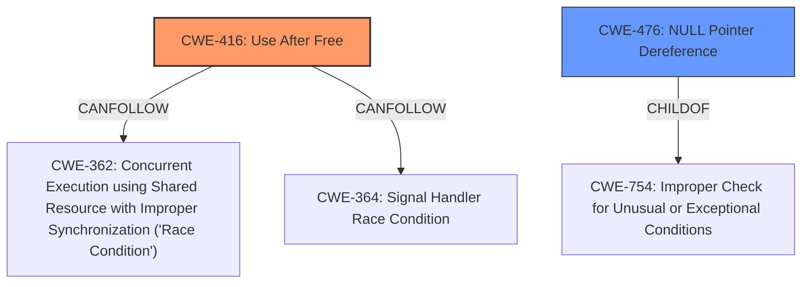

# Analysis Report for CVE-2025-22077

# Vulnerability Analysis Report: CVE-2025-22077

## Description

In the Linux kernel, the following vulnerability has been resolved Revert smb client fix TCP timers deadlock after rmmod This reverts commit e9f2517a3e18a54a3943c098d2226b245d488801. Commit e9f2517a3e18 (smb client fix TCP timers deadlock after rmmod) is intended to fix a null-ptr-deref in LOCKDEP, which is mentioned as CVE-2024-54680, but is actually did not fix anything The issue can be reproduced on top of it. [0] Also, it reverted the change by commit ef7134c7fc48 (smb client Fix use-after-free of network namespace.) and introduced a real issue by reviving the kernel TCP socket. When a reconnect happens for a CIFS connection, the socket state transitions to FIN_WAIT_1. Then, inet_csk_clear_xmit_timers_sync() in tcp_close() stops all timers for the socket. If an incoming FIN packet is lost, the socket will stay at FIN_WAIT_1 forever, and such sockets could be leaked up to net.ipv4.tcp_max_orphans. Usually, FIN can be retransmitted by the peer, but if the peer aborts the connection, the issue comes into reality. I warned about this privately by pointing out the exact report [1], but the bogus fix was finally merged. So, we should not stop the timers to finally kill the connection on our side in that case, meaning we must not use a kernel socket for TCP whose sk->sk_net_refcnt is 0. The kernel socket does not have a reference to its netns to make it possible to tear down netns without cleaning up every resource in it. For example, tunnel devices use a UDP socket internally, but we can destroy netns without removing such devices and let it complete during exit. Otherwise, netns would be leaked when the last application died. However, this is problematic for TCP sockets because TCP has timers to close the connection gracefully even after the socket is close()d. The lifetime of the socket and its netns is different from the lifetime of the underlying connection. If the socket user does not maintain the netns lifetime, the timer could be fired after the socket is close()d and its netns is freed up, resulting in use-after-free. Actually, we have seen so many similar issues and converted such sockets to have a reference to netns. Thats why I converted the CIFS client socket to have a reference to netns (sk->sk_net_refcnt == 1), which is somehow mentioned as out-of-scope of CIFS and technically wrong in e9f2517a3e18, but **is in-scope and right fix**. Regarding the LOCKDEP issue, we can prevent the module unload by bumping the module refcount when switching the LOCKDDEP key in sock_lock_init_class_and_name(). [2] For a while, lets revert the bogus fix. Note that now we can use sk_net_refcnt_upgrade() for the socket conversion, but Ill do so later separately to make backport easy.

## Vulnerability Description Key Phrases

- **Rootcause:** null-ptr-deref, use-after-free
- **Product:** Linux kernel

## Analysis (with Relationship Data)

# Summary
| CWE ID | CWE Name | Confidence | CWE Abstraction Level | CWE Vulnerability Mapping Label | CWE-Vulnerability Mapping Notes |
|---|---|---|---|---|---|
| CWE-416 | Use After Free | 1.0 | Variant | Allowed | Primary CWE |
| CWE-476 | NULL Pointer Dereference | 0.7 | Base | Allowed | Secondary Candidate |

## Evidence and Confidence

*   **Confidence Score:** 0.85
*   **Evidence Strength:** MEDIUM

## Relationship Analysis
The primary CWE is CWE-416, which is a variant. CWE-476 is a base CWE and a child of CWE-754. CWE-416 can follow CWE-362 and CWE-364.



## Vulnerability Chain
The vulnerability chain starts with a **use-after-free** condition when the TCP socket's timers are fired after the socket is closed and its network namespace is freed. This can lead to a **null-ptr-deref**.

## Summary of Analysis
The vulnerability description clearly mentions both **use-after-free** and **null-ptr-deref** conditions. The primary issue seems to be the **use-after-free**, as the timers fire after the netns is freed. Therefore, CWE-416 is chosen as the primary CWE. The **null-ptr-deref** is mentioned in the context of a previous, flawed fix, but it is still a potential consequence.

Relevant CWE Information:

# Enhanced Context (25 CWEs)
The following CWEs were identified as potentially relevant to this vulnerability:

## CWE-667: Improper Locking
**Abstraction Level**: Class
**Similarity Score**: 0.77
**Source**: dense

**Description**:
The product does not properly acquire or release a lock on a resource, leading to unexpected resource state changes and behaviors.

**Mapping Guidance**:
- Usage: Allowed-with-Review
- Rationale: This CWE entry is a Class and might have Base-level children that would be more appropriate


## CWE-362: Concurrent Execution using Shared Resource with Improper Synchronization ('Race Condition')
**Abstraction Level**: Class
**Similarity Score**: 0.76
**Source**: dense

**Description**:
The product contains a concurrent code sequence that requires temporary, exclusive access to a shared resource, but a timing window exists in which the shared resource can be modified by another code sequence operating concurrently.

**Mapping Guidance**:
- Usage: Allowed-with-Review
- Rationale: This CWE entry is a Class and might have Base-level children that would be more appropriate


## CWE-476: NULL Pointer Dereference
**Abstraction Level**: Base
**Similarity Score**: 0.75
**Source**: dense

**Description**:
The product dereferences a pointer that it expects to be valid but is NULL.

**Mapping Guidance**:
- Usage: Allowed
- Rationale: This CWE entry is at the Base level of abstraction, which is a preferred level of abstraction for mapping to the root causes of vulnerabilities.


## CWE-824: Access of Uninitialized Pointer
**Abstraction Level**: Base
**Similarity Score**: 0.75
**Source**: dense

**Description**:
The product accesses or uses a pointer that has not been initialized.

**Mapping Guidance**:
- Usage: Allowed
- Rationale: This CWE entry is at the Base level of abstraction, which is a preferred level of abstraction for mapping to the root causes of vulnerabilities.


## CWE-833: Deadlock
**Abstraction Level**: Base
**Similarity Score**: 0.75
**Source**: dense

**Description**:
The product contains multiple threads or executable segments that are waiting for each other to release a necessary lock, resulting in deadlock.

**Mapping Guidance**:
- Usage: Allowed
- Rationale: This CWE entry is at the Base level of abstraction, which is a preferred level of abstraction for mapping to the root causes of vulnerabilities.


## CWE-755: Improper Handling of Exceptional Conditions
**Abstraction Level**: Class
**Similarity Score**: 0.74
**Source**: dense

**Description**:
The product does not handle or incorrectly handles an exceptional condition.

**Mapping Guidance**:
- Usage: Discouraged
- Rationale: This CWE entry is a level-1 Class (i.e., a child of a Pillar). It might have lower-level children that would be more appropriate


## CWE-404: Improper Resource Shutdown or Release
**Abstraction Level**: Class
**Similarity Score**: 0.74
**Source**: dense

**Description**:
The product does not release or incorrectly releases a resource before it is made available for re-use.

**Mapping Guidance**:
- Usage: Allowed-with-Review
- Rationale: This CWE entry is a Class and might have Base-level children that would be more appropriate


## CWE-252: Unchecked Return Value
**Abstraction Level**: Base
**Similarity Score**: 0.74
**Source**: dense

**Description**:
The product does not check the return value from a method or function, which can prevent it from detecting unexpected states and conditions.

**Mapping Guidance**:
- Usage: Allowed
- Rationale: This CWE entry is at the Base level of abstraction, which is a preferred level of abstraction for mapping to the root causes of vulnerabilities.


## CWE-911: Improper Update of Reference Count
**Abstraction Level**: Base
**Similarity Score**: 0.74
**Source**: dense

**Description**:
The product uses a reference count to manage a resource, but it does not update or incorrectly updates the reference count.

**Mapping Guidance**:
- Usage: Allowed
- Rationale: This CWE entry is at the Base level of abstraction, which is a preferred level of abstraction for mapping to the root causes of vulnerabilities.


## CWE-401: Missing Release of Memory after Effective Lifetime
**Abstraction Level**: Variant
**Similarity Score**: 0.74
**Source**: dense

**Description**:
The product does not sufficiently track and release allocated memory after it has been used, which slowly consumes remaining memory.

**Mapping Guidance**:
- Usage: Allowed
- Rationale: This CWE entry is at the Variant level of abstraction, which is a preferred level of abstraction for mapping to the root causes of vulnerabilities.


## CWE-362: Concurrent Execution using Shared Resource with Improper Synchronization ('Race Condition')
**Abstraction Level**: Class
**Similarity Score**: 1023.01
**Source**: sparse

**Description**:
The product contains a concurrent code sequence that requires temporary, exclusive access to a shared resource, but a timing window exists in which the shared resource can be modified by another code sequence operating concurrently.

**Mapping Guidance**:
- Usage: Allowed-with-Review
- Rationale: This CWE entry is a Class and might have Base-level children that would be more appropriate


## CWE-667: Improper Locking
**Abstraction Level**: Class
**Similarity Score**: 991.09
**Source**: sparse

**Description**:
The product does not properly acquire or release a lock on a resource, leading to unexpected resource state changes and behaviors.

**Mapping Guidance**:
- Usage: Allowed-with-Review
- Rationale: This CWE entry is a Class and might have Base-level children that would be more appropriate


## CWE-911: Improper Update of Reference Count
**Abstraction Level**: Base
**Similarity Score**: 990.00
**Source**: sparse

**Description**:
The product uses a reference count to manage a resource, but it does not update or incorrectly updates the reference count.

**Mapping Guidance**:
- Usage: Allowed
- Rationale: This CWE entry is at the Base level of abstraction, which is a preferred level of abstraction for mapping to the root causes of vulnerabilities.


## CWE-772: Missing Release of Resource after Effective Lifetime
**Abstraction Level**: Base
**Similarity Score**: 970.32
**Source**: sparse

**Description**:
The product does not release a resource after its effective lifetime has ended, i.e., after the resource is no longer needed.

**Mapping Guidance**:
- Usage: Allowed
- Rationale: This CWE entry is at the Base level of abstraction, which is a preferred level of abstraction for mapping to the root


## CWE Relationship Analysis

Current CWEs represent these abstraction levels: .


### Vulnerability Chain Analysis

**Chain starting from CWE-416:**
- 416 (Use After Free) - ROOT


**Chain starting from CWE-476:**
- 476 (NULL Pointer Dereference) - ROOT


### CWE Relationship Diagram

```mermaid
graph TD
    classDef primary fill:#f96,stroke:#333,stroke-width:2px
    classDef secondary fill:#69f,stroke:#333
    classDef tertiary fill:#9e9,stroke:#333
```


*Report generated on 2025-07-14 10:10:47*
