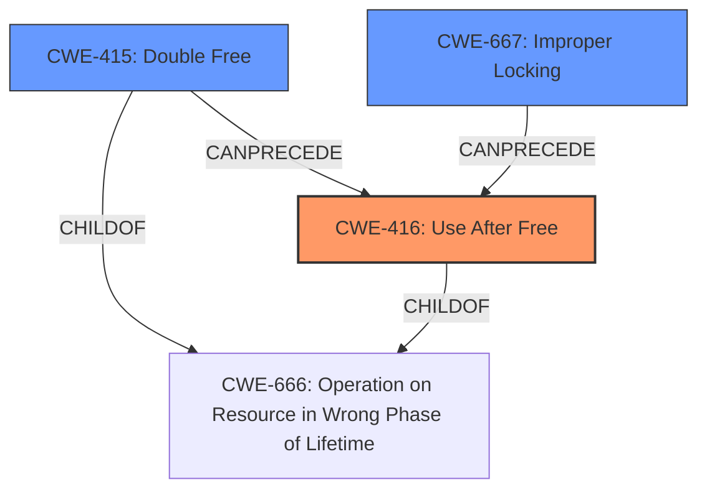

# Raw Analyzer Response for CVE-2025-22083

```markdown
# Summary
| CWE ID | CWE Name | Confidence | CWE Abstraction Level | CWE Vulnerability Mapping Label | CWE-Vulnerability Mapping Notes |
|---|---|---|---|---|---|
| CWE-416 | Use After Free | 0.9 | Variant | Primary | Allowed |
| CWE-415 | Double Free | 0.6 | Variant | Secondary | Allowed |
| CWE-667 | Improper Locking | 0.5 | Class | Secondary | Allowed-with-Review |

## Evidence and Confidence

*   **Confidence Score:** 0.8
*   **Evidence Strength:** HIGH

## Relationship Analysis
The primary weakness is a **use-after-free**, which is a type of memory corruption. CWE-416 (Use After Free) is a variant-level CWE that directly describes this condition. We also considered CWE-415 (Double Free) as a secondary issue, because a double free can lead to a use-after-free. CWE-667 (Improper Locking) was also considered as a potential contributing factor if a race condition allowed the memory to be freed while another thread still had access to it.



## Vulnerability Chain
The vulnerability chain starts with multiple calls to `vhost_scsi_set_endpoint` without an intervening `vhost_scsi_clear_endpoint`. This leads to several problems:

1.  **Use-after-free**: A pointer to `vs_tpg` is freed, but the pointer is still used later. This is the primary weakness.
2.  **Tpg dir removal hang**: The refcount of a tpg drops to -1, preventing its removal.
3.  **Tpg leak**: Target names are overwritten, leading to un-removable tpgs.

The primary root cause is the **improper state management** when `vhost_scsi_set_endpoint` is called multiple times. This leads to the **use-after-free** as the immediate consequence, and further issues like the hang and leak.

## Summary of Analysis
The primary weakness is a **use-after-free** vulnerability in the Linux kernel's vhost-scsi component. This occurs when the `vhost_scsi_set_endpoint` function is called multiple times without an intervening call to `vhost_scsi_clear_endpoint`, leading to a freed pointer being accessed later. The vulnerability description explicitly mentions "This fixes a **use after free** that occurs when vhost_scsi_set_endpoint is called more than once...". This clearly points to **CWE-416: Use After Free** as the primary CWE.

**CWE-416: Use After Free** is the most specific and accurate representation of the vulnerability. The vulnerability description clearly states the **use-after-free** condition, making CWE-416 the most appropriate choice.

The graph relationships helped confirm that **CWE-416** is the most appropriate primary weakness.

Relevant CWE Information:

# Enhanced Context (25 CWEs)
The following CWEs were identified as potentially relevant to this vulnerability:

## CWE-667: Improper Locking
**Abstraction Level**: Class
**Similarity Score**: 0.77
**Source**: dense

**Description**:
The product does not properly acquire or release a lock on a resource, leading to unexpected resource state changes and behaviors.

**Mapping Guidance**:
- Usage: Allowed-with-Review
- Rationale: This CWE entry is a Class and might have Base-level children that would be more appropriate

**Why Not Selected**: While a race condition *could* contribute, the primary issue is the **use-after-free**, not necessarily a locking problem. Thus, this is a secondary consideration.

## CWE-362: Concurrent Execution using Shared Resource with Improper Synchronization ('Race Condition')
**Abstraction Level**: Class
**Similarity Score**: 0.75
**Source**: dense

**Description**:
The product contains a concurrent code sequence that requires temporary, exclusive access to a shared resource, but a timing window exists in which the shared resource can be modified by another code sequence operating concurrently.

**Mapping Guidance**:
- Usage: Allowed-with-Review
- Rationale: This CWE entry is a Class and might have Base-level children that would be more appropriate

**Why Not Selected**: Similar to CWE-667, concurrency might play a role, but the core issue is the **use-after-free**.

## CWE-212: Improper Removal of Sensitive Information Before Storage or Transfer
**Abstraction Level**: Base
**Similarity Score**: 0.75
**Source**: dense

**Description**:
The product stores, transfers, or shares a resource that contains sensitive information, but it does not properly remove that information before the product makes the resource available to unauthorized actors.

**Mapping Guidance**:
- Usage: Allowed
- Rationale: This CWE entry is at the Base level of abstraction, which is a preferred level of abstraction for mapping to the root causes of vulnerabilities.

**Why Not Selected**: This CWE is not relevant to the vulnerability description. The issue is not about sensitive information.

## CWE-367: Time-of-check Time-of-use (TOCTOU) Race Condition
**Abstraction Level**: Base
**Similarity Score**: 0.75
**Source**: dense

**Description**:
The product checks the state of a resource before using that resource, but the resource's state can change between the check and the use in a way that invalidates the results of the check. This can cause the product to perform invalid actions when the resource is in an unexpected state.

**Mapping Guidance**:
- Usage: Allowed
- Rationale: This CWE entry is at the Base level of abstraction, which is a preferred level of abstraction for mapping to the root causes of vulnerabilities.

**Why Not Selected**: The vulnerability isn't a TOCTOU issue. There's no check performed before the use.

## CWE-824: Access of Uninitialized Pointer
**Abstraction Level**: Base
**Similarity Score**: 0.75
**Source**: dense

**Description**:
The product accesses or uses a pointer that has not been initialized.

**Mapping Guidance**:
- Usage: Allowed
- Rationale: This CWE entry is at the Base level of abstraction, which is a preferred level of abstraction for mapping to the root causes of vulnerabilities.

**Why Not Selected**: The issue is that the pointer was freed, not that it was uninitialized.

## CWE-755: Improper Handling of Exceptional Conditions
**Abstraction Level**: Class
**Similarity Score**: 0.75
**Source**: dense

**Description**:
The product does not handle or incorrectly handles an exceptional condition.

**Mapping Guidance**:
- Usage: Discouraged
- Rationale: This CWE entry is a level-1 Class (i.e., a child of a Pillar). It might have lower-level children that would be more appropriate

**Why Not Selected**: This CWE is too generic. The vulnerability is a specific type of memory corruption.

## CWE-404: Improper Resource Shutdown or Release
**Abstraction Level**: Class
**Similarity Score**: 0.74
**Source**: dense

**Description**:
The product does not release or incorrectly releases a resource before it is made available for re-use.

**Mapping Guidance**:
- Usage: Allowed-with-Review
- Rationale: This CWE entry is a Class and might have Base-level children that would be more appropriate

**Why Not Selected**: This is related, but **CWE-416** is more specific, because it focuses on the *use* after the release.

## CWE-754: Improper Check for Unusual or Exceptional Conditions
**Abstraction Level**: Class
**Similarity Score**: 0.74
**Source**: dense

**Description**:
The product does not check or incorrectly checks for unusual or exceptional conditions that are not expected to occur frequently during day to day operation of the product.

**Mapping Guidance**:
- Usage: Allowed-with-Review
- Rationale: This CWE entry is a Class and might have Base-level children that would be more appropriate

**Why Not Selected**: The issue isn't a missing check, but rather using memory after it's been freed.

## CWE-59: Improper Link Resolution Before File Access ('Link Following')
**Abstraction Level**: