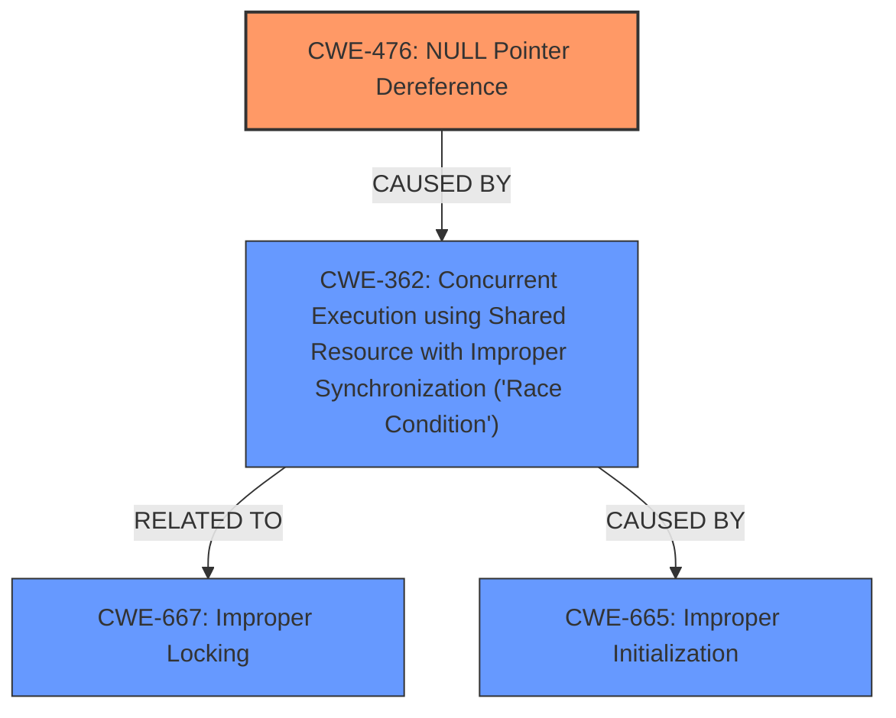

# Analysis for CVE-2025-22084

# Summary
| CWE ID | CWE Name | Confidence | CWE Abstraction Level | CWE Vulnerability Mapping Label | CWE-Vulnerability Mapping Notes |
|---|---|---|---|---|---|
| CWE-476 | **CWE-476: NULL Pointer Dereference** | 1.0 | Base | Primary | Allowed |
| CWE-362 | **CWE-362: Concurrent Execution using Shared Resource with Improper Synchronization ('Race Condition')** | 0.7 | Base | Secondary | Allowed |
| CWE-667 | **CWE-667: Improper Locking** | 0.5 | Class | Secondary | Allowed-with-Review |
| CWE-665 | **CWE-665: Improper Initialization** | 0.4 | Class | Secondary | Discouraged |

## Evidence and Confidence

*   **Confidence Score:** 0.8
*   **Evidence Strength:** HIGH

## Relationship Analysis
The primary weakness is a **CWE-476: NULL Pointer Dereference**, which occurs due to a **race condition** (**CWE-362**) and **improper initialization** (**CWE-665**). The **race condition** arises because `devm_serdev_device_open()` is called before the client operations are fully initialized. **CWE-362** is related to **CWE-667: Improper Locking** which could be a potential cause.

## Vulnerability Chain
1.  **Improper Initialization** of client operations.
2.  **Race Condition** due to concurrent execution during initialization.
3.  **NULL Pointer Dereference** when the `receive_buf` handler is called before `serdev->ops` is valid.

The chain starts with **improper initialization**, leading to a **race condition**, and ultimately resulting in a **NULL pointer dereference**.

## Summary of Analysis
The primary **ROOTCAUSE** and **WEAKNESS** is a **CWE-476: NULL Pointer Dereference**. The vulnerability occurs because the `w1_uart_probe()` function calls `w1_uart_serdev_open()` before setting the client ops. This can trigger a **NULL pointer dereference** because the `receive_buf` handler assumes `serdev->ops` is valid when it is not. This is further exacerbated by a **race condition** (**CWE-362**) where `devm_serdev_device_open()` is called before fully initializing the device. **CWE-667** is considered as a possible cause of the **race condition**.

The provided analysis focuses primarily on the **NULL pointer dereference** and **race condition**. The evidence from the vulnerability description clearly indicates that the **NULL pointer dereference** is a direct result of the timing issue during device initialization. Therefore, **CWE-476** is the most appropriate primary CWE. The **race condition** is a contributing factor, making **CWE-362** a secondary CWE.

I am overriding the retriever results that placed **CWE-252: Unchecked Return Value** high in the results, because the vulnerability description focuses on the **NULL pointer dereference** due to a **race condition** during device initialization, not on unchecked return values.

The selected CWEs are at the optimal level of specificity. **CWE-476** is a base-level CWE that accurately describes the **NULL pointer dereference**. **CWE-362** captures the concurrent execution issue leading to the vulnerability.

Relevant CWE Information:

# Enhanced Context (25 CWEs)
The following CWEs were identified as potentially relevant to this vulnerability:

## CWE-824: Access of Uninitialized Pointer
**Abstraction Level**: Base
**Similarity Score**: 0.76
**Source**: dense

**Description**:
The product accesses or uses a pointer that has not been initialized.

**Mapping Guidance**:
- Usage: Allowed
- Rationale: This CWE entry is at the Base level of abstraction, which is a preferred level of abstraction for mapping to the root causes of vulnerabilities.

## CWE-667: Improper Locking
**Abstraction Level**: Class
**Similarity Score**: 0.74
**Source**: dense

**Description**:
The product does not properly acquire or release a lock on a resource, leading to unexpected resource state changes and behaviors.

**Mapping Guidance**:
- Usage: Allowed-with-Review
- Rationale: This CWE entry is a Class and might have Base-level children that would be more appropriate

## CWE-822: Untrusted Pointer Dereference
**Abstraction Level**: Base
**Similarity Score**: 0.74
**Source**: dense

**Description**:
The product obtains a value from an untrusted source, converts this value to a pointer, and dereferences the resulting pointer.

**Mapping Guidance**:
- Usage: Allowed
- Rationale: This CWE entry is at the Base level of abstraction, which is a preferred level of abstraction for mapping to the root causes of vulnerabilities.

## CWE-476: NULL Pointer Dereference
**Abstraction Level**: Base
**Similarity Score**: 0.73
**Source**: dense

**Description**:
The product dereferences a pointer that it expects to be valid but is NULL.

**Mapping Guidance**:
- Usage: Allowed
- Rationale: This CWE entry is at the Base level of abstraction, which is a preferred level of abstraction for mapping to the root causes of vulnerabilities.

## CWE-703: Improper Check or Handling of Exceptional Conditions
**Abstraction Level**: Pillar
**Similarity Score**: 0.73
**Source**: dense

**Description**:
The product does not properly anticipate or handle exceptional conditions that rarely occur during normal operation of the product.

**Mapping Guidance**:
- Usage: Discouraged
- Rationale: This CWE entry is extremely high-level, a Pillar.

## CWE-665: Improper Initialization
**Abstraction Level**: Class
**Similarity Score**: 0.73
**Source**: dense

**Description**:
The product does not initialize or incorrectly initializes a resource, which might leave the resource in an unexpected state when it is accessed or used.

**Mapping Guidance**:
- Usage: Discouraged
- Rationale: This CWE entry is a level-1 Class (i.e., a child of a Pillar). It might have lower-level children that would be more appropriate

## CWE-252: Unchecked Return Value
**Abstraction Level**: Base
**Similarity Score**: 0.73
**Source**: dense

**Description**:
The product does not check the return value from a method or function, which can prevent it from detecting unexpected states and conditions.

**Mapping Guidance**:
- Usage: Allowed
- Rationale: This CWE entry is at the Base level of abstraction, which is a preferred level of abstraction for mapping to the root causes of vulnerabilities.

## CWE-696: Incorrect Behavior Order
**Abstraction Level**: Class
**Similarity Score**: 0.72
**Source**: dense

**Description**:
The product performs multiple related behaviors, but the behaviors are performed in the wrong order in ways which may produce resultant weaknesses.

**Mapping Guidance**:
- Usage: Allowed-with-Review
- Rationale: This CWE entry is a Class and might have Base-level children that would be more appropriate

## CWE-754: Improper Check for Unusual or Exceptional Conditions
**Abstraction Level**: Class
**Similarity Score**: 0.72
**Source**: dense

**Description**:
The product does not check or incorrectly checks for unusual or exceptional conditions that are not expected to occur frequently during day to day operation of the product.

**Mapping Guidance**:
- Usage: Allowed-with-Review
- Rationale: This CWE entry is a Class and might have Base-level children that would be more appropriate

## CWE-366: Race Condition within a Thread
**Abstraction Level**: Base
**Similarity Score**: 0.72
**Source**: dense

**Description**:
If two threads of execution use a resource simultaneously, there exists the possibility that resources may be used while invalid, in turn making the state of execution undefined.

**Mapping Guidance**:
- Usage: Allowed
- Rationale: This CWE entry is at the Base level of abstraction, which is a preferred level of abstraction for mapping to the root causes of vulnerabilities.

## CWE-252: Unchecked