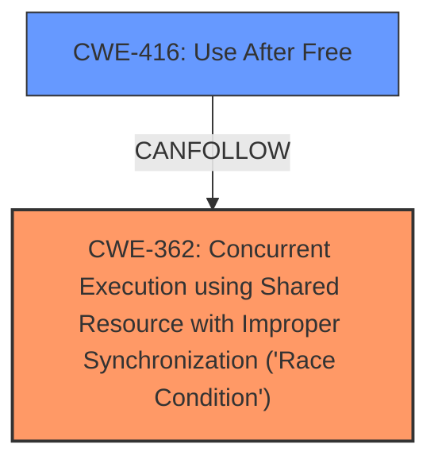

# Analysis for CVE-2025-22100

# Summary
| CWE ID | CWE Name | Confidence | CWE Abstraction Level | CWE Vulnerability Mapping Label | CWE-Vulnerability Mapping Notes |
|---|---|---|---|---|---|
| CWE-362 | Concurrent Execution using Shared Resource with Improper Synchronization ('Race Condition') | 0.9 | Class | Primary | Allowed-with-Review |
| CWE-416 | Use After Free | 0.9 | Variant | Secondary | Allowed |

## Evidence and Confidence

*   **Confidence Score:** 0.9
*   **Evidence Strength:** MEDIUM

## Relationship Analysis
The primary weakness is a **race condition** (CWE-362) which can lead to a **use-after-free** (CWE-416). CWE-362 is a Class, and it has child CWEs that could be more specific, but without more information about the race condition a class is appropriate. CWE-416 is a Variant and represents the resulting memory corruption.

## Vulnerability Chain
The vulnerability chain starts with a **race condition** (CWE-362) due to missing protection of access to groups with an xarray lock. This leads to a **use-after-free** error (CWE-416).

## Summary of Analysis
The vulnerability description clearly indicates a **race condition** that results in a **use-after-free**.
The evidence is in the Vulnerability Description Key Phrases:
- **rootcause:** **race condition**
- **weakness:** **use-after-free**
CWE-362 and CWE-416 had the highest retriever scores. The graph relationships show that race conditions (CWE-362) can precede **use-after-free** (CWE-416). CWE-362 is a Class, but there is no information to use a more specific Base CWE. CWE-416 is a Variant, which is a good level of specificity.

Relevant CWE Information:

# Enhanced Context (25 CWEs)
The following CWEs were identified as potentially relevant to this vulnerability:

## CWE-362: Concurrent Execution using Shared Resource with Improper Synchronization ('Race Condition')
**Abstraction Level**: Class
**Similarity Score**: 0.75
**Source**: dense

**Description**:
The product contains a concurrent code sequence that requires temporary, exclusive access to a shared resource, but a timing window exists in which the shared resource can be modified by another code sequence operating concurrently.

**Mapping Guidance**:
- Usage: Allowed-with-Review
- Rationale: This CWE entry is a Class and might have Base-level children that would be more appropriate

## CWE-416: Use After Free
**Abstraction Level**: Variant
**Similarity Score**: 2.60
**Source**: graph

**Description**:
The product reuses or references memory after it has been freed. At some point afterward, the memory may be allocated again and saved in another pointer, while the original pointer references a location somewhere within the new allocation. Any operations using the original pointer are no longer valid because the memory "belongs" to the code that operates on the new pointer.

**Mapping Guidance**:
- Usage: Allowed
- Rationale: This CWE entry is at the Variant level of abstraction, which is a preferred level of abstraction for mapping to the root causes of vulnerabilities.

### CWEs Considered But Not Used

*   **CWE-667 Improper Locking**: While locking issues often contribute to race conditions, the description explicitly mentions a race condition due to missing protection, making CWE-362 a more direct fit.
*   **CWE-367 Time-of-check Time-of-use (TOCTOU) Race Condition**: This is a specific type of race condition, but the provided information doesn't explicitly indicate a TOCTOU vulnerability.
*   **CWE-364 Signal Handler Race Condition**: This is specific to signal handlers and not applicable here.
*   **CWE-662 Improper Synchronization**: Similar to improper locking, but the description focuses on the race condition and resulting memory corruption.
*   **CWE-415 Double Free**: While double frees are memory corruption issues, the description indicates a **use-after-free**, making CWE-416 more accurate.
*   **CWE-911 Improper Update of Reference Count**: This is specific to reference counting and not applicable here.
*   **CWE-366 Race Condition within a Thread**: This is too general since it doesn't specify the **improper synchronization**.
*   **CWE-609 Double-Checked Locking**: This is a specific synchronization technique, but the description doesn't mention this.