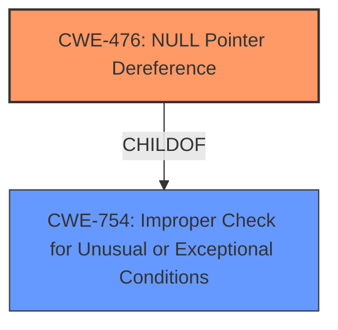

# Analysis Report for CVE-2025-22103

# Vulnerability Analysis Report: CVE-2025-22103

## Description

In the Linux kernel, the following vulnerability has been resolved net fix **NULL pointer dereference** in l3mdev_l3_rcv When delete l3s ipvlan ip link del link eth0 ipvlan1 type ipvlan mode l3s This may cause a null pointer dereference Call trace ip_rcv_finish+0x48/0xd0 ip_rcv+0x5c/0x100 __netif_receive_skb_one_core+0x64/0xb0 __netif_receive_skb+0x20/0x80 process_backlog+0xb4/0x204 napi_poll+0xe8/0x294 net_rx_action+0xd8/0x22c __do_softirq+0x12c/0x354 This is because l3mdev_l3_rcv() visit dev->l3mdev_ops after ipvlan_l3s_unregister() assign the dev->l3mdev_ops to NULL. The process like this (CPU1) | (CPU2) l3mdev_l3_rcv() | check dev->priv_flags | master = skb->dev | | | ipvlan_l3s_unregister() | set dev->priv_flags | dev->l3mdev_ops = NULL | visit master->l3mdev_ops | To avoid this by do not set dev->l3mdev_ops when unregister l3s ipvlan.

## Vulnerability Description Key Phrases

- **Rootcause:** NULL pointer dereference
- **Product:** Linux kernel
- **Component:** net

## Analysis (with Relationship Data)

# Summary
| CWE ID | CWE Name | Confidence | CWE Abstraction Level | CWE Vulnerability Mapping Label | CWE-Vulnerability Mapping Notes |
|---|---|---|---|---|---|
| CWE-476 | NULL Pointer Dereference | 1.0 | Base | Primary | Allowed |

## Evidence and Confidence

*   **Confidence Score:** 1.0
*   **Evidence Strength:** HIGH

## Relationship Analysis
The primary relationship that influenced my decision was the ChildOf relationship between CWE-476 (NULL Pointer Dereference) and its parent, CWE-754 (Improper Check for Unusual or Exceptional Conditions). While CWE-754 is a broader category, the vulnerability description specifically mentions a **NULL pointer dereference**, making CWE-476 the more precise and appropriate choice.



## Vulnerability Chain
The vulnerability chain involves a race condition where the `dev->l3mdev_ops` pointer is set to NULL by `ipvlan_l3s_unregister()` on one CPU, while `l3mdev_l3_rcv()` on another CPU attempts to dereference it.

1.  Race Condition leads to
2.  **NULL pointer dereference** (CWE-476)
3.  System Crash (Impact)

## Summary of Analysis
The analysis is strongly based on the provided evidence, specifically the vulnerability description that mentions a "**NULL pointer dereference**".

> In the Linux kernel, the following vulnerability has been resolved net fix **NULL pointer dereference** in l3mdev_l3_rcv When delete l3s ipvlan ip link del link eth0 ipvlan1 type ipvlan mode l3s This may cause a null pointer dereference Call trace ip_rcv_finish+0x48/0xd0 ip_rcv+0x5c/0x100 __netif_receive_skb_one_core+0x64/0xb0 __netif_receive_skb+0x20/0x80 process_backlog+0xb4/0x204 napi_poll+0xe8/0x294 net_rx_action+0xd8/0x22c __do_softirq+0x12c/0x354 This is because l3mdev_l3_rcv() visit dev->l3mdev_ops after ipvlan_l3s_unregister() assign the dev->l3mdev_ops to NULL.

The retriever results also list CWE-476 (NULL Pointer Dereference) as a top candidate.

CWE-476 is at the Base level of abstraction, providing sufficient detail for this vulnerability.

**CWEs Considered but Not Used:**

*   **CWE-252 Unchecked Return Value:** While an unchecked return value can *lead* to a **NULL pointer dereference**, the description directly states the dereference is the issue, not the missing check.
*   **CWE-909 Missing Initialization of Resource and CWE-456 Missing Initialization of a Variable:** These are not applicable because the issue isn't a missing initialization, but rather a **NULL** assignment during unregistration that's not properly synchronized.
*   **CWE-665 Improper Initialization:** Similar to the above, this is not about incorrect initial state, but rather a later incorrect state caused by a race condition and improper synchronization.
*   **CWE-822 Untrusted Pointer Dereference:** This isn't about an untrusted source providing a pointer value, but a **NULL** assignment in a race condition.
*   **CWE-690 Unchecked Return Value to NULL Pointer Dereference:** While related, CWE-476 more directly describes the vulnerability without needing to combine multiple weaknesses.
*   **CWE-787 Out-of-bounds Write:** This is completely unrelated to the described vulnerability.
*   **CWE-1285 Improper Validation of Specified Index, Position, or Offset in Input:** This is not relevant to the vulnerability description.
*   **CWE-1325 Improperly Controlled Sequential Memory Allocation:** Not related to the described **NULL pointer dereference**.


## CWE Relationship Analysis

Current CWEs represent these abstraction levels: .


### Vulnerability Chain Analysis

**Chain starting from CWE-665:**
- 665 (Improper Initialization) - ROOT


**Chain starting from CWE-690:**
- 690 (Unchecked Return Value to NULL Pointer Dereference) - ROOT


### CWE Relationship Diagram

```mermaid
graph TD
    classDef primary fill:#f96,stroke:#333,stroke-width:2px
    classDef secondary fill:#69f,stroke:#333
    classDef tertiary fill:#9e9,stroke:#333
```


*Report generated on 2025-07-14 10:14:37*
