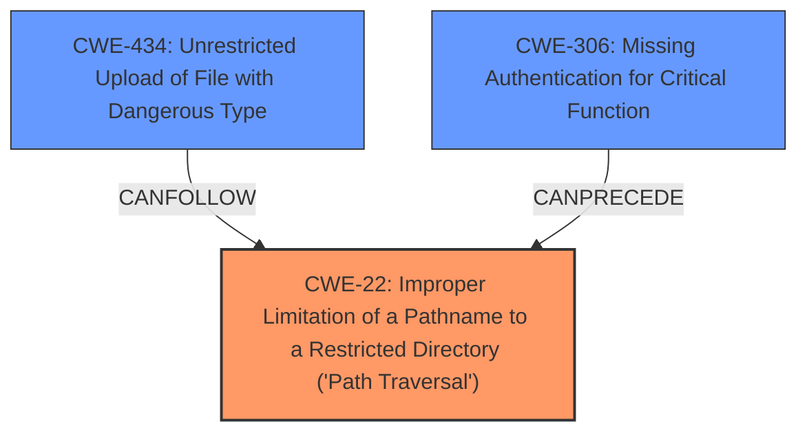

# Analysis Report for CVE-2025-22137

# Vulnerability Analysis Report: CVE-2025-22137

## Description

Pingvin Share is a self-hosted file sharing platform and an alternative for WeTransfer. This vulnerability allows an authenticated or unauthenticated (if anonymous shares are allowed) user to overwrite arbitrary files on the server, including sensitive system files, via HTTP POST requests. The issue has been patched in version 1.4.0.

## Vulnerability Description Key Phrases

- **Impact:** overwrite arbitrary files on the server
- **Vector:** HTTP POST requests
- **Attacker:** authenticated or unauthenticated user
- **Product:** Pingvin Share

## Analysis (with Relationship Data)

# Summary

| CWE ID  | CWE Name                                                                                    | Confidence | CWE Abstraction Level | CWE Vulnerability Mapping Label | CWE-Vulnerability Mapping Notes |
| :-------- | :------------------------------------------------------------------------------------------ | :--------- | :---------------------- | :------------------------------ | :------------------------------ |
| CWE-22    | Improper Limitation of a Pathname to a Restricted Directory ('Path Traversal')        | 0.9        | Base                    | Primary                         | Allowed                       |
| CWE-434   | Unrestricted Upload of File with Dangerous Type                                     | 0.7        | Base                    | Secondary                       | Allowed                       |
| CWE-306   | Missing Authentication for Critical Function                                           | 0.6       | Base                    | Secondary                       | Allowed                       |

## Evidence and Confidence

*   **Confidence Score:** 0.8
*   **Evidence Strength:** HIGH

## Relationship Analysis

The primary weakness is CWE-22, which describes a path traversal vulnerability. The other CWEs describe related weaknesses where files can be uploaded and authentication might be missing.



## Vulnerability Chain

1.  **Root Cause:** Improper path validation or limitation (**CWE-22**) allows writing outside the intended directory.
2.  **Prerequisite (Optional):** **Missing authentication (CWE-306)** if anonymous shares are allowed, which exacerbates the issue.
3.  **Contributing Factor:** **Unrestricted file upload (CWE-434)** allows for potentially dangerous files to be placed in arbitrary locations.
4.  **Impact:** Arbitrary file overwrite, leading to potential DoS or RCE.

## Summary of Analysis

The vulnerability description explicitly states that an authenticated or unauthenticated user can **overwrite arbitrary files on the server**, including sensitive system files. The commit message "Commit 6cf5c66 fixed the remote arbitrary file overwrite on file upload endpoint. The commit added validation for the file ID format to prevent arbitrary file overwrites" further supports that **lack of validation** for file ID's lead to arbitrary file overwrites.

**CWE-22** (Improper Limitation of a Pathname to a Restricted Directory ('Path Traversal')) is selected as the primary CWE because the core issue is the ability to write files outside of the intended directory. The patch implemented validation for the file ID format to prevent arbitrary file overwrites, showing that the path was not correctly validated.

**CWE-434** (Unrestricted Upload of File with Dangerous Type) is a secondary CWE because the vulnerability involves overwriting files, suggesting a file upload mechanism is involved.

**CWE-306** (Missing Authentication for Critical Function) is a secondary CWE because the vulnerability can be exploited by both authenticated and unauthenticated users (if anonymous shares are allowed). This suggests that authentication may be missing or insufficient for the file overwrite functionality.

Other CWEs Considered:

*   CWE-79 (Improper Neutralization of Input During Web Page Generation ('Cross-site Scripting')): While file overwrites could potentially lead to XSS if the overwritten files are web pages, the core issue is file system access, not XSS.
*   CWE-918 (Server-Side Request Forgery (SSRF)): Not relevant as the vulnerability does not involve making requests to other servers.
*   CWE-639 (Authorization Bypass Through User-Controlled Key): Although the vulnerability can be exploited by both authenticated and unauthenticated users, the core issue is path traversal, not authorization bypass.

The selected CWEs are at the optimal level of specificity because they directly address the root cause (CWE-22) and contributing factors (CWE-434 and CWE-306) of the vulnerability.


## CWE Relationship Analysis

Current CWEs represent these abstraction levels: .


### Vulnerability Chain Analysis

**Chain starting from CWE-22:**
- 22 (Improper Limitation of a Pathname to a Restricted Directory ('Path Traversal')) - ROOT


**Chain starting from CWE-639:**
- 639 (Authorization Bypass Through User-Controlled Key) - ROOT


### CWE Relationship Diagram

```mermaid
graph TD
    classDef primary fill:#f96,stroke:#333,stroke-width:2px
    classDef secondary fill:#69f,stroke:#333
    classDef tertiary fill:#9e9,stroke:#333
```


*Report generated on 2025-07-14 10:17:16*
