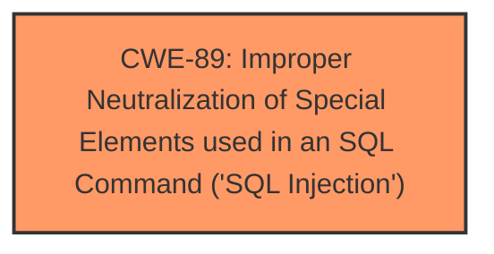

# Analysis Report for CVE-2025-2221

# Vulnerability Analysis Report: CVE-2025-2221

## Description

The WPCOM Member plugin for WordPress is vulnerable to **time-based SQL Injection** via the user_phone parameter in all versions up to, and including, 1.7.6 due to **insufficient escaping on the user supplied parameter and lack of sufficient preparation on the existing SQL query**. This makes it possible for unauthenticated attackers to append additional SQL queries into already existing queries that can be used to extract sensitive information from the database.

## Vulnerability Description Key Phrases

- **Rootcause:** insufficient escaping on the user supplied parameter and lack of sufficient preparation on the existing SQL query
- **Weakness:** time-based SQL Injection
- **Impact:** extract sensitive information from the database
- **Vector:** time-based SQL Injection
- **Attacker:** unauthenticated attackers
- **Product:** WPCOM Member plugin for WordPress
- **Version:** all versions up to and including 1.7.6
- **Component:** user_phone parameter

## Analysis (with Relationship Data)

# Summary
| CWE ID | CWE Name | Confidence | CWE Abstraction Level | CWE Vulnerability Mapping Label | CWE-Vulnerability Mapping Notes |
|---|---|---|---|---|---|
| CWE-89 | Improper Neutralization of Special Elements used in an SQL Command ('SQL Injection') | 1.0 | Base | Primary | Allowed |

## Evidence and Confidence

*   **Confidence Score:** 1.0
*   **Evidence Strength:** HIGH

## Relationship Analysis
The primary relationship that influenced the selection of CWE-89 is its direct relevance to the vulnerability description, which explicitly mentions "**time-based SQL Injection**". CWE-89 is a Base level CWE and directly addresses the root cause of **improper neutralization** leading to SQL Injection. The retriever results strongly suggested CWE-89 as the top candidate.



## Vulnerability Chain
The vulnerability chain starts with **insufficient escaping on the user supplied parameter and lack of sufficient preparation on the existing SQL query**, which leads to **time-based SQL Injection**, and finally results in the ability to **extract sensitive information from the database**. CWE-89 directly addresses the **root cause** of **improper neutralization** in SQL commands.

## Summary of Analysis
The vulnerability description clearly indicates a **time-based SQL Injection** vulnerability due to **insufficient escaping** and **lack of sufficient preparation** in the SQL query. The most relevant CWE is CWE-89, which directly addresses **improper neutralization** leading to SQL Injection. This is further supported by the retriever results, which lists CWE-89 as the top candidate.

The evidence from the vulnerability description:
- "**time-based SQL Injection**"
- "**insufficient escaping on the user supplied parameter and lack of sufficient preparation on the existing SQL query**"

CWE-89 is at the Base level of abstraction, providing a specific match for the **root cause** of the vulnerability.

Other CWEs Considered:

*   CWE-116: Improper Encoding or Escaping of Output: While related to input validation, this is more general than SQL injection and less specific to the vulnerability.
*   CWE-90: Improper Neutralization of Special Elements used in an LDAP Query ('LDAP Injection'): This is specific to LDAP, not SQL.
*   CWE-790: Improper Filtering of Special Elements: This is a more general class of weakness and not as precise as CWE-89.
*   CWE-352: Cross-Site Request Forgery (CSRF): This is a different type of vulnerability unrelated to SQL injection.
*   CWE-502: Deserialization of Untrusted Data: This is also a different type of vulnerability.
*   CWE-943: Improper Neutralization of Special Elements in Data Query Logic: This is a Class-level CWE, and CWE-89, a child of this CWE, is more specific.
*   CWE-341: Predictable from Observable State: Not directly related to the root cause.
*   CWE-96: Improper Neutralization of Directives in Statically Saved Code ('Static Code Injection'): This is specific to static code injection, not SQL injection.
*   CWE-471: Modification of Assumed-Immutable Data (MAID): Not directly related to the root cause.


## CWE Relationship Analysis

Current CWEs represent these abstraction levels: .


### Vulnerability Chain Analysis

**Chain starting from CWE-90:**
- 90 (Improper Neutralization of Special Elements used in an LDAP Query ('LDAP Injection')) - ROOT


**Chain starting from CWE-89:**
- 89 (Improper Neutralization of Special Elements used in an SQL Command ('SQL Injection')) - ROOT


### CWE Relationship Diagram

```mermaid
graph TD
    classDef primary fill:#f96,stroke:#333,stroke-width:2px
    classDef secondary fill:#69f,stroke:#333
    classDef tertiary fill:#9e9,stroke:#333
```


*Report generated on 2025-07-14 10:20:21*
