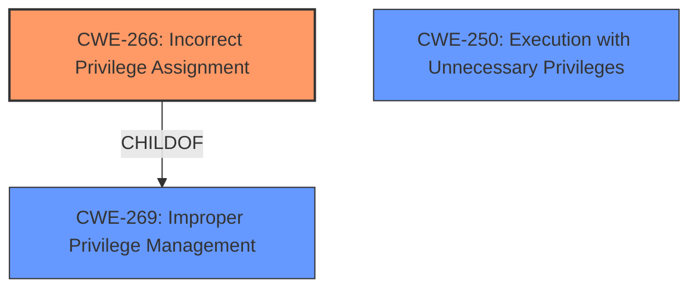

# Raw Analyzer Response for CVE-2025-22231

# Summary
| CWE ID | CWE Name | Confidence | CWE Abstraction Level | CWE Vulnerability Mapping Label | CWE-Vulnerability Mapping Notes |
|---|---|---|---|---|---|
| CWE-266 | Incorrect Privilege Assignment | 0.9 | Base | Allowed | Primary CWE. The **incorrect privilege assignment** is the root cause. |
| CWE-250 | Execution with Unnecessary Privileges | 0.7 | Base | Allowed | Secondary candidate. This could be present but there is no evidence to support it. |
| CWE-269 | Improper Privilege Management | 0.6 | Class | Discouraged | Secondary candidate. This is too high level and discouraged. |

## Evidence and Confidence

*   **Confidence Score:** 0.9
*   **Evidence Strength:** MEDIUM

## Relationship Analysis
The primary relationship that influenced my decision was the parent-child relationship between CWE-269 (Improper Privilege Management) and CWE-266 (Incorrect Privilege Assignment). CWE-266 is a more specific Base CWE, making it a better fit than the more general Class CWE-269. There's no evidence of chain relationships or peer relationships impacting the CWE selection, so these were not considered. The abstraction level was crucial, favoring the most specific Base CWE.

## Vulnerability Chain
The vulnerability chain starts with **incorrect privilege assignment** (CWE-266), leading to the ability for a local user with administrative privileges to escalate to root. The chain is: CWE-266 -> Privilege Escalation.

## Summary of Analysis
The primary CWE identified is CWE-266 (Incorrect Privilege Assignment), with a confidence score of 0.9. This assessment is based on the vulnerability description indicating a local **privilege escalation vulnerability**, where a malicious actor with local administrative privileges can escalate to root. The "CVE Reference Links Content Summary" section confirms this, stating, "The root cause is a local privilege escalation vulnerability within VMware Aria Operations." The key phrase "local **privilege escalation vulnerability**" strongly suggests a problem with how privileges are assigned. The guidance on Privileges vs Permissions also supports this mapping, specifically indicating that privilege escalation often involves CWE-266 when it's a misconfiguration.

CWE-269 (Improper Privilege Management) was considered but deemed too general, as CWE-266 provides a more specific classification. CWE-250 (Execution with Unnecessary Privileges) was also considered but there was insufficient evidence to support that code was running with unnecessary privileges. The evidence points to the initial assignment of privileges being the root cause, so CWE-266 is the most appropriate and specific choice.

The selected CWE is at the optimal level of specificity, providing a clear understanding of the root cause of the vulnerability.