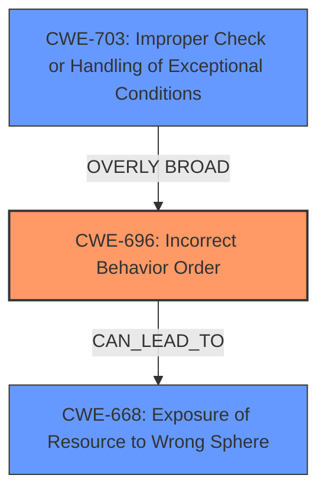

# Raw Analyzer Response for CVE-2025-22235

# Summary
| CWE ID | CWE Name | Confidence | CWE Abstraction Level | CWE Vulnerability Mapping Label | CWE-Vulnerability Mapping Notes |
|---|---|---|---|---|---|
| CWE-696 | Incorrect Behavior Order | 0.85 | Base | Allowed | Primary CWE.  The actuator endpoint is checked to see if it is disabled or not exposed.  The **incorrect behavior order** is that the matcher should not be created if the endpoint is disabled or not exposed. |
| CWE-703 | Improper Check or Handling of Exceptional Conditions | 0.65 | Pillar | Discouraged | Secondary Candidate.  **Improper null handling** causes an exceptional condition which is not handled. |
| CWE-668 | Exposure of Resource to Wrong Sphere | 0.50 | Class | Discouraged | Secondary Candidate. The `/null` endpoint, if not properly protected, could expose resources to the wrong sphere. |

## Evidence and Confidence

*   **Confidence Score:** 0.75
*   **Evidence Strength:** MEDIUM

## Relationship Analysis
The primary CWE selected is CWE-696, which describes an **incorrect behavior order**. This choice is influenced by the vulnerability description indicating that the matcher should not be created if the endpoint is disabled or not exposed.

The secondary CWE candidate CWE-703, **Improper Check or Handling of Exceptional Conditions**, is a Pillar level CWE and is too high-level for this vulnerability. The root cause is more specific than a general failure to handle exceptional conditions, so this mapping is less preferred.

CWE-668, **Exposure of Resource to Wrong Sphere**, is considered as a potential impact if the `/null` endpoint is not properly protected. However, this is a consequence rather than the direct cause of the vulnerability. It is a Class level CWE.

## Vulnerability Chain
The vulnerability chain starts with an **incorrect behavior order** (CWE-696) in the creation of the matcher. This leads to a potential exposure of resources to the wrong sphere (CWE-668) if the `/null` endpoint is not properly protected. The **improper null handling** (CWE-703) is an exceptional condition which is not handled.

## Summary of Analysis
The initial assessment focused on identifying the root cause of the vulnerability based on the provided evidence. The vulnerability description and CVE reference links highlight that the `EndpointRequest.to()` method creates an incorrect matcher when the actuator endpoint is disabled or not exposed.

The retriever results suggested several potential CWEs, including CWE-668, CWE-863, and CWE-917. However, after further analysis, CWE-696 was identified as the most appropriate primary CWE because it specifically addresses the **incorrect behavior order** leading to the vulnerability.

The relationship analysis helped refine the selection by highlighting the chain of events and the potential impact of the vulnerability. The final decision was influenced by the need to identify the root cause and map it to the most specific CWE available. The selected CWEs are at the optimal level of specificity, with CWE-696 at the Base level.

Relevant CWE Information:

# Enhanced Context (25 CWEs)
The following CWEs were identified as potentially relevant to this vulnerability:

## CWE-668: Exposure of Resource to Wrong Sphere
**Abstraction Level**: Class
**Similarity Score**: 0.73
**Source**: dense

**Description**:
The product exposes a resource to the wrong control sphere, providing unintended actors with inappropriate access to the resource.

**Mapping Guidance**:
- Usage: Discouraged
- Rationale: CWE-668 is high-level and is often misused as a catch-all when lower-level CWE IDs might be applicable. It is sometimes used for low-information vulnerability reports [REF-1287]. It is a level-1 Class (i.e., a child of a Pillar). It is not useful for trend analysis.

## CWE-917: Improper Neutralization of Special Elements used in an Expression Language Statement ('Expression Language Language Injection')
**Abstraction Level**: Base
**Similarity Score**: 0.72
**Source**: dense

**Description**:
The product constructs all or part of an expression language (EL) statement in a framework such as a Java Server Page (JSP) using externally-influenced input from an upstream component, but it does not neutralize or incorrectly neutralizes special elements that could modify the intended EL statement before it is executed.

**Mapping Guidance**:
- Usage: Allowed
- Rationale: This CWE entry is at the Base level of abstraction, which is a preferred level of abstraction for mapping to the root causes of vulnerabilities.

## CWE-941: Incorrectly Specified Destination in a Communication Channel
**Abstraction Level**: Base
**Similarity Score**: 0.72
**Source**: dense

**Description**:
The product creates a communication channel to initiate an outgoing request to an actor, but it does not correctly specify the intended destination for that actor.

**Mapping Guidance**:
- Usage: Allowed
- Rationale: This CWE entry is at the Base level of abstraction, which is a preferred level of abstraction for mapping to the root causes of vulnerabilities.

## CWE-824: Access of Uninitialized Pointer
**Abstraction Level**: Base
**Similarity Score**: 0.72
**Source**: dense

**Description**:
The product accesses or uses a pointer that has not been initialized.

**Mapping Guidance**:
- Usage: Allowed
- Rationale: This CWE entry is at the Base level of abstraction, which is a preferred level of abstraction for mapping to the root causes of vulnerabilities.

## CWE-497: Exposure of Sensitive System Information to an Unauthorized Control Sphere
**Abstraction Level**: Base
**Similarity Score**: 0.71
**Source**: dense

**Description**:
The product does not properly prevent sensitive system-level information from being accessed by unauthorized actors who do not have the same level of access to the underlying system as the product does.

**Mapping Guidance**:
- Usage: Allowed
- Rationale: This CWE entry is at the Base level of abstraction, which is a preferred level of abstraction for mapping to the root causes of vulnerabilities.

## CWE-178: Improper Handling of Case Sensitivity
**Abstraction Level**: Base
**Similarity Score**: 0.71
**Source**: dense

**Description**:
The product does not properly account for differences in case sensitivity when accessing or determining the properties of a resource, leading to inconsistent results.

**Mapping Guidance**:
- Usage: Allowed
- Rationale: This CWE entry is at the Base level of abstraction, which is a preferred level of abstraction for mapping to the root causes of vulnerabilities.

## CWE-703: Improper Check or Handling of Exceptional Conditions
**Abstraction Level**: Pillar
**Similarity Score**: 0.71
**Source**: dense

**Description**:
The product does not properly anticipate or handle exceptional conditions that rarely occur during normal operation of the product.

**Mapping Guidance**:
- Usage: Discouraged
- Rationale: This CWE entry is extremely high-level, a Pillar.

## CWE-1391: Use of Weak Credentials
**Abstraction Level**: Class
**Similarity Score**: 0.71
**Source**: dense

**Description**:
The product uses weak credentials (such as a default key or hard-coded password) that can be calculated, derived, reused, or guessed by an attacker.

**Mapping Guidance**:
- Usage: Allowed-with-Review
- Rationale: This CWE entry is a Class and might have Base-level children that would be more appropriate

## CWE-303: Incorrect Implementation of Authentication Algorithm
**Abstraction Level**: Base
**Similarity Score**: 0.71
**Source**: dense

**Description**:
The requirements for the product dictate the use of an established authentication algorithm, but the implementation of the algorithm is incorrect.

**Mapping Guidance**:
- Usage: Allowed
- Rationale: This CWE entry is at the Base level of abstraction, which is a preferred level of abstraction for mapping to the root causes of vulnerabilities.

## CWE-610: Externally Controlled Reference to a Resource in Another Sphere
**Abstraction Level**: Class
**Similarity Score**: 0.71
**Source**: dense

**Description**:
The product uses an externally controlled name or reference that resolves to a resource that is outside of the intended control sphere.

**Mapping Guidance**:
- Usage: Discouraged
- Rationale: This CWE entry is a level-1 Class (i.e., a child of a Pillar). It might have lower-level children that would be more appropriate

## CWE-668