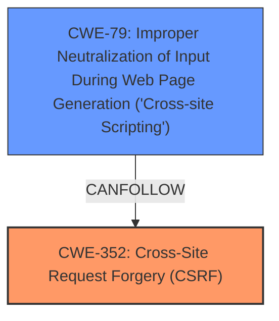

# Analysis for CVE-2025-22342

# Summary
| CWE ID | CWE Name | Confidence | CWE Abstraction Level | CWE Vulnerability Mapping Label | CWE-Vulnerability Mapping Notes |
|---|---|---|---|---|---|
| CWE-352 | Cross-Site Request Forgery (CSRF) | 0.9 | Compound | Allowed | Primary CWE |
| CWE-79 | Improper Neutralization of Input During Web Page Generation ('Cross-site Scripting') | 0.8 | Base | Allowed | Secondary Candidate |

## Evidence and Confidence

*   **Confidence Score:** 0.85
*   **Evidence Strength:** HIGH

## Relationship Analysis
The primary relationship identified is that CWE-352 [Cross-Site Request Forgery (CSRF)] can often lead to other vulnerabilities, such as Cross-Site Scripting (XSS). However, the description explicitly states a CSRF **weakness** leads to Stored XSS, suggesting a direct link where a successful CSRF attack is used to inject malicious scripts. The graph relationships show that CWE-79 [Improper Neutralization of Input During Web Page Generation ('Cross-site Scripting')] can be a consequence of other weaknesses. The abstraction levels are appropriate, with CWE-352 [Cross-Site Request Forgery (CSRF)] being a compound weakness and CWE-79 [Improper Neutralization of Input During Web Page Generation ('Cross-site Scripting')] being a base weakness.

## Vulnerability Chain
The vulnerability chain starts with CWE-352 [Cross-Site Request Forgery (CSRF)], where the application doesn't properly verify the origin of requests. This allows an attacker to potentially forge requests on behalf of a user. The impact of this is CWE-79 [Improper Neutralization of Input During Web Page Generation ('Cross-site Scripting')], where the forged request injects malicious scripts into the system, leading to Stored XSS.

## Summary of Analysis
The initial analysis identified both CWE-352 [Cross-Site Request Forgery (CSRF)] and CWE-79 [Improper Neutralization of Input During Web Page Generation ('Cross-site Scripting')] as potential candidates. The vulnerability description explicitly mentions "Cross-Site Request Forgery (CSRF) vulnerability" and that this **weakness** leads to "Stored XSS". This indicates that the primary issue is the **lack** of CSRF protection, which then allows for the injection of malicious scripts.

The evidence strongly supports CWE-352 [Cross-Site Request Forgery (CSRF)] as the primary **root cause**, which is confirmed by the "CVE Reference Links Content Summary" section stating "Weaknesses/vulnerabilities present: Cross Site Request Forgery (CSRF)". The Stored XSS is a direct consequence of the successful CSRF attack, making CWE-79 [Improper Neutralization of Input During Web Page Generation ('Cross-site Scripting')] a secondary weakness in this specific context.

The retriever results also support this, with CWE-352 [Cross-Site Request Forgery (CSRF)] having the highest score.

The final decision is based on the explicit mention of CSRF as the vulnerability and the direct consequence of Stored XSS due to successful exploitation of the CSRF **weakness**. The selected CWEs are at the optimal level of specificity, with CWE-352 [Cross-Site Request Forgery (CSRF)] being a compound weakness and CWE-79 [Improper Neutralization of Input During Web Page Generation ('Cross-site Scripting')] being a base weakness.

CWE-89 [Improper Neutralization of Special Elements used in an SQL Command ('SQL Injection')], CWE-434 [Unrestricted Upload of File with Dangerous Type] were considered due to their presence in the retriever results, but they do not directly relate to the vulnerability description. There is no mention of SQL injection or file uploads.

CWE-116 [Improper Encoding or Escaping of Output] was considered, but CWE-79 [Improper Neutralization of Input During Web Page Generation ('Cross-site Scripting')] is a more specific match for the XSS vulnerability.