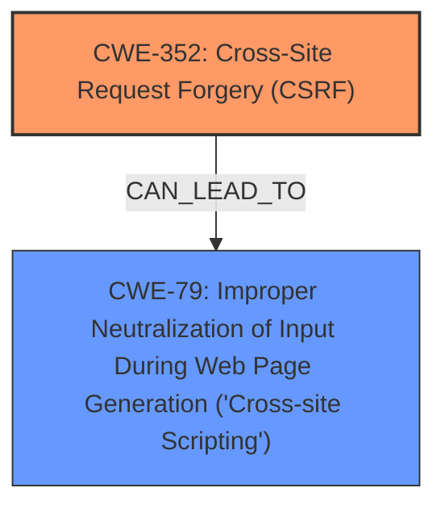

# Raw Analyzer Response for CVE-2025-22343

# Summary
| CWE ID | CWE Name | Confidence | CWE Abstraction Level | CWE Vulnerability Mapping Label | CWE-Vulnerability Mapping Notes |
|---|---|---|---|---|---|
| CWE-352 | Cross-Site Request Forgery (CSRF) | 0.9 | Compound | Primary | Allowed |
| CWE-79 | Improper Neutralization of Input During Web Page Generation ('Cross-site Scripting') | 0.8 | Base | Secondary | Allowed |

## Evidence and Confidence

*   **Confidence Score:** 0.85
*   **Evidence Strength:** HIGH

## Relationship Analysis
The primary weakness is identified as CWE-352, which is a Compound weakness. The vulnerability description explicitly mentions CSRF. The secondary weakness, Stored XSS, is represented by CWE-79. There isn't a direct relationship between CWE-352 and CWE-79 in the provided data. However, the vulnerability chain shows how CSRF can lead to Stored XSS. The abstraction levels are appropriate, with CWE-352 being Compound and CWE-79 being Base.

## Vulnerability Chain
The vulnerability chain starts with **CSRF** (CWE-352), which allows an attacker to force a higher-privileged user to perform unwanted actions. One such action could be injecting malicious scripts that are then stored on the server. This leads to **Stored XSS** (CWE-79), where the injected script is executed when other users access the stored data.

CWE-352 (Root Cause) -> CWE-79 (Impact)

## Summary of Analysis
The initial assessment focused on identifying the root cause and the resulting weakness based on the vulnerability description and CVE reference. The description explicitly mentions both **CSRF** and **Stored XSS**, making CWE-352 and CWE-79 strong candidates.

The evidence from the "CVE Reference Links Content Summary" confirms that the **root cause** of the vulnerability is **Cross-Site Request Forgery (CSRF)**. The summary also states that CSRF allows a malicious actor to force higher privileged users to execute unwanted actions. The vulnerability description also identifies **Stored XSS** as a weakness.

The graph relationships and retriever results support the selection of CWE-352 and CWE-79. CWE-352 is a Compound weakness, which aligns with its complex nature. CWE-79 is a Base weakness, representing the specific issue of improper neutralization of input.

The final selection of CWEs is based on the evidence provided and the relationships between them. CWE-352 represents the root cause, and CWE-79 represents the resulting weakness. The chosen CWEs are at the optimal level of specificity, accurately reflecting the vulnerability.

Relevant CWE Information:

# Enhanced Context (25 CWEs)
The following CWEs were identified as potentially relevant to this vulnerability:

## CWE-352: Cross-Site Request Forgery (CSRF)
**Abstraction Level**: Compound
**Similarity Score**: 0.75
**Source**: dense

**Description**:
The web application does not, or can not, sufficiently verify whether a well-formed, valid, consistent request was intentionally provided by the user who submitted the request.

**Mapping Guidance**:
- Usage: Allowed
- Rationale: This is a well-known Composite of multiple weaknesses that must all occur simultaneously, although it is attack-oriented in nature.

**Technical Explanation:** CWE-352 (Cross-Site Request Forgery) is a compound weakness where a web application doesn't properly verify if a request was intentionally provided by the user. This allows an attacker to force a user to execute unwanted actions on a web application they are authenticated on. The security implication is that an attacker can perform actions as the user, leading to data modification or other malicious activities.

**CWE Selection Justification:** The vulnerability description explicitly mentions **CSRF** as a **rootcause**, and the "CVE Reference Links Content Summary" confirms this. The description of CWE-352 aligns perfectly with the vulnerability. Confidence: 0.9

## CWE-79: Improper Neutralization of Input During Web Page Generation ('Cross-site Scripting')
**Abstraction Level**: Base
**Similarity Score**: 0.71
**Source**: dense

**Description**:
The product does not neutralize or incorrectly neutralizes user-controllable input before it is placed in output that is used as a web page that is served to other users.

**Mapping Guidance**:
- Usage: Allowed
- Rationale: This CWE entry is at the Base level of abstraction, which is a preferred level of abstraction for mapping to the root causes of vulnerabilities.

**Technical Explanation:** CWE-79 (Improper Neutralization of Input During Web Page Generation) describes a scenario where a product doesn't neutralize user-controllable input before placing it in output that is used as a web page. This can lead to Cross-site Scripting (XSS) attacks. The security implication is that an attacker can inject malicious scripts into web pages viewed by other users.

**CWE Selection Justification:** The vulnerability description mentions **Stored XSS** as a **weakness**. This aligns with the description of CWE-79. The "CVE Reference Links Content Summary" also mentions that the CSRF can lead to a malicious actor forcing higher privileged users to execute unwanted actions. This can include injecting malicious scripts. Confidence: 0.8

**Other CWEs Considered but Not Used:**

*   CWE-434 (Unrestricted Upload of File with Dangerous Type): While file uploads can be a source of vulnerabilities, the description focuses on CSRF and XSS, not file uploads.
*   CWE-116 (Improper Encoding or Escaping of Output): This could be related to XSS, but CWE-79 is more specific to the context of web page generation.
*   CWE-89 (Improper Neutralization of Special Elements used in an SQL Command ('SQL Injection')): There's no mention of SQL injection in the vulnerability description.
*   CWE-601 (URL Redirection to Untrusted Site ('Open Redirect')): This is not related to the described vulnerability.
*   CWE-425 (Direct Request ('Forced Browsing')): While access control is mentioned in the summary (OWASP A1), the primary issue is CSRF.